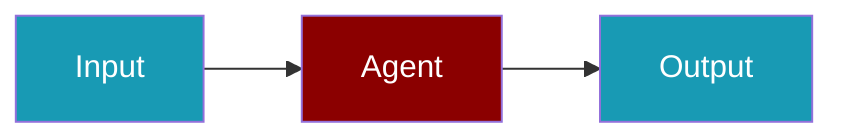

# Together.ai Provider

Access open-source models via Together.ai.

## Environment Variables

```bash
export TOGETHER_API_KEY=...
```

## Supported Modalities

| Modality | Supported |
|----------|-----------|
| Text/Chat | ✅ |
| Embeddings | ✅ |
| Tools | ✅ |

## Quick Start

<Steps>
<Step title="Simple Usage">
```typescript
import { Agent } from 'praisonai';

const agent = new Agent({
  name: 'TogetherAgent',
  instructions: 'You are a helpful assistant.',
  llm: 'togetherai/meta-llama/Llama-3-70b-chat-hf'
});

const response = await agent.chat('Hello!');
```
</Step>
<Step title="With Configuration">
Adjust provider credentials and model settings for production — see the sections above.
</Step>
</Steps>

## Related

<CardGroup cols={2}>
  <Card title="Together.ai CLI Usage" icon="terminal" href="/docs/js/providers/togetherai-cli">
    Together.ai CLI Usage
  </Card>
</CardGroup>
