Agents can use publish-subscribe messaging to communicate with each other and external systems.

```mermaid
graph LR
    subgraph "Pub/Sub"
        A[📤 Publisher] --> B[📬 Topic]
        B --> C[📥 Subscriber A]
        B --> D[📥 Subscriber B]
    end
    
    classDef pub fill:#6366F1,stroke:#7C90A0,color:#fff
    classDef topic fill:#F59E0B,stroke:#7C90A0,color:#fff
    classDef sub fill:#10B981,stroke:#7C90A0,color:#fff
    
    class A pub
    class B topic
    class C,D sub
```



## Quick Start

<Steps>

<Step title="Create PubSub">
```typescript
import { createPubSub } from 'praisonai';

const pubsub = createPubSub();

// Subscribe to topic
pubsub.subscribe('orders', (event) => {
  console.log('New order:', event.data);
});

// Publish message
pubsub.publish('orders', { id: '123', total: 99.99 });
```
</Step>

<Step title="Agent Communication">
```typescript
const agent1 = new Agent({
  pubsub,
  onComplete: (result) => {
    pubsub.publish('task.done', result);
  }
});

pubsub.subscribe('task.done', (event) => {
  agent2.chat(`Process: ${event.data}`);
});
```
</Step>

</Steps>

---

## User Interaction Flow


---

## Configuration Levels

```typescript
// Level 1: Function - Simple create
const pubsub = createPubSub();

// Level 2: Dict - With options
const pubsub = createPubSub({
  maxListeners: 100,
  wildcard: true
});

// Level 3: Instance - Full control
import { EventEmitterPubSub } from 'praisonai';

const pubsub = new EventEmitterPubSub({
  maxListeners: 100,
  wildcard: true,
  delimiter: '.',
  onError: (err) => console.error(err)
});
```

---

## Use Cases

| Pattern | Description |
|---------|-------------|
| Events | Notify when things happen |
| Decoupling | Components don't know each other |
| Broadcasting | Send to multiple listeners |
| Queuing | Process messages asynchronously |

---

## API Reference

<Card title="EventEmitterPubSub" icon="code" href="/docs/sdk/reference/typescript/classes/EventEmitterPubSub">
  PubSub implementation
</Card>

---

## Best Practices

<AccordionGroup>
  <Accordion title="Use descriptive topics">
    `user.created` is clearer than `event1`.
  </Accordion>
  
  <Accordion title="Handle errors">
    Subscribers should handle their own errors.
  </Accordion>
  
  <Accordion title="Unsubscribe when done">
    Prevent memory leaks by cleaning up.
  </Accordion>
</AccordionGroup>

---

## Related

<CardGroup cols={2}>
  <Card title="Events" icon="bell" href="/docs/js/events">
    Event system
  </Card>
  <Card title="Teams" icon="users" href="/docs/js/teams">
    Multi-agent teams
  </Card>
</CardGroup>
