PubSub enables publish-subscribe messaging between agents and components.

```mermaid
graph LR
    subgraph "Pub/Sub Messaging"
        A[📤 Publisher] --> B[📬 Topic]
        B --> C[📥 Subscriber A]
        B --> D[📥 Subscriber B]
    end
    
    classDef pub fill:#6366F1,stroke:#7C90A0,color:#fff
    classDef topic fill:#F59E0B,stroke:#7C90A0,color:#fff
    classDef sub fill:#10B981,stroke:#7C90A0,color:#fff
    
    class A pub
    class B topic
    class C,D sub
```



## Quick Start

```typescript
import { createPubSub } from 'praisonai';

const pubsub = createPubSub();

// Subscribe to topic
pubsub.subscribe('orders', (event) => {
  console.log('New order:', event.data);
});

// Publish message
pubsub.publish('orders', { id: '123', total: 99.99 });
```

## Use Cases

| Pattern | Description |
|---------|-------------|
| Events | Notify when things happen |
| Decoupling | Components don't need to know each other |
| Broadcasting | Send to multiple listeners |

---

## Common Examples

### Agent Events

```typescript
pubsub.subscribe('agent.completed', (event) => {
  saveToDatabase(event.data.result);
});
```

### Multi-Agent Communication

```typescript
// Agent 1 publishes
pubsub.publish('task.ready', { task: 'Process data' });

// Agent 2 subscribes
pubsub.subscribe('task.ready', async (event) => {
  await processTask(event.data.task);
});
```

---

## Related

<CardGroup cols={2}>
  <Card title="Events" icon="bell" href="/docs/js/events">
    Event system
  </Card>
  <Card title="Teams" icon="users" href="/docs/js/teams">
    Multi-agent teams
  </Card>
</CardGroup>
