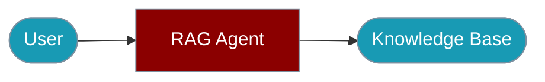

Build and run RAG agents from the command line.




## Quick Start

<Steps>

<Step title="Simple Usage">

```bash
praisonai-ts run --knowledge my-kb --prompt "What is PraisonAI?"
```

</Step>

<Step title="With Configuration">

```bash
praisonai-ts chat --knowledge my-kb --instructions "Answer from docs" --model gpt-4o
```

</Step>

</Steps>

---

## Commands

### Create Knowledge Base

```bash
# Create a new knowledge base
praisonai-ts knowledge create my-kb

# Add documents
praisonai-ts knowledge add my-kb ./documents/

# Add from URL
praisonai-ts knowledge add my-kb https://example.com/doc.pdf
```

### Query Knowledge Base

```bash
# Query the knowledge base
praisonai-ts knowledge query my-kb "What is PraisonAI?"

# Query with options
praisonai-ts knowledge query my-kb "question" --top-k 5 --min-score 0.7
```

### Run RAG Agent

```bash
# Run agent with knowledge base
praisonai-ts run \
  --instructions "Answer questions using the knowledge base" \
  --knowledge my-kb \
  --prompt "What is PraisonAI?"

# Interactive mode
praisonai-ts chat \
  --knowledge my-kb \
  --instructions "You are a helpful assistant"
```

## Options

| Option | Type | Default | Description |
|--------|------|---------|-------------|
| `--knowledge` | string | - | Knowledge base name or path |
| `--top-k` | number | `5` | Number of results to retrieve |
| `--min-score` | number | `0.7` | Minimum similarity score |
| `--rerank` | boolean | `false` | Enable reranking |
| `--citations` | string | `inline` | Citation format |

## Examples

### Build Knowledge Base from Directory

```bash
# Add all PDFs from a directory
praisonai-ts knowledge add docs-kb ./docs/ --pattern "*.pdf"

# Add with metadata
praisonai-ts knowledge add docs-kb ./docs/ \
  --metadata '{"source": "documentation", "version": "1.0"}'
```

### RAG Chat Session

```bash
# Start interactive RAG chat
praisonai-ts chat \
  --knowledge docs-kb \
  --instructions "Answer questions about the documentation" \
  --model gpt-4o
```

### Export Knowledge Base

```bash
# Export to JSON
praisonai-ts knowledge export docs-kb --output kb-export.json

# Import from JSON
praisonai-ts knowledge import new-kb --input kb-export.json
```

## Environment Variables

| Variable | Required | Description |
|----------|----------|-------------|
| `OPENAI_API_KEY` | Yes | For embeddings |
| `PINECONE_API_KEY` | For Pinecone | Pinecone API key |

## Related

<CardGroup cols={2}>
  <Card title="RAG Agent SDK" icon="database" href="/docs/js/rag-agent">
    Build RAG agents in code
  </Card>
  <Card title="Knowledge Base" icon="book" href="/docs/js/knowledge-base">
    Manage knowledge bases
  </Card>
</CardGroup>
