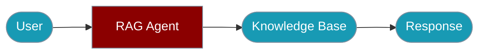

Build agents that retrieve and cite information from knowledge bases.



## Quick Start

<Steps>

<Step title="Simple Usage">

```typescript
import { Agent, createMemoryVectorStore } from 'praisonai-ts';

// Create a vector store for RAG
const vectorStore = createMemoryVectorStore();

// Add documents to the knowledge base
await vectorStore.addDocuments([
  { id: '1', content: 'PraisonAI is an AI agent framework', metadata: { source: 'docs' } },
  { id: '2', content: 'Agents can use tools to accomplish tasks', metadata: { source: 'docs' } },
]);

// Create an agent with RAG capabilities
const agent = new Agent({
  name: 'RAGAgent',
  instructions: 'You answer questions using the knowledge base. Always cite sources.',
  knowledge: vectorStore,
});

const response = await agent.chat('What is PraisonAI?');
console.log(response);
```

</Step>

<Step title="With Configuration">

Use `ragConfig`, production vector stores, and reranking — see Configuration Options below.

</Step>

</Steps>

## Configuration Options

```typescript
import { Agent, createPineconeStore } from 'praisonai-ts';

const vectorStore = await createPineconeStore({
  apiKey: process.env.PINECONE_API_KEY!,
  index: 'my-knowledge-base',
  namespace: 'docs',
});

const agent = new Agent({
  name: 'RAGAgent',
  instructions: 'You are a helpful assistant with access to a knowledge base.',
  knowledge: vectorStore,
  ragConfig: {
    topK: 5,                    // Number of results to retrieve
    minScore: 0.7,              // Minimum similarity score
    includeMetadata: true,      // Include document metadata
    rerank: true,               // Enable reranking
    citationFormat: 'inline',   // Citation format: inline, footnote, none
  },
});
```

## Vector Store Options

### Memory Vector Store (Development)

```typescript
import { createMemoryVectorStore } from 'praisonai-ts';

const store = createMemoryVectorStore();
```

### Pinecone

```typescript
import { createPineconeStore } from 'praisonai-ts';

const store = await createPineconeStore({
  apiKey: process.env.PINECONE_API_KEY!,
  index: 'my-index',
  namespace: 'my-namespace',
});
```

### Weaviate

```typescript
import { createWeaviateStore } from 'praisonai-ts';

const store = await createWeaviateStore({
  host: process.env.WEAVIATE_HOST!,
  apiKey: process.env.WEAVIATE_API_KEY,
  className: 'Documents',
});
```

### Qdrant

```typescript
import { createQdrantStore } from 'praisonai-ts';

const store = await createQdrantStore({
  url: process.env.QDRANT_URL!,
  apiKey: process.env.QDRANT_API_KEY,
  collectionName: 'my-collection',
});
```

### ChromaDB

```typescript
import { createChromaStore } from 'praisonai-ts';

const store = await createChromaStore({
  path: './chroma-data',
  collectionName: 'my-collection',
});
```

## Adding Documents

```typescript
// Add single document
await vectorStore.addDocument({
  id: 'doc-1',
  content: 'Document content here',
  metadata: { source: 'manual', category: 'guide' },
});

// Add multiple documents
await vectorStore.addDocuments([
  { id: 'doc-2', content: 'First document', metadata: {} },
  { id: 'doc-3', content: 'Second document', metadata: {} },
]);

// Add from file (PDF, TXT, MD)
await vectorStore.addFromFile('./document.pdf');
```

## Reranking

Enable reranking for better retrieval quality:

```typescript
import { Agent, createCohereReranker } from 'praisonai-ts';

const reranker = createCohereReranker({
  apiKey: process.env.COHERE_API_KEY!,
  model: 'rerank-english-v3.0',
});

const agent = new Agent({
  name: 'RAGAgent',
  instructions: 'Answer questions using the knowledge base.',
  knowledge: vectorStore,
  reranker: reranker,
});
```

## Graph RAG

For complex relationships between documents:

```typescript
import { createGraphRAG } from 'praisonai-ts';

const graphRAG = await createGraphRAG({
  vectorStore: vectorStore,
  extractEntities: true,
  extractRelationships: true,
});

const agent = new Agent({
  name: 'GraphRAGAgent',
  instructions: 'Answer questions using the knowledge graph.',
  knowledge: graphRAG,
});
```

## Best Practices

<AccordionGroup>
  <Accordion title="Chunk documents appropriately">
    Split large documents into meaningful chunks.
  </Accordion>
  <Accordion title="Use metadata">
    Add source, date, and category metadata for filtering.
  </Accordion>
  <Accordion title="Enable reranking">
    Improves retrieval quality for complex queries.
  </Accordion>
  <Accordion title="Set appropriate topK">
    Balance between context size and relevance.
  </Accordion>
</AccordionGroup>

## Environment Variables

| Variable | Required | Description |
|----------|----------|-------------|
| `OPENAI_API_KEY` | Yes | For embeddings and LLM |
| `PINECONE_API_KEY` | For Pinecone | Pinecone API key |
| `COHERE_API_KEY` | For reranking | Cohere API key |

## Related

<CardGroup cols={2}>
  <Card title="Knowledge Base" icon="book" href="/docs/js/knowledge-base">
    Managing knowledge bases
  </Card>
  <Card title="Graph RAG" icon="diagram-project" href="/docs/js/graph-rag">
    Graph-based RAG
  </Card>
</CardGroup>
