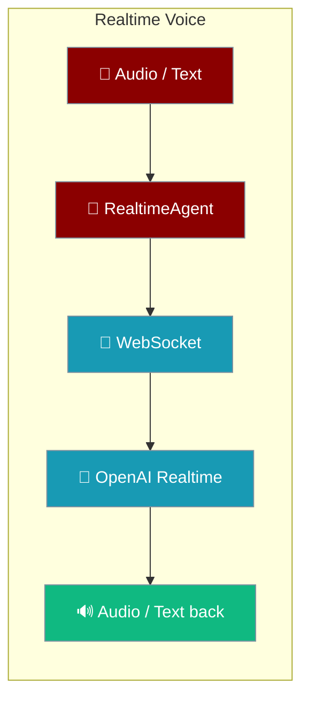
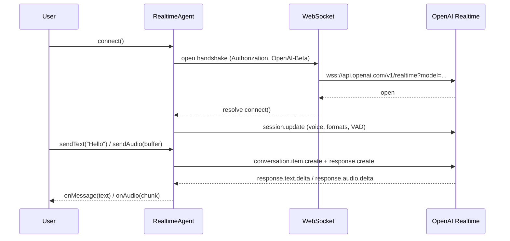

`RealtimeAgent` opens a real WebSocket to OpenAI's Realtime API for bidirectional audio and text.

<Note>
Looking for token-by-token **text** streaming (`agent.stream('Tell me a story')`)? That moved to [Streaming](/js/streaming). This page is the voice-first `RealtimeAgent`.
</Note>


```mermaid
graph LR
    subgraph "Realtime Voice"
        Mic[🎤 Audio / Text] --> A[🤖 RealtimeAgent]
        A --> WS[🔌 WebSocket]
        WS --> API[🧠 OpenAI Realtime]
        API --> Out[🔊 Audio / Text back]
    end

    classDef input fill:#8B0000,stroke:#7C90A0,color:#fff
    classDef agent fill:#8B0000,stroke:#7C90A0,color:#fff
    classDef proc fill:#189AB4,stroke:#7C90A0,color:#fff
    classDef out fill:#10B981,stroke:#7C90A0,color:#fff

    class Mic input
    class A agent
    class WS,API proc
    class Out out
```

## Quick Start

<Steps>

<Step title="Connect and send text">
```typescript
import { RealtimeAgent } from 'praisonai';

const agent = new RealtimeAgent({
  name: 'VoiceAssistant',
  llm: 'gpt-4o-realtime-preview',
  apiKey: process.env.OPENAI_API_KEY,
});

agent.onAudio((chunk) => playAudio(chunk));   // Uint8Array of decoded audio
agent.onMessage((text) => console.log(text)); // text deltas

await agent.connect();          // Real WebSocket — throws on auth/network failure
await agent.sendText('Hello!'); // Real API frames — throws if not connected
```
</Step>

<Step title="Stream microphone audio">
```typescript
import { RealtimeAgent } from 'praisonai';

const agent = new RealtimeAgent({
  instructions: 'You are a helpful voice assistant.',
  realtime: { voice: 'nova' },
  apiKey: process.env.OPENAI_API_KEY,
});

agent.onAudio((chunk) => playAudio(chunk));

await agent.connect();
agent.sendAudio(microphoneBuffer);  // Uint8Array | ArrayBuffer of PCM16
agent.commitAudio();                // ask the server to process the buffer
```
</Step>

</Steps>

<Warning>
**What happens on connect failure.** `connect()` resolves only after the WebSocket handshake actually completes. A bad API key, an unreachable host, a close during the handshake, or a timeout all **reject** — the agent never reports a fake "connected" state. Wrap `connect()` in `try/catch` and expect an honest error.
</Warning>

---

## How It Works

Both audio and text turns travel over the same live socket.


```mermaid
sequenceDiagram
    participant User
    participant Agent as RealtimeAgent
    participant WS as WebSocket
    participant API as OpenAI Realtime

    User->>Agent: connect()
    Agent->>WS: open handshake (Authorization, OpenAI-Beta)
    WS->>API: wss://api.openai.com/v1/realtime?model=...
    API-->>WS: open
    WS-->>Agent: resolve connect()
    Agent->>API: session.update (voice, formats, VAD)

    User->>Agent: sendText("Hello") / sendAudio(buffer)
    Agent->>API: conversation.item.create + response.create
    API-->>Agent: response.text.delta / response.audio.delta
    Agent-->>User: onMessage(text) / onAudio(chunk)
```

| Behaviour | What actually happens |
|-----------|-----------------------|
| `connect()` | Resolves only on socket `open`; rejects on error, close, or timeout |
| `isConnected()` | Reads the live socket `readyState` — flips to `false` on a server-initiated close |
| `sendText()` / `sendAudio()` | Send real API frames; **throw** when not connected |
| Events | Every event is parsed off the wire; unknown server types pass through verbatim |

---

## Events

Register handlers by event type, or use `'*'` to receive every server event. Convenience callbacks mirror the Python agent.

```typescript
import { RealtimeAgent } from 'praisonai';

const agent = new RealtimeAgent({ apiKey: process.env.OPENAI_API_KEY });

// Typed event handlers
agent.on('response.audio.delta', (event) => playAudio(event.data));
agent.on('response.text.delta', (event) => process.stdout.write(event.data.delta));

// Receive everything, including unknown server types (passed through verbatim)
agent.on('*', (event) => console.log(event.type));

// Python-parity convenience callbacks
agent.onMessage((text) => console.log(text));   // decoded text deltas
agent.onAudio((chunk) => playAudio(chunk));      // decoded audio bytes
agent.onError((err) => console.error(err));

await agent.connect();
```

Known event types include `session.created`, `session.updated`, `response.text.delta`, `response.audio.delta`, `response.done`, and `error`. Any other type the server sends is emitted untouched.

---

## Configuration Options

Pass `realtime` as a config object to tune voice and audio.

| Option | Type | Default | Description |
|--------|------|---------|-------------|
| `voice` | `'alloy' \| 'echo' \| 'fable' \| 'onyx' \| 'nova' \| 'shimmer'` | `'alloy'` | Response voice |
| `inputFormat` | `'pcm16' \| 'g711_ulaw' \| 'g711_alaw'` | `'pcm16'` | Audio input format |
| `outputFormat` | `'pcm16' \| 'g711_ulaw' \| 'g711_alaw'` | `'pcm16'` | Audio output format |
| `sampleRate` | `number` | `24000` | Local playback hint (not sent to the API) |
| `vadEnabled` | `boolean` | `true` | Server-side voice activity detection |
| `vadThreshold` | `number` | `0.5` | VAD sensitivity |
| `timeout` | `number` | `300` | Session timeout (seconds) |

Agent-level options: `llm` (default `gpt-4o-realtime-preview`), `apiKey` (falls back to `OPENAI_API_KEY`), `url` (endpoint override), `headers`, `webSocket` (inject a constructor), and `connectTimeoutMs` (default `30000`).

```typescript
import { RealtimeAgent } from 'praisonai';

const agent = new RealtimeAgent({
  name: 'VoiceAssistant',
  llm: 'gpt-4o-realtime-preview',
  apiKey: process.env.OPENAI_API_KEY,
  connectTimeoutMs: 10000,
  realtime: {
    voice: 'nova',
    inputFormat: 'pcm16',
    vadEnabled: true,
  },
});
```

<Card title="RealtimeAgent API Reference" icon="code" href="/sdk/reference/typescript/classes/RealtimeAgent">
  Full class documentation
</Card>

---

## Runtime Requirements

The WebSocket implementation is resolved at call time: an injected `{ webSocket }` constructor first, then `globalThis.WebSocket`, then the optional `ws` package.

| Runtime | How it connects |
|---------|-----------------|
| Node ≥ 22 | Global `WebSocket` with `{ headers }` for `Authorization` and `OpenAI-Beta` |
| Older Node | Install `ws` (`npm install ws`) — the fallback path picks it up |
| Browser | No handshake headers; falls back to OpenAI's documented subprotocol credentials |

<Warning>
The browser subprotocol path puts the API key in the page. Use an ephemeral key there. It is verified at wire level only.
</Warning>

If no implementation is available, `connect()` throws with the three ways to fix it (upgrade Node, install `ws`, or inject a constructor) — it never pretends to connect.

---

## Best Practices

<AccordionGroup>
  <Accordion title="Always try/catch connect()">
    A bad key, a bad URL, or a timeout rejects. Handle the error instead of assuming a connection succeeded.
  </Accordion>
  <Accordion title="Send only after connect() resolves">
    `sendText`, `sendAudio`, `commitAudio`, and `clearAudio` throw when disconnected. Await `connect()` first, and re-check `isConnected()` after a possible server close.
  </Accordion>
  <Accordion title="Handle unknown event types">
    The server may send event types this SDK doesn't name. Register `'*'` so you see them all rather than dropping frames.
  </Accordion>
  <Accordion title="Use an ephemeral key in browsers">
    Browsers cannot set handshake headers, so credentials travel as a subprotocol — visible in the page. Mint a short-lived key for that path.
  </Accordion>
</AccordionGroup>

<Note>
`sampleRate` is a local playback hint and is not sent to the API. The low-level `SQLiteAdapter` in `praisonai/db/sqlite` is unrelated to this agent and still degrades to a `Map` for legacy callers.
</Note>

---

## Related

<CardGroup cols={2}>
  <Card title="Streaming" icon="wave-pulse" href="/js/streaming">
    Token-by-token text streaming
  </Card>
  <Card title="Voice" icon="microphone" href="/js/voice">
    Voice interactions
  </Card>
  <Card title="Audio" icon="volume-high" href="/js/audio">
    Audio input and output
  </Card>
  <Card title="Agent" icon="user" href="/js/agent">
    Create agents
  </Card>
</CardGroup>
