Agents can stream responses - see results word-by-word as they're generated.

```mermaid
graph LR
    subgraph "Streaming"
        A[👤 User] --> B[🤖 Agent]
        B --> C[✨ Word]
        B --> D[✨ by]
        B --> E[✨ Word]
    end
    
    classDef user fill:#6366F1,stroke:#7C90A0,color:#fff
    classDef agent fill:#F59E0B,stroke:#7C90A0,color:#fff
    classDef stream fill:#10B981,stroke:#7C90A0,color:#fff
    
    class A user
    class B agent
    class C,D,E stream
```



## Quick Start

<Steps>

<Step title="Stream Response">
```typescript
import { Agent } from 'praisonai';

const agent = new Agent({
  instructions: 'You tell engaging stories'
});

// Stream word by word
for await (const chunk of agent.stream('Tell me a story')) {
  process.stdout.write(chunk);
}
```
</Step>

<Step title="With Callback">
```typescript
await agent.chat('Explain quantum physics', {
  stream: true,
  onChunk: (chunk) => {
    displayInUI(chunk);
  }
});
```
</Step>

</Steps>

---

## User Interaction Flow


---

## Configuration Levels

```typescript
// Level 1: Bool - Enable streaming
const response = await agent.chat('Hello', {
  stream: true
});

// Level 2: Method - Use stream iterator
for await (const chunk of agent.stream('Hello')) {
  console.log(chunk);
}

// Level 3: Dict - With callbacks
await agent.chat('Hello', {
  stream: true,
  onChunk: (chunk) => console.log(chunk),
  onComplete: (full) => console.log('Done:', full)
});
```

---

## When to Stream

| Scenario | Use Streaming? |
|----------|---------------|
| Long responses | ✅ Yes - better UX |
| Short answers | ❌ No - wait for complete |
| Real-time chat | ✅ Yes - feels natural |
| Data extraction | ❌ No - need complete output |

---

## Best Practices

<AccordionGroup>
  <Accordion title="Use for long content">
    Streaming helps most with responses over a few seconds.
  </Accordion>
  
  <Accordion title="Handle interruptions">
    Users may cancel mid-stream - handle gracefully.
  </Accordion>
  
  <Accordion title="Buffer for structured output">
    When parsing JSON, wait for complete output.
  </Accordion>
</AccordionGroup>

---

## Related

<CardGroup cols={2}>
  <Card title="Agent" icon="user" href="/docs/js/agent">
    Create agents
  </Card>
  <Card title="Voice" icon="microphone" href="/docs/js/voice">
    Voice interactions
  </Card>
</CardGroup>
