Realtime enables streaming responses from agents - see results as they're generated, not all at once.

```mermaid
graph LR
    subgraph "Streaming"
        A[🤖 Agent] --> B[📊 Stream]
        B --> C[✨ Word]
        B --> D[✨ by]
        B --> E[✨ Word]
    end
    
    classDef agent fill:#6366F1,stroke:#7C90A0,color:#fff
    classDef stream fill:#F59E0B,stroke:#7C90A0,color:#fff
    classDef word fill:#10B981,stroke:#7C90A0,color:#fff
    
    class A agent
    class B stream
    class C,D,E word
```



## Quick Start

```typescript
import { Agent } from 'praisonai';

const agent = new Agent({
  instructions: 'You are a helpful assistant'
});

// Stream response
for await (const chunk of agent.stream('Tell me a story')) {
  process.stdout.write(chunk);  // Print as it arrives
}
```

## When to Use Streaming

| Scenario | Streaming? |
|----------|------------|
| Long responses | ✅ Yes - better user experience |
| Short answers | ❌ No - wait for complete |
| Real-time chat | ✅ Yes - feels natural |
| Data extraction | ❌ No - need complete output |

---

## Common Examples

### Chat Interface

```typescript
const response = await agent.chat('Explain quantum physics', {
  stream: true,
  onChunk: (chunk) => {
    displayToUser(chunk);  // Show in UI
  }
});
```

### Progress Indicator

```typescript
let charCount = 0;
for await (const chunk of agent.stream('Write a long article')) {
  charCount += chunk.length;
  updateProgress(`Generated ${charCount} characters...`);
}
```

---

## Best Practices

<AccordionGroup>
  <Accordion title="Use for long content">
    Streaming is most valuable for responses that take several seconds.
  </Accordion>
  
  <Accordion title="Handle errors gracefully">
    Streams can be interrupted - always handle errors in your stream consumer.
  </Accordion>
</AccordionGroup>

---

## Related

<CardGroup cols={2}>
  <Card title="Agent" icon="user" href="/docs/js/agent">
    Create agents
  </Card>
  <Card title="Voice" icon="microphone" href="/docs/js/voice">
    Voice interactions
  </Card>
</CardGroup>
