Reflection enables agents to review and improve their own work - like proofreading before submitting.



```mermaid
graph LR
    subgraph "Self-Improvement"
        A[📝 Draft] --> B[🔍 Review]
        B --> C[✏️ Improve]
        C --> D[✅ Final]
    end
    
    classDef draft fill:#6366F1,stroke:#7C90A0,color:#fff
    classDef review fill:#F59E0B,stroke:#7C90A0,color:#fff
    classDef final fill:#10B981,stroke:#7C90A0,color:#fff
    
    class A draft
    class B,C review
    class D final
```

## Quick Start

```typescript
import { Agent } from 'praisonai';

const agent = new Agent({
  instructions: 'You are a helpful assistant',
  reflect: true,            // Enable reflection
  reflectionRounds: 2       // How many times to review
});

const result = await agent.chat('Write a business proposal');
// Agent writes, reviews, and improves before returning
```

## How It Works

1. **Generate**: Agent creates initial response
2. **Review**: Agent critiques its own work
3. **Improve**: Agent fixes identified issues
4. **Repeat**: Process continues for specified rounds

---

## Configuration

| Option | Default | Description |
|--------|---------|-------------|
| `reflect` | `false` | Enable reflection |
| `reflectionRounds` | `1` | Number of review cycles |
| `reflectionPrompt` | Auto | Custom review instructions |

---

## Common Examples

### Writing Improvement

```typescript
const agent = new Agent({
  instructions: 'Write clear, engaging content',
  reflect: true,
  reflectionRounds: 2
});

// Agent will draft, review, and polish the content
await agent.chat('Write an introduction for our annual report');
```

### Code Review

```typescript
const agent = new Agent({
  instructions: 'Write clean, efficient code',
  reflect: true,
  reflectionPrompt: 'Review for bugs, performance, and readability'
});
```

---

## Best Practices

<AccordionGroup>
  <Accordion title="Use 1-2 rounds">
    More rounds don't always mean better results. 1-2 rounds usually suffice.
  </Accordion>
  
  <Accordion title="For quality-critical tasks">
    Enable reflection for important content like proposals, articles, or code.
  </Accordion>
</AccordionGroup>

---

## Related

<CardGroup cols={2}>
  <Card title="Criteria" icon="check-double" href="/docs/js/criteria">
    Define success conditions
  </Card>
  <Card title="Agent" icon="user" href="/docs/js/agent">
    Create agents
  </Card>
</CardGroup>
