Agents can review and improve their own responses before returning.

```mermaid
graph LR
    subgraph "Self-Improvement"
        A[📝 Draft] --> B[🔍 Review]
        B --> C[✏️ Improve]
        C --> D[✅ Final]
    end
    
    classDef draft fill:#6366F1,stroke:#7C90A0,color:#fff
    classDef review fill:#F59E0B,stroke:#7C90A0,color:#fff
    classDef final fill:#10B981,stroke:#7C90A0,color:#fff
    
    class A draft
    class B,C review
    class D final
```



## Quick Start

<Steps>

<Step title="Enable Reflection">
```typescript
import { Agent } from 'praisonai';

const agent = new Agent({
  instructions: 'You write professional content',
  reflection: true
});

await agent.chat('Write a business proposal');
// Agent writes, reviews, and improves before returning
```
</Step>

<Step title="Multiple Rounds">
```typescript
const agent = new Agent({
  reflection: {
    rounds: 2,  // Review twice
    prompt: 'Check for clarity and professionalism'
  }
});
```
</Step>

</Steps>

---

## User Interaction Flow


---

## Configuration Levels

```typescript
// Level 1: Bool - Enable with defaults
const agent = new Agent({
  reflection: true
});

// Level 2: Dict - With options
const agent = new Agent({
  reflection: {
    rounds: 2,
    prompt: 'Review for errors and clarity'
  }
});

// Level 3: Instance - Full control
const agent = new Agent({
  reflection: {
    rounds: 3,
    prompt: 'Focus on tone and accuracy',
    stopWhen: (output) => output.quality > 0.9
  }
});
```

---

## How It Works

1. **Generate**: Agent creates initial response
2. **Review**: Agent critiques its own work  
3. **Improve**: Agent fixes identified issues
4. **Repeat**: Process continues for specified rounds

---

## API Reference

<Card title="ReflectionConfig" icon="code" href="/docs/sdk/reference/typescript/classes/ReflectionConfig">
  Complete configuration options
</Card>

---

## Best Practices

<AccordionGroup>
  <Accordion title="Use 1-2 rounds">
    More rounds don't always mean better results.
  </Accordion>
  
  <Accordion title="For quality-critical tasks">
    Enable for proposals, articles, and important content.
  </Accordion>
  
  <Accordion title="Combine with criteria">
    Use reflection with criteria for validated quality.
  </Accordion>
</AccordionGroup>

---

## Related

<CardGroup cols={2}>
  <Card title="Criteria" icon="check-double" href="/docs/js/criteria">
    Define success conditions
  </Card>
  <Card title="Agent" icon="user" href="/docs/js/agent">
    Create agents
  </Card>
</CardGroup>
