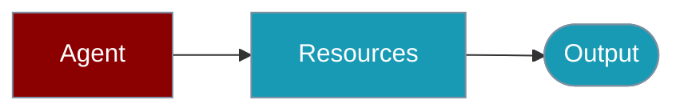

Load and manage external resources for Agents.




## Quick Start

<Steps>

<Step title="Simple Usage">

```typescript
import { Agent } from 'praisonai';

const agent = new Agent({ name: 'Assistant', instructions: 'Be helpful.' });
await agent.chat('Hello');
```

</Step>

<Step title="With Configuration">

Configure resource limits and permissions in your Agent setup.

</Step>

</Steps>

---

## Usage

```typescript
// ```

## API Reference

## Related

<CardGroup cols={2}>
  <Card title="Agent" icon="robot" href="/docs/js/agent">
    Agent basics
  </Card>
  <Card title="Tools" icon="wrench" href="/docs/js/tools">
    Agent tools
  </Card>
</CardGroup>
