Retrieval finds relevant information from your data to give agents the context they need.

```mermaid
graph LR
    subgraph "Smart Retrieval"
        A[❓ Question] --> B[🔍 Search]
        B --> C[📚 Knowledge]
        C --> D[📄 Relevant Docs]
        D --> E[🤖 Agent]
    end
    
    classDef question fill:#6366F1,stroke:#7C90A0,color:#fff
    classDef search fill:#F59E0B,stroke:#7C90A0,color:#fff
    classDef result fill:#10B981,stroke:#7C90A0,color:#fff
    
    class A question
    class B,C search
    class D,E result
```



## Quick Start

```typescript
import { Agent, Knowledge } from 'praisonai';

// Create knowledge base
const knowledge = new Knowledge();
await knowledge.add('docs/*.md');

// Agent with retrieval
const agent = new Agent({
  instructions: 'Answer questions using the provided context',
  knowledge: knowledge
});

const answer = await agent.chat('How do I install the SDK?');
// Agent finds relevant docs and answers accurately
```

## Retrieval Strategies

| Strategy | Best For |
|----------|----------|
| Basic | Simple keyword matching |
| Semantic | Meaning-based search |
| Hybrid | Combines keyword + semantic |
| Fusion | Multiple query variations |

---

## Common Examples

### Customer Support

```typescript
const knowledge = new Knowledge();
await knowledge.add('support-docs/*.md');

const agent = new Agent({
  knowledge,
  instructions: 'Answer support questions helpfully'
});

await agent.chat('How do I reset my password?');
```

### Code Documentation

```typescript
const knowledge = new Knowledge();
await knowledge.add('api-reference/*.md');
await knowledge.add('examples/*.ts');

const agent = new Agent({
  knowledge,
  instructions: 'Help developers use our API'
});
```

---

## Best Practices

<AccordionGroup>
  <Accordion title="Keep documents focused">
    Smaller, focused documents retrieve better than large monolithic files.
  </Accordion>
  
  <Accordion title="Use semantic search">
    Semantic retrieval finds conceptually related content, not just keyword matches.
  </Accordion>
</AccordionGroup>

---

## Related

<CardGroup cols={2}>
  <Card title="RAG" icon="book" href="/docs/js/rag">
    Retrieval Augmented Generation
  </Card>
  <Card title="Knowledge" icon="brain" href="/docs/js/knowledge">
    Knowledge base management
  </Card>
</CardGroup>
