Agents can search and retrieve relevant information from your documents.

```mermaid
graph LR
    subgraph "Smart Retrieval"
        A[❓ Question] --> B[🔍 Search]
        B --> C[📚 Knowledge]
        C --> D[📄 Context]
        D --> E[🤖 Agent]
    end
    
    classDef question fill:#6366F1,stroke:#7C90A0,color:#fff
    classDef search fill:#F59E0B,stroke:#7C90A0,color:#fff
    classDef result fill:#10B981,stroke:#7C90A0,color:#fff
    
    class A question
    class B,C search
    class D,E result
```



## Quick Start

<Steps>

<Step title="Add Knowledge Base">
```typescript
import { Agent } from 'praisonai';

const agent = new Agent({
  instructions: 'Answer questions using the provided documents',
  knowledge: './docs/'  // Folder of documents
});

await agent.chat('What is the return policy?');
// Agent searches docs and answers accurately
```
</Step>

<Step title="With Custom Retrieval">
```typescript
const agent = new Agent({
  knowledge: {
    path: './docs/',
    strategy: 'semantic',  // or 'keyword', 'hybrid'
    topK: 5
  }
});
```
</Step>

</Steps>

---

## User Interaction Flow


---

## Configuration Levels

```typescript
// Level 1: String - Path to documents
const agent = new Agent({
  knowledge: './docs/'
});

// Level 2: Array - Multiple sources
const agent = new Agent({
  knowledge: ['./policies/', './faq/', './guides/']
});

// Level 3: Dict - Full options
const agent = new Agent({
  knowledge: {
    path: './docs/',
    strategy: 'hybrid',
    topK: 10,
    minScore: 0.7,
    chunkSize: 500
  }
});
```

---

## Retrieval Strategies

| Strategy | Best For |
|----------|----------|
| `keyword` | Exact term matching |
| `semantic` | Meaning-based search |
| `hybrid` | Combines both approaches |

---

## Best Practices

<AccordionGroup>
  <Accordion title="Use semantic for complex questions">
    Semantic search finds related content even without exact keywords.
  </Accordion>
  
  <Accordion title="Keep documents focused">
    Smaller, topic-specific documents retrieve better.
  </Accordion>
  
  <Accordion title="Set minimum score">
    Filter out low-relevance results with minScore.
  </Accordion>
</AccordionGroup>

---

## Related

<CardGroup cols={2}>
  <Card title="Knowledge" icon="brain" href="/docs/js/knowledge">
    Knowledge base
  </Card>
  <Card title="RAG" icon="book" href="/docs/js/rag">
    Retrieval augmented generation
  </Card>
</CardGroup>
