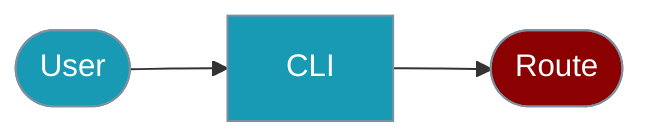

The `praisonai-ts` CLI provides the `router` command for request routing analysis.




## Quick Start

<Steps>

<Step title="Simple Usage">


```bash
# Analyze input and suggest routing
praisonai-ts router analyze "Help me debug this code"

# Get JSON output
praisonai-ts router analyze "What is 2+2?" --json
```

**Example Output:**
```json
{
  "success": true,
  "data": {
    "input": "Help me debug this code",
    "selectedRoute": "code",
    "confidence": 0.95,
    "matchedRoutes": ["code", "question", "general"]
  }
}
```

</Step>
</Steps>

## Route Categories

The router analyzes input and suggests appropriate routing:

| Route | Triggers |
|-------|----------|
| `code` | code, debug, function, programming |
| `math` | calculate, math, equation |
| `research` | research, find, search |
| `creative` | write, create, generate |
| `question` | what, how, why, explain |
| `greeting` | hello, hi, hey |
| `general` | Default fallback |

## SDK Usage

For programmatic routing:

```typescript
import { RouterAgent, Agent } from 'praisonai';

const codeAgent = new Agent({ name: 'CodeExpert', instructions: '...' });
const mathAgent = new Agent({ name: 'MathExpert', instructions: '...' });

const router = new RouterAgent({
  routes: [
    { agent: codeAgent, condition: (input) => /code|debug/i.test(input) },
    { agent: mathAgent, condition: (input) => /math|calculate/i.test(input) }
  ]
});

const result = await router.route('Help me debug this');
```

For more details, see the [Router Agent SDK documentation](/docs/js/router-agent).

---

## Related

<CardGroup cols={2}>
  <Card title="Router Agent SDK" icon="route" href="/docs/js/router-agent">
    Programmatic routing
  </Card>
  <Card title="Routing" icon="route" href="/docs/js/routing">
    Request routing
  </Card>
</CardGroup>
