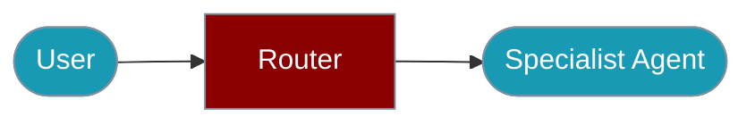
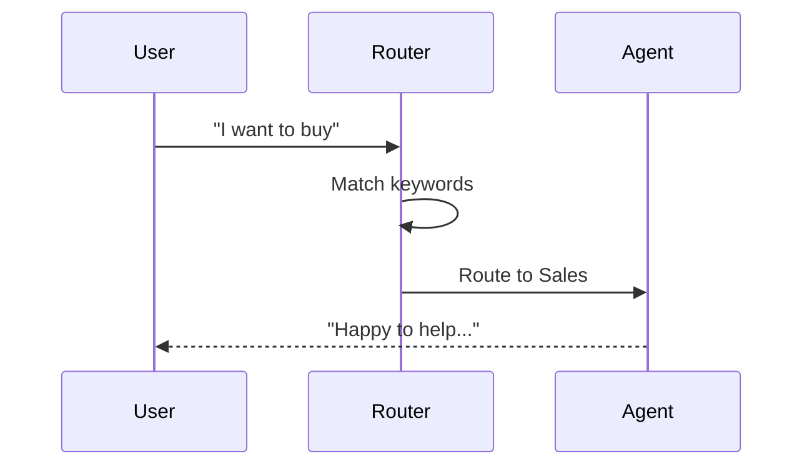
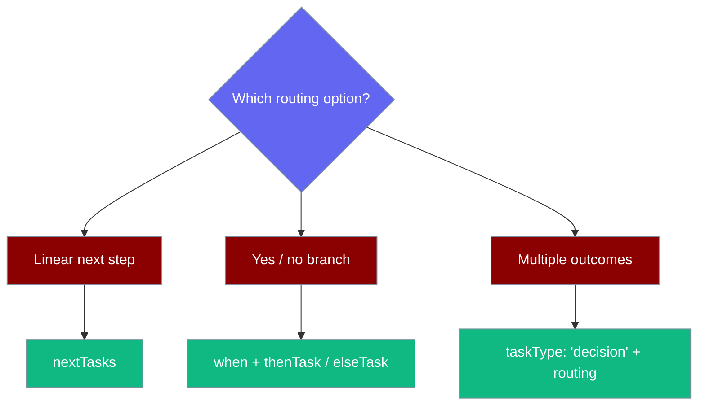

Agents can route user requests to the most appropriate specialist automatically.


```mermaid
graph LR
    User([User]) --> Router[Router]
    Router --> Specialist([Specialist Agent])

    classDef agent fill:#8B0000,stroke:#7C90A0,color:#fff
    classDef tool fill:#189AB4,stroke:#7C90A0,color:#fff

    class Router agent
    class User,Specialist tool
    classDef agent fill:#8B0000,color:#fff
    classDef tool fill:#189AB4,color:#fff
```

## Quick Start

<Steps>

<Step title="Simple Usage">
```typescript
import { Agent, Router } from 'praisonai';

const salesAgent = new Agent({ instructions: 'You handle sales inquiries' });
const techAgent = new Agent({ instructions: 'You provide tech support' });

const router = new Router({
  agents: [salesAgent, techAgent],
  defaultAgent: techAgent
});

// Automatically routes to the right agent
const response = await router.route("I'd like to buy your product");
// → Sales agent responds
```
</Step>

<Step title="With Configuration">
```typescript
const router = new Router({
  routes: [
    { agent: salesAgent, keywords: ['buy', 'price', 'purchase'] },
    { agent: techAgent, keywords: ['error', 'bug', 'help'] }
  ]
});
```
</Step>

</Steps>

---

## User Interaction Flow


```mermaid
sequenceDiagram
    participant User
    participant Router
    participant Agent
    
    User->>Router: "I want to buy"
    Router->>Router: Match keywords
    Router->>Agent: Route to Sales
    Agent-->>User: "Happy to help..."
```

---

## Configuration Levels

```typescript
// Level 1: Array - Simple agent list
const router = new Router({
  agents: [salesAgent, techAgent]
});

// Level 2: Dict - With keywords
const router = new Router({
  routes: [
    { agent: salesAgent, keywords: ['buy', 'price'] }
  ]
});

// Level 3: Instance - Full control
const router = new Router({
  routes: [
    {
      agent: salesAgent,
      condition: (input) => input.includes('purchase'),
      priority: 1
    }
  ],
  defaultAgent: generalAgent
});
```

---

## Routing Options

| Option | Description |
|--------|-------------|
| `agents` | List of agents to route to |
| `routes` | Route definitions with conditions |
| `defaultAgent` | Fallback when no match |
| `priority` | Route priority (lower = first) |

---

## API Reference

<Card title="Conditions Module" icon="code" href="/sdk/reference/typescript/modules/conditions">
  Routing conditions module
</Card>

---

## Task-Level Routing

A team of tasks routes itself: set `isStart` and `nextTasks` (or a decision table) and the graph, not the list order, decides what runs.

`process: 'workflow'` turns on the graph. Without it, a team walks the task list in order.


```mermaid
graph TB
    Start{Which routing option?} --> A[Linear next step]
    Start --> B[Yes / no branch]
    Start --> C[Multiple outcomes]

    A --> A1[nextTasks]
    B --> B1[when + thenTask / elseTask]
    C --> C1[taskType: 'decision' + routing]

    classDef q fill:#6366F1,stroke:#7C90A0,color:#fff
    classDef opt fill:#8B0000,stroke:#7C90A0,color:#fff
    classDef pick fill:#10B981,stroke:#7C90A0,color:#fff

    class Start q
    class A,B,C opt
    class A1,B1,C1 pick
```

### Follow a fixed path

`isStart` picks the entry point; `nextTasks` picks what runs after.

```typescript
import { Agent, Team, Task } from 'praisonai';

const team = new Team({
  agents: [new Agent({ instructions: 'help' })],
  tasks: [
    new Task({ name: 'one', description: 'step one', isStart: true, nextTasks: ['three'] }),
    new Task({ name: 'two', description: 'step two' }),      // never runs — the graph skips it
    new Task({ name: 'three', description: 'step three' })
  ],
  process: 'workflow'
});

await team.start();
// Runs: one → three
```

### Branch on a condition

`when` gates `thenTask` and `elseTask`. `{{previous_output}}` holds the last result.

```typescript
new Task({
  name: 'triage',
  description: 'triage the ticket',
  isStart: true,
  when: '{{previous_output}} contains urgent',
  thenTask: 'escalate',
  elseTask: 'archive'
});
```

### Route on a decision

A `taskType: 'decision'` task reads a `decision` field from its answer and follows the `routing` table. The target `'exit'` ends the run.

```typescript
const team = new Team({
  agents: [reviewer],
  tasks: [
    new Task({
      name: 'gate',
      description: 'approve or reject',
      isStart: true,
      taskType: 'decision',
      routing: { approve: ['ship'], reject: ['exit'] }
    }),
    new Task({ name: 'ship', description: 'ship it' })
  ],
  process: 'workflow'
});

await team.start();
```

<Note>
`condition` is the older name for `routing` — same table. The model often wraps JSON in a ` ```json ` fence; the fence is stripped before `decision` is read, so `{"decision":"approve"}` and its fenced form route the same way. A decision that matches nothing ends the run. Cycles are bounded by `maxIter`.
</Note>

---

## Best Practices

<AccordionGroup>
  <Accordion title="Set a default agent">
    Always have a fallback for unmatched requests.
  </Accordion>
  
  <Accordion title="Use clear keywords">
    Distinct keywords for each route prevent confusion.
  </Accordion>
  
  <Accordion title="Keep routes simple">
    Start with keyword matching, add complexity only if needed.
  </Accordion>

  <Accordion title="Pick the smallest routing tool">
    `nextTasks` for a fixed path, `when` for a yes/no branch, a `decision` table for many outcomes.
  </Accordion>
</AccordionGroup>

---

## Related

<CardGroup cols={2}>
  <Card title="Handoffs" icon="hand" href="/js/handoffs">
    Transfer conversations
  </Card>
  <Card title="Teams" icon="users" href="/js/teams">
    Multi-agent teams
  </Card>
</CardGroup>
