Routing automatically sends questions to the best agent for the job - like a receptionist directing calls.

```mermaid
graph LR
    subgraph "Smart Routing"
        A[❓ Question] --> B[🔀 Router]
        B -->|math| C[🧮 Math Agent]
        B -->|code| D[💻 Code Agent]
        B -->|general| E[🤖 General Agent]
    end
    
    classDef question fill:#6366F1,stroke:#7C90A0,color:#fff
    classDef router fill:#F59E0B,stroke:#7C90A0,color:#fff
    classDef agent fill:#10B981,stroke:#7C90A0,color:#fff
    
    class A question
    class B router
    class C,D,E agent
```



## Quick Start

<Steps>

<Step title="Create Specialized Agents">
```typescript
import { Agent, Router } from 'praisonai';

const mathAgent = new Agent({
  name: 'Math Expert',
  instructions: 'You solve math problems'
});

const codeAgent = new Agent({
  name: 'Code Expert',
  instructions: 'You help with programming'
});
```
</Step>

<Step title="Set Up Router">
```typescript
const router = new Router({
  math: { 
    agent: mathAgent, 
    keywords: ['calculate', 'math', 'number', '+', '-', '*', '/']
  },
  code: { 
    agent: codeAgent, 
    keywords: ['code', 'program', 'function', 'debug']
  }
});
```
</Step>

<Step title="Chat and Route">
```typescript
// Automatically routes to math agent
await router.chat("Calculate 25 * 4");
// → "25 × 4 = 100"

// Automatically routes to code agent
await router.chat("How do I write a for loop?");
// → "Here's how to write a for loop..."
```
</Step>

</Steps>

---

## How It Works


---

## Routing Methods

| Method | Best For |
|--------|----------|
| Keywords | Simple topic matching |
| Patterns | Complex regex matching |
| Priority | When multiple routes might match |

### Pattern-Based Routing

```typescript
const router = new Router({
  email: {
    agent: emailAgent,
    pattern: /email|@|mail/i
  },
  phone: {
    agent: phoneAgent,
    pattern: /\d{3}[-.\s]?\d{3}[-.\s]?\d{4}/
  }
});
```

### Priority Routing

```typescript
const router = new Router({
  urgent: {
    agent: urgentAgent,
    keywords: ['urgent', 'asap', 'emergency'],
    priority: 10  // Check first
  },
  general: {
    agent: generalAgent,
    keywords: ['help', 'question'],
    priority: 1   // Check last
  }
});
```

---

## Common Examples

### Customer Support

```typescript
const router = new Router({
  billing: {
    agent: billingAgent,
    keywords: ['invoice', 'payment', 'refund', 'charge']
  },
  technical: {
    agent: techAgent,
    keywords: ['error', 'bug', 'crash', 'not working']
  },
  sales: {
    agent: salesAgent,
    keywords: ['pricing', 'plans', 'upgrade', 'features']
  }
});
```

### Multi-Language Support

```typescript
const router = new Router({
  spanish: {
    agent: spanishAgent,
    pattern: /hola|gracias|ayuda/i
  },
  french: {
    agent: frenchAgent,
    pattern: /bonjour|merci|aide/i
  },
  english: {
    agent: englishAgent,
    keywords: ['hello', 'thanks', 'help']
  }
});
```

---

## Best Practices

<AccordionGroup>
  <Accordion title="Use specific keywords">
    Choose keywords that clearly indicate the topic. Avoid generic words that could match anything.
  </Accordion>
  
  <Accordion title="Always have a default">
    Set up a general-purpose agent as the fallback for unmatched requests.
  </Accordion>
  
  <Accordion title="Use priority for overlaps">
    When routes might match the same input, set priorities to control which agent gets the request.
  </Accordion>
</AccordionGroup>

---

## Related

<CardGroup cols={2}>
  <Card title="Handoffs" icon="hand" href="/docs/js/handoffs">
    Transfer between agents
  </Card>
  <Card title="Teams" icon="users" href="/docs/js/teams">
    Multi-agent collaboration
  </Card>
</CardGroup>
