Agents can route user requests to the most appropriate specialist automatically.

```mermaid
graph LR
    subgraph "Smart Routing"
        A[👤 User] --> B[🤖 Router]
        B -->|sales| C[📈 Sales]
        B -->|tech| D[🔧 Tech]
        B -->|billing| E[💰 Billing]
    end
    
    classDef user fill:#6366F1,stroke:#7C90A0,color:#fff
    classDef router fill:#F59E0B,stroke:#7C90A0,color:#fff
    classDef agent fill:#10B981,stroke:#7C90A0,color:#fff
    
    class A user
    class B router
    class C,D,E agent
```



## Quick Start

<Steps>

<Step title="Create Router Agent">
```typescript
import { Agent, Router } from 'praisonai';

const salesAgent = new Agent({ instructions: 'You handle sales inquiries' });
const techAgent = new Agent({ instructions: 'You provide tech support' });

const router = new Router({
  agents: [salesAgent, techAgent],
  defaultAgent: techAgent
});

// Automatically routes to the right agent
const response = await router.route("I'd like to buy your product");
// → Sales agent responds
```
</Step>

<Step title="With Conditions">
```typescript
const router = new Router({
  routes: [
    { agent: salesAgent, keywords: ['buy', 'price', 'purchase'] },
    { agent: techAgent, keywords: ['error', 'bug', 'help'] }
  ]
});
```
</Step>

</Steps>

---

## User Interaction Flow


---

## Configuration Levels

```typescript
// Level 1: Array - Simple agent list
const router = new Router({
  agents: [salesAgent, techAgent]
});

// Level 2: Dict - With keywords
const router = new Router({
  routes: [
    { agent: salesAgent, keywords: ['buy', 'price'] }
  ]
});

// Level 3: Instance - Full control
const router = new Router({
  routes: [
    {
      agent: salesAgent,
      condition: (input) => input.includes('purchase'),
      priority: 1
    }
  ],
  defaultAgent: generalAgent
});
```

---

## Routing Options

| Option | Description |
|--------|-------------|
| `agents` | List of agents to route to |
| `routes` | Route definitions with conditions |
| `defaultAgent` | Fallback when no match |
| `priority` | Route priority (lower = first) |

---

## API Reference

<Card title="Conditions Module" icon="code" href="/docs/sdk/reference/typescript/modules/conditions">
  Routing conditions module
</Card>

---

## Best Practices

<AccordionGroup>
  <Accordion title="Set a default agent">
    Always have a fallback for unmatched requests.
  </Accordion>
  
  <Accordion title="Use clear keywords">
    Distinct keywords for each route prevent confusion.
  </Accordion>
  
  <Accordion title="Keep routes simple">
    Start with keyword matching, add complexity only if needed.
  </Accordion>
</AccordionGroup>

---

## Related

<CardGroup cols={2}>
  <Card title="Handoffs" icon="hand" href="/docs/js/handoffs">
    Transfer conversations
  </Card>
  <Card title="Teams" icon="users" href="/docs/js/teams">
    Multi-agent teams
  </Card>
</CardGroup>
