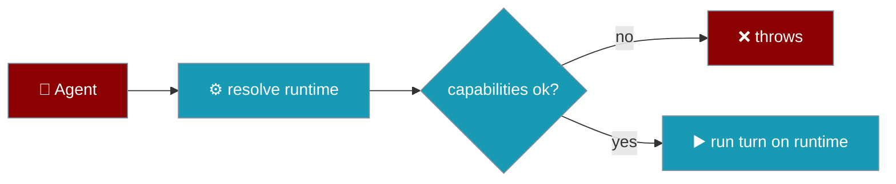

`runtime` hands the whole turn to a registered runtime instead of running the local chat loop.



## Quick Start

<Steps>

<Step title="Use the builtin runtime">
```typescript
import { Agent } from 'praisonai';

const agent = new Agent({ instructions: 'Delegated', runtime: true });
await agent.chat('Do the work');
```
`runtime: true` selects `DEFAULT_RUNTIME_ID` (`'praisonai'`).
</Step>

<Step title="Name a runtime and require capabilities">
```typescript
import { Agent } from 'praisonai';

const agent = new Agent({
  instructions: 'Streamed',
  runtime: { runtime: 'praisonai', requiredCapabilities: ['streaming'] },
});
```
</Step>

</Steps>

---

## `AgentRuntimeConfig`

| Field | Type | Notes |
|---|---|---|
| `runtime` | `string` | Runtime id. Defaults to `DEFAULT_RUNTIME_ID` (`'praisonai'`). |
| `requiredCapabilities` | `string[]` | Checked before the agent is built; a missing capability throws. |
| `configOverrides` | `Record<string, unknown>` | Runtime-specific options forwarded on every turn. |
| `metadata` | `Record<string, unknown>` | Free-form metadata. |

`runtime` accepts `true`, a string id, an `AgentRuntimeConfig` object (snake_case keys accepted), or an object that already satisfies `AgentRuntimeProtocol`.

## When it throws

<Warning>
```text
# a required capability the runtime does not report
Error: Runtime 'praisonai' does not provide the required capability: streaming.
  It reports: (none).

# runtime combined with backend or runOn (both say where the loop runs)
TypeError: Agent(runtime, backend/runOn) sets where the loop runs twice. ...

# an invalid runtime type
TypeError: Invalid runtime type: number. Expected boolean, string, object, or an AgentRuntimeProtocol instance.
```
</Warning>

`runtime` and `backend` / `runOn` answer the same question — where the loop runs — so naming both is rejected as a contradiction.

## Reading the resolved runtime

```typescript
import { Agent } from 'praisonai';

const agent = new Agent({ instructions: 'x', runtime: true });
console.log(agent.getRuntime()); // the resolved runtime, or undefined
```

## Related

<CardGroup cols={2}>
  <Card title="Placement" icon="server" href="/js/placement">
    backend / runOn / toolsRunOn
  </Card>
  <Card title="Agent" icon="robot" href="/js/agent">
    Constructor options
  </Card>
</CardGroup>
