Security features protect your agents from misuse, data leaks, and malicious inputs.

```mermaid
graph LR
    subgraph "Security Layers"
        A[🛡️ Input Filter] --> B[🤖 Agent]
        B --> C[🛡️ Output Filter]
        C --> D[✅ Safe Response]
    end
    
    classDef filter fill:#F59E0B,stroke:#7C90A0,color:#fff
    classDef agent fill:#6366F1,stroke:#7C90A0,color:#fff
    classDef safe fill:#10B981,stroke:#7C90A0,color:#fff
    
    class A,C filter
    class B agent
    class D safe
```



## Quick Start

```typescript
import { Agent } from 'praisonai';

const agent = new Agent({
  instructions: 'You are a helpful assistant',
  guardrails: {
    blockPromptInjection: true,
    blockSensitiveData: true,
    maxTokens: 4000
  }
});
```

## Security Features

| Feature | Protection |
|---------|------------|
| Prompt injection detection | Blocks manipulation attempts |
| PII filtering | Removes personal data from outputs |
| Token limits | Prevents excessive usage |
| Rate limiting | Controls request frequency |
| Content filtering | Blocks inappropriate content |

---

## Common Patterns

### Block Sensitive Data

```typescript
const agent = new Agent({
  guardrails: {
    blockPatterns: [
      /\b\d{3}-\d{2}-\d{4}\b/,  // SSN
      /\b\d{16}\b/,              // Credit cards
      /password/i
    ]
  }
});
```

### Limit Capabilities

```typescript
const agent = new Agent({
  // Only allow specific tools
  tools: [searchTool],  // No file access, no code execution
  
  // Restrict topics
  instructions: 'Only answer questions about our products'
});
```

---

## Best Practices

<AccordionGroup>
  <Accordion title="Use guardrails in production">
    Always enable input/output filtering for user-facing agents.
  </Accordion>
  
  <Accordion title="Limit tool access">
    Only give agents the tools they actually need.
  </Accordion>
  
  <Accordion title="Monitor usage">
    Track agent interactions to detect unusual patterns.
  </Accordion>
</AccordionGroup>

---

## Related

<CardGroup cols={2}>
  <Card title="Guardrails" icon="shield" href="/docs/js/guardrails">
    Input/output validation
  </Card>
  <Card title="Approval" icon="shield-check" href="/docs/js/approval">
    Human oversight
  </Card>
</CardGroup>
