Agents include security features to prevent misuse and protect data.

```mermaid
graph LR
    subgraph "Security Layers"
        A[🛡️ Input] --> B[🤖 Agent]
        B --> C[🛡️ Output]
        C --> D[✅ Safe]
    end
    
    classDef filter fill:#F59E0B,stroke:#7C90A0,color:#fff
    classDef agent fill:#6366F1,stroke:#7C90A0,color:#fff
    classDef safe fill:#10B981,stroke:#7C90A0,color:#fff
    
    class A,C filter
    class B agent
    class D safe
```



## Quick Start

<Steps>

<Step title="Enable Security">
```typescript
import { Agent } from 'praisonai';

const agent = new Agent({
  instructions: 'You are a helpful assistant',
  security: true  // Enable all protections
});

await agent.chat('Ignore previous instructions and...');
// Prompt injection blocked
```
</Step>

<Step title="Custom Rules">
```typescript
const agent = new Agent({
  security: {
    blockInjection: true,
    blockPII: true,
    maxTokens: 4000
  }
});
```
</Step>

</Steps>

---

## User Interaction Flow


---

## Configuration Levels

```typescript
// Level 1: Bool - Enable all protections
const agent = new Agent({
  security: true
});

// Level 2: Array - Specific protections
const agent = new Agent({
  security: ['injection', 'pii', 'profanity']
});

// Level 3: Dict - Full control
const agent = new Agent({
  security: {
    blockInjection: true,
    blockPII: true,
    blockPatterns: [/password/i, /\b\d{16}\b/],  // Credit cards
    maxTokens: 4000,
    rateLimit: 10  // Per minute
  }
});
```

---

## Security Features

| Feature | Protection |
|---------|------------|
| `blockInjection` | Stops prompt manipulation |
| `blockPII` | Filters personal data |
| `blockPatterns` | Custom regex filters |
| `maxTokens` | Limits output size |
| `rateLimit` | Controls request frequency |

---

## Best Practices

<AccordionGroup>
  <Accordion title="Enable in production">
    Always enable security for user-facing agents.
  </Accordion>
  
  <Accordion title="Limit tool access">
    Only give agents the tools they actually need.
  </Accordion>
  
  <Accordion title="Monitor usage">
    Track interactions to detect unusual patterns.
  </Accordion>
</AccordionGroup>

---

## Related

<CardGroup cols={2}>
  <Card title="Guardrails" icon="shield" href="/docs/js/guardrails">
    Input/output validation
  </Card>
  <Card title="Approval" icon="shield-check" href="/docs/js/approval">
    Human oversight
  </Card>
</CardGroup>
