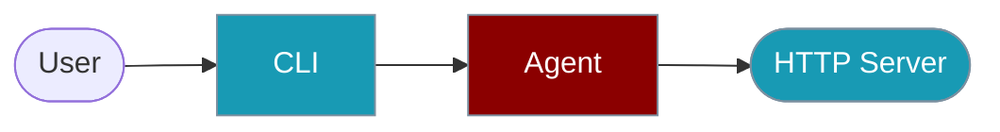

Run Agent HTTP servers from the command line.




Run AI agent servers from the command line.

## Quick Start

<Steps>

<Step title="Simple Usage">

```bash
praisonai-ts server start --port 3000 --instructions "You are helpful"
```

</Step>

<Step title="With Configuration">

```bash
praisonai-ts server start --framework express --port 3000 --streaming
```

</Step>

</Steps>

---

## Commands

### Start Server

```bash
# Start HTTP server
praisonai-ts server start \
  --port 3000 \
  --instructions "You are a helpful assistant"

# With specific framework
praisonai-ts server start \
  --framework express \
  --port 3000

# With streaming
praisonai-ts server start \
  --streaming \
  --cors "*"
```

## Options

| Option | Type | Default | Description |
|--------|------|---------|-------------|
| `--port` | number | `3000` | Server port |
| `--framework` | string | `http` | Framework (http, express, hono, fastify) |
| `--instructions` | string | - | Agent instructions |
| `--model` | string | `gpt-4o` | Model to use |
| `--streaming` | boolean | `false` | Enable streaming |
| `--cors` | string | - | CORS origin |

## Examples

### Express Server

```bash
praisonai-ts server start \
  --framework express \
  --port 3000 \
  --instructions "You are a helpful API assistant" \
  --streaming
```

### With Tools

```bash
praisonai-ts server start \
  --port 3000 \
  --tools calculator,search \
  --streaming
```

## Environment Variables

| Variable | Required | Description |
|----------|----------|-------------|
| `OPENAI_API_KEY` | Yes | For the agent |
| `PORT` | No | Server port |

## Related

<CardGroup cols={2}>
  <Card title="Server Adapters" icon="server" href="/docs/js/server-adapters">
    Express, Hono, Fastify
  </Card>
  <Card title="Agent" icon="robot" href="/docs/js/agent">
    Agent configuration
  </Card>
</CardGroup>
