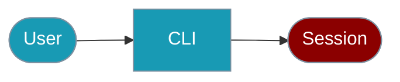

The `praisonai-ts` CLI provides commands for managing conversation sessions.



## Quick Start

<Steps>

<Step title="Simple Usage">

```bash
praisonai-ts session list
```

</Step>

<Step title="With Configuration">

```bash
praisonai-ts chat "Hello" --session my-session
```

</Step>

</Steps>

---

## List Sessions

```bash
# List all sessions
praisonai-ts session list

# Get JSON output
praisonai-ts session list --json
```

## Create Session

```bash
# Create a new session
praisonai-ts session create

# Create with custom ID
praisonai-ts session create my-session
```

## Get Session Details

```bash
# Get session details
praisonai-ts session get my-session --json
```

## Delete Session

```bash
# Delete a session
praisonai-ts session delete my-session
```

## Export Session

```bash
# Export session data
praisonai-ts session export my-session --json
```

## Chat with Session

```bash
# Chat with session continuity
praisonai-ts chat "Hello" --session my-session
praisonai-ts chat "What did I just say?" --session my-session
```

## SDK Usage

For programmatic session management:

```typescript
import { SessionManager } from 'praisonai';

const sessions = new SessionManager();

// Create session
const session = await sessions.create('my-session');

// Get session
const existing = await sessions.get('my-session');

// List sessions
const all = await sessions.list();

// Delete session
await sessions.delete('my-session');
```

For more details, see the [Sessions SDK documentation](/docs/js/sessions).

## Related

<CardGroup cols={2}>
  <Card title="Sessions" icon="clock-rotate-left" href="/docs/js/sessions">Session SDK</Card>
  <Card title="Agent CLI" icon="terminal" href="/docs/js/agent-cli">Agent commands</Card>
</CardGroup>
