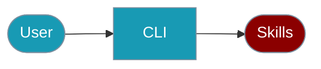

The `praisonai-ts` CLI provides commands for managing agent skills.



## Quick Start

<Steps>

<Step title="Simple Usage">

```bash
praisonai-ts skills list
```

</Step>

<Step title="With Configuration">

```bash
praisonai-ts skills validate ./my-skill
```

</Step>

</Steps>

---

## List Skills

```bash
# List all available skills
praisonai-ts skills list

# Get JSON output
praisonai-ts skills list --json
```

## Discover Skills

```bash
# Discover skills in a directory
praisonai-ts skills discover ./skills

# Discover in default locations
praisonai-ts skills discover
```

## Validate Skills

```bash
# Validate a skill
praisonai-ts skills validate ./my-skill

# Validate with JSON output
praisonai-ts skills validate ./my-skill --json
```

## Get Skill Info

```bash
# Get information about a skill
praisonai-ts skills info my-skill
```

## Skill Locations

Skills are discovered in these locations (in order of precedence):
1. `./.praison/skills/` - Project-level skills
2. `~/.praisonai/skills/` - User-level skills
3. `/etc/praison/skills/` - System-level skills

## SDK Usage

For programmatic skill management:

```typescript
import { SkillManager } from 'praisonai';

const manager = new SkillManager();

// Discover skills
const skills = await manager.discover('./skills');

// Load a skill
const skill = await manager.load('my-skill');

// Validate a skill
const isValid = await manager.validate('./my-skill');
```

For more details, see the [Skills SDK documentation](/docs/js/skills).

## Related

<CardGroup cols={2}>
  <Card title="Skills" icon="graduation-cap" href="/docs/js/skills">Skills SDK</Card>
  <Card title="Agent" icon="robot" href="/docs/js/agent">Agent configuration</Card>
</CardGroup>
