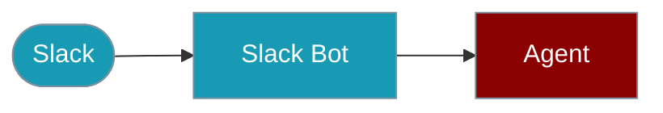

Build intelligent Slack bots that can respond to messages, handle mentions, and execute tasks.




## Quick Start

<Steps>

<Step title="Simple Usage">

```typescript
import { Agent, createSlackBot } from 'praisonai-ts';

// Create an agent
const agent = new Agent({
  name: 'SlackAssistant',
  instructions: 'You are a helpful Slack assistant.',
});

// Create Slack bot
const bot = createSlackBot({
  botToken: process.env.SLACK_BOT_TOKEN!,
  signingSecret: process.env.SLACK_SIGNING_SECRET!,
});

// Handle messages
bot.onMessage(async (message) => {
  const response = await agent.chat(message.text);
  return { text: response, threadTs: message.ts };
});

// Start the bot
bot.listen(3000);
```

</Step>

<Step title="With Configuration">

Configure signing secrets, Socket Mode, and event handlers — see sections below.

</Step>

</Steps>

---

## Configuration

```typescript
import { createSlackBot } from 'praisonai-ts';

const bot = createSlackBot({
  // Required
  botToken: process.env.SLACK_BOT_TOKEN!,
  
  // For webhook mode (recommended for production)
  signingSecret: process.env.SLACK_SIGNING_SECRET!,
  
  // For Socket Mode (development)
  appToken: process.env.SLACK_APP_TOKEN,
  socketMode: true,
});
```

## Event Handlers

### Message Handler

```typescript
bot.onMessage(async (message) => {
  // message.channel - Channel ID
  // message.user - User ID
  // message.text - Message text
  // message.ts - Timestamp
  // message.threadTs - Thread timestamp (if in thread)
  
  const response = await agent.chat(message.text);
  
  return {
    text: response,
    threadTs: message.ts, // Reply in thread
  };
});
```

### App Mention Handler

```typescript
bot.onAppMention(async (message) => {
  // Triggered when bot is @mentioned
  const response = await agent.chat(message.text);
  return { text: response };
});
```

### Reaction Handler

```typescript
bot.onReactionAdded(async (event) => {
  if (event.reaction === 'eyes') {
    // Process message when 👀 reaction is added
    console.log('Processing message:', event.item.ts);
  }
});
```

## Rich Responses

### With Blocks

```typescript
bot.onMessage(async (message) => {
  return {
    text: 'Here are the results:',
    blocks: [
      {
        type: 'section',
        text: {
          type: 'mrkdwn',
          text: '*Results*\n• Item 1\n• Item 2',
        },
      },
      {
        type: 'actions',
        elements: [
          {
            type: 'button',
            text: { type: 'plain_text', text: 'View More' },
            action_id: 'view_more',
          },
        ],
      },
    ],
  };
});
```

## Socket Mode (Development)

For local development without exposing a public URL:

```typescript
const bot = createSlackBot({
  botToken: process.env.SLACK_BOT_TOKEN!,
  appToken: process.env.SLACK_APP_TOKEN!,
  socketMode: true,
});

// No need to call listen() - socket mode connects automatically
await bot.start();
```

## Webhook Mode (Production)

For production deployments:

```typescript
const bot = createSlackBot({
  botToken: process.env.SLACK_BOT_TOKEN!,
  signingSecret: process.env.SLACK_SIGNING_SECRET!,
});

// Start HTTP server
bot.listen(3000);
```

## With Tools

```typescript
const agent = new Agent({
  name: 'SlackAssistant',
  instructions: 'You help with tasks in Slack.',
  tools: [
    {
      name: 'search_docs',
      description: 'Search documentation',
      execute: async ({ query }) => {
        // Search implementation
        return { results: ['doc1', 'doc2'] };
      },
    },
  ],
});

bot.onMessage(async (message) => {
  const response = await agent.chat(message.text);
  return { text: response };
});
```

## Environment Variables

| Variable | Required | Description |
|----------|----------|-------------|
| `SLACK_BOT_TOKEN` | Yes | Bot token (xoxb-...) |
| `SLACK_SIGNING_SECRET` | Webhook | Signing secret |
| `SLACK_APP_TOKEN` | Socket | App token (xapp-...) |
| `OPENAI_API_KEY` | Yes | For the agent |

## Slack App Setup

1. Create a Slack App at https://api.slack.com/apps
2. Enable **Socket Mode** or configure **Event Subscriptions**
3. Add bot scopes: `chat:write`, `app_mentions:read`, `channels:history`
4. Install to workspace
5. Copy tokens to environment variables

## Best Practices

1. **Use threads** - Reply in threads to keep channels clean
2. **Handle errors gracefully** - Return friendly error messages
3. **Rate limit** - Respect Slack's rate limits
4. **Log interactions** - Track usage for debugging

## Related

<CardGroup cols={2}>
  <Card title="Agent" icon="robot" href="/docs/js/agent">Core agent docs</Card>
  <Card title="Tools" icon="wrench" href="/docs/js/tools">Adding tools</Card>
</CardGroup>