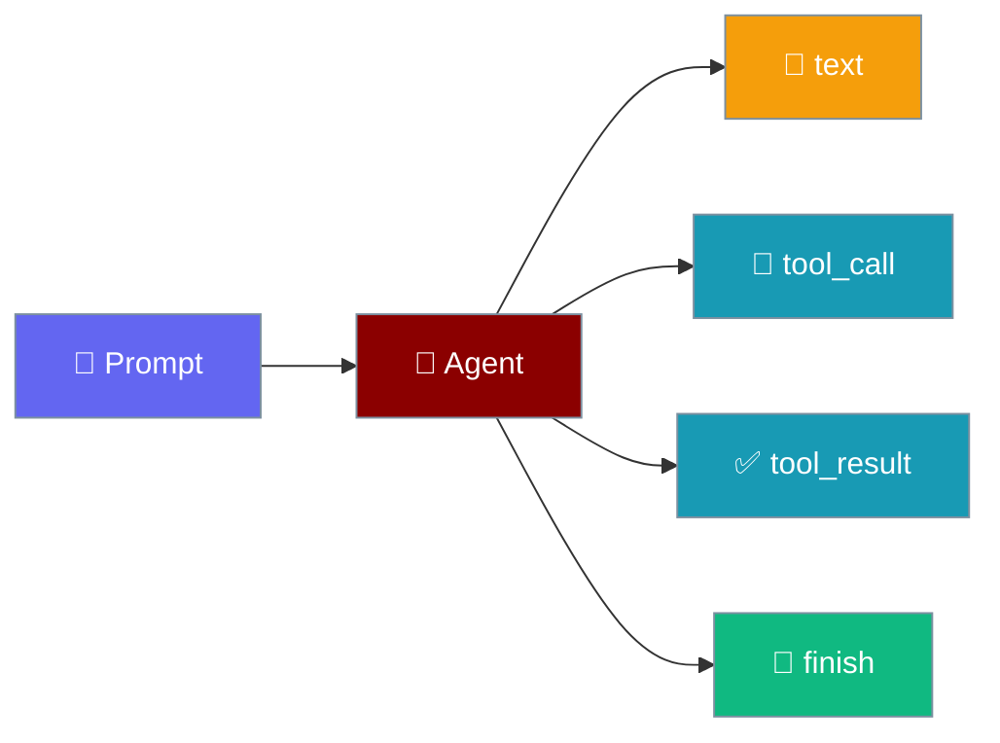
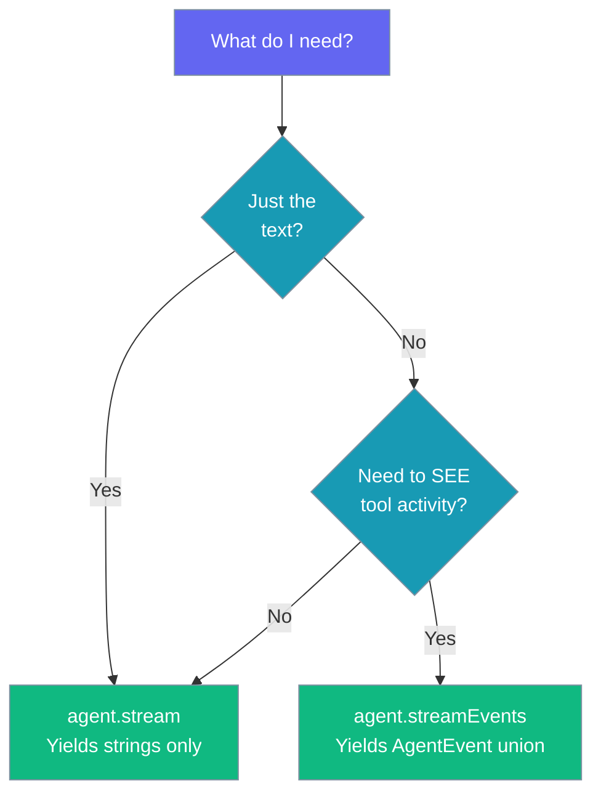

`agent.streamEvents()` yields a typed union — text tokens, tool calls, tool results, and terminal events — in the exact order the agent produced them, so a UI can *show* tool activity instead of inferring it from prose.



## Quick Start

<Steps>
<Step title="Consume the event stream">
One agent, one tool, one `for await` — switch on `event.type`.

```typescript
import { Agent } from 'praisonai';

function getWeather(city: string): string {
  return `Weather in ${city}: 22°C, sunny`;
}

const agent = new Agent({
  instructions: 'You are a weather assistant',
  llm: 'gpt-4o-mini',
  stream: true,
  tools: [getWeather],
});

for await (const event of agent.streamEvents('What is the weather in Paris?')) {
  switch (event.type) {
    case 'text':        process.stdout.write(event.delta); break;
    case 'tool_call':   console.log(`\n→ ${event.name}(${JSON.stringify(event.args)})`); break;
    case 'tool_result': console.log(`  ${event.ok ? '✓' : '✗'} ${event.output}`); break;
    case 'finish':      console.log(`\n[done]`); break;
    case 'error':       console.error(event.error); break;
  }
}
```
</Step>
</Steps>

---

## The Event Union

`streamEvents()` yields the `AgentEvent` discriminated union — five variants, keyed on `type`.

| Variant | Fields | Emitted when |
|---------|--------|--------------|
| `text` | `delta: string` | The model emits a token. |
| `tool_call` | `callId: string`, `name: string`, `args: Record<string, unknown>` | A tool is *about to* run. Announced **before** it runs so a UI can render a call-in-progress row. |
| `tool_result` | `callId: string`, `name: string`, `ok: boolean`, `output: string` | A tool finished, threw, or was denied by the approval gate. |
| `finish` | `text: string` | The run completed. |
| `error` | `error: Error` | The run errored out. |

<Warning>
**Never infer success from a non-empty `output`.** A tool that failed with a message is byte-identical to one that succeeded with a message. `ok: false` is emitted on both failure paths — a thrown error and an approval-gate denial. If your UI treats "we got a string back" as a green checkmark, a silently-broken tool will look like a normal answer.
</Warning>

---

## Pairing Calls to Results with `callId`

`callId` is the provider's id for the invocation and is the only key that may pair a `tool_result` to its `tool_call`.

Matching by position holds only while exactly one call is in flight, and silently attributes the wrong output the moment that stops being true.

```typescript
const inFlight = new Map<string, { name: string; args: unknown }>();

for await (const event of agent.streamEvents(prompt)) {
  if (event.type === 'tool_call') {
    inFlight.set(event.callId, { name: event.name, args: event.args });
  } else if (event.type === 'tool_result') {
    const call = inFlight.get(event.callId);
    inFlight.delete(event.callId);
    renderRow(call!, event);
  }
}
```

---

## Order Matters

Structured events share the same queue as the text, which keeps a tool call in its true position.

On a separate channel a call could arrive before the sentence introducing it, and a reader cannot tell a reordered transcript from a model that genuinely said things in that order.

```typescript
// A transcript rendered in event order reads exactly as it happened:
//
//   Checking.                 ← text
//   → getWeather({"city":"Paris"})   ← tool_call
//     ✓ Weather in Paris: 22°C, sunny  ← tool_result
//   It is 22°C and sunny in Paris.   ← text
//   [done]                    ← finish
```

---

## `stream()` vs `streamEvents()`

Use `stream()` for text-only output; use `streamEvents()` when the UI must render tool activity.



`stream()` filters on `type === 'text'` internally, so widening the `AgentEvent` union does not affect it — text-only consumers are unaffected by this change.

---

## Upgrading an Exhaustive `switch`

Widening a union is source-breaking for an exhaustive `switch`.

A consumer that handled `text`/`finish`/`error` and treated everything else as an error will now see `tool_call`/`tool_result` on the default branch. Add cases (or ignore the new variants explicitly) before upgrading.

```typescript
for await (const event of agent.streamEvents(prompt)) {
  switch (event.type) {
    case 'text':   process.stdout.write(event.delta); break;
    case 'finish': done(event.text); break;
    case 'error':  fail(event.error); break;
    default:       /* tool_call, tool_result — ignore or handle */ break;
  }
}
```

---

## Cancelling a Stream

Pass an `AbortSignal` through `AgentStreamOptions.signal` to stop generation when the user leaves the screen.

```typescript
const controller = new AbortController();

// Later, when the user navigates away:
// controller.abort();

for await (const event of agent.streamEvents(prompt, { signal: controller.signal })) {
  if (event.type === 'text') process.stdout.write(event.delta);
}
```

Breaking out of the `for await` loop also aborts automatically — the iterator's `return()` stops the in-flight provider request so no further tokens are generated or billed.

---

## Best Practices

<AccordionGroup>
  <Accordion title="Show ok in the UI, not the output length">
    The whole point of `ok` is that output length is not a signal. Render a checkmark or an error state from `event.ok`, never from whether `event.output` is non-empty.
  </Accordion>

  <Accordion title="Render tool_call immediately">
    `tool_call` is emitted before the tool runs. Render a call-in-progress row the moment it arrives so the user knows work is happening.
  </Accordion>

  <Accordion title="Match by callId from day one">
    Position-matching works right up until the day two calls are in flight at once, then it silently attributes the wrong output. Key a `Map` on `callId` from the start.
  </Accordion>

  <Accordion title="Cancel long streams">
    Pass an `AbortSignal` via `AgentStreamOptions.signal` when the user leaves the screen, or break the `for await` loop. Both stop the provider request so tokens are no longer generated or billed.
  </Accordion>
</AccordionGroup>

---

## Related

<CardGroup cols={2}>
  <Card title="Streaming" icon="wave-pulse" href="/js/streaming">
    Stream text token-by-token
  </Card>
  <Card title="Mobile Entry" icon="mobile" href="/js/mobile-entry">
    Webview-safe bundle from praisonai/mobile
  </Card>
  <Card title="Events (listener API)" icon="ear-listen" href="/js/events">
    The agent.on(...) listener style
  </Card>
  <Card title="Agent" icon="robot" href="/js/agent">
    Full agent configuration
  </Card>
</CardGroup>
