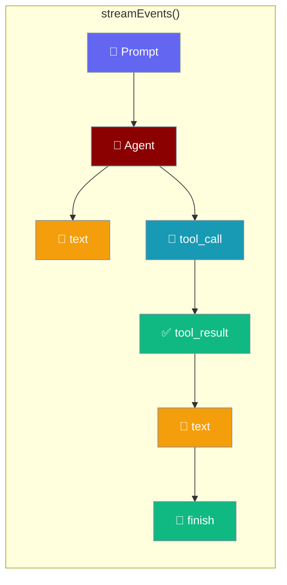
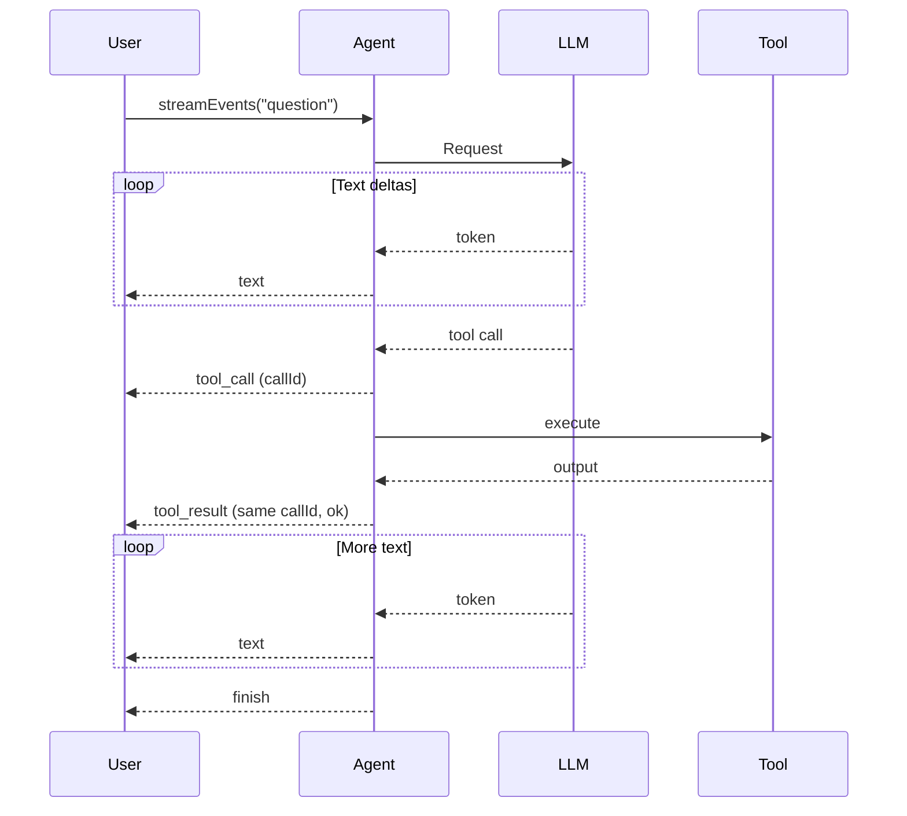
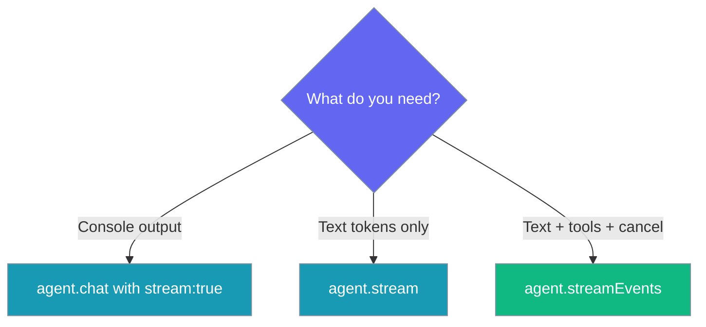

Stream typed events (`text`, `tool_call`, `tool_result`, `finish`, `error`) instead of just token text, so a UI can show tool activity as it happens.



## Quick Start

<Steps>
<Step title="See tools happening live">
Iterate the event stream and switch on `event.type` to render text, tool calls, and results as they arrive.

```typescript
import { Agent } from 'praisonai';

function getWeather(city: string): string {
  return `Weather in ${city}: 22°C, sunny`;
}

const agent = new Agent({
  instructions: 'You are a helpful assistant',
  tools: [getWeather],
});

for await (const event of agent.streamEvents('What is the weather in Paris?')) {
  if (event.type === 'text')        process.stdout.write(event.delta);
  else if (event.type === 'tool_call')   console.log(`\n[tool] ${event.name}(${JSON.stringify(event.args)})`);
  else if (event.type === 'tool_result') console.log(`[tool] ${event.name} -> ${event.ok ? 'ok' : 'fail'}: ${event.output}`);
  else if (event.type === 'finish')      console.log(`\n[done] ${event.text}`);
}
```
</Step>

<Step title="Cancel a turn">
Pass an `AbortController` signal to stop generation mid-turn — or just break the `for await` loop, which aborts the upstream provider request automatically.

```typescript
import { Agent } from 'praisonai';

const agent = new Agent({ instructions: 'You are a helpful assistant' });
const controller = new AbortController();

setTimeout(() => controller.abort(), 2000);  // Cancel after 2 seconds

for await (const event of agent.streamEvents('Write a long essay', { signal: controller.signal })) {
  if (event.type === 'text') process.stdout.write(event.delta);
  if (event.type === 'finish') break;  // Breaking also aborts upstream generation
}
```
</Step>
</Steps>

---

## How It Works

Structured events share the same internal queue as text deltas, so tool activity is reported in its true position in the response.



---

## The Five Event Types

Every event is a member of the `AgentEvent` discriminated union — switch on `type` to narrow the fields.

| Event | Fields | Meaning |
|-------|--------|---------|
| `text` | `delta: string` | A token chunk. Concatenate to build the reply. |
| `tool_call` | `callId, name, args` | A tool is about to run. |
| `tool_result` | `callId, name, ok, output` | The tool finished. **`ok` is the only success signal** — never infer success from a non-empty `output`. |
| `finish` | `text: string` | The final full response. |
| `error` | `error: Error` | Something threw. Terminal. |

<Note>
Every `tool_result` has a matching `tool_call` with the same `callId`, emitted before it — even when the tool is **denied** at the approval gate, **unregistered**, or receives **malformed** or **non-object** arguments. UIs that pair by `callId` never see an orphan result. **Do not pair by position** — that only works while exactly one call is ever in flight.
</Note>

---

## Choosing a Streaming API

Pick the smallest API that gives you what you need.



| You want | Use |
|----------|-----|
| Console output that "just streams" | `agent.chat(...)` with `stream: true` |
| Just the text tokens as strings | `for await (const tok of agent.stream(prompt))` |
| Text **plus** tool activity, cancellation, custom UI | `for await (const ev of agent.streamEvents(prompt))` |

---

## Common Patterns

### Chat UI that shows tools in progress

Track calls in a `Map` keyed by `callId`, then flip each card from *running* to *ok* or *fail* on the matching result.

```typescript
import { Agent } from 'praisonai';

function getWeather(city: string): string {
  return `Weather in ${city}: 22°C, sunny`;
}

const agent = new Agent({ instructions: 'You are a helpful assistant', tools: [getWeather] });
const cards = new Map<string, { name: string; args: unknown; status: string }>();

for await (const event of agent.streamEvents('Weather in Paris and Tokyo?')) {
  if (event.type === 'tool_call') {
    cards.set(event.callId, { name: event.name, args: event.args, status: 'running' });
  } else if (event.type === 'tool_result') {
    const card = cards.get(event.callId);
    if (card) card.status = event.ok ? 'ok' : 'fail';
  }
  console.log([...cards.values()]);  // Render the tool cards
}
```

### Progress spinner around a slow tool

Narrate `tool_call.name` in a status line, then clear it on the matching `tool_result`.

```typescript
import { Agent } from 'praisonai';

function searchDocs(query: string): string {
  return `Found 3 results for ${query}`;
}

const agent = new Agent({ instructions: 'You are a research assistant', tools: [searchDocs] });

for await (const event of agent.streamEvents('Search the docs for streaming')) {
  if (event.type === 'tool_call')   process.stdout.write(`⏳ Running ${event.name}...`);
  if (event.type === 'tool_result') process.stdout.write(`\r✅ ${event.name} done       \n`);
}
```

---

## Best Practices

<AccordionGroup>
  <Accordion title="Pair by callId, never by position">
    Order is preserved, but positional matching breaks the moment two tools run in one turn. Always key your state on `event.callId` so a `tool_result` finds its `tool_call`.
  </Accordion>

  <Accordion title="Treat ok === false as failure, always">
    A failed tool that returns a friendly `output` looks identical to a success — the `output` is the same shape either way. Only `event.ok === true` means the tool succeeded.
  </Accordion>

  <Accordion title="Break the for await loop to cancel">
    The iterator's `return()` is the language's own abort signal — breaking out of the loop stops upstream generation and billing. Pass `opts.signal` for external cancellation.
  </Accordion>

  <Accordion title="Return objects from tools that expect named args">
    JSON scalars, arrays, or `null` are rejected before execution with `Invalid arguments for tool <name>: expected a JSON object`. Pass an object so arguments map to named parameters.
  </Accordion>
</AccordionGroup>

---

## Related

<CardGroup cols={2}>
  <Card title="Streaming" icon="wave-pulse" href="/js/streaming">
    Token-level text streaming
  </Card>
  <Card title="Callbacks" icon="webhook" href="/js/callbacks">
    Lifecycle callbacks
  </Card>
  <Card title="Approval" icon="shield-check" href="/js/approval">
    Denials also emit paired events
  </Card>
</CardGroup>
