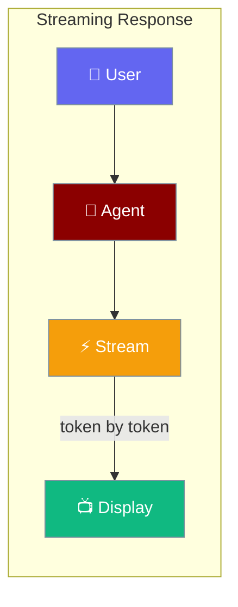
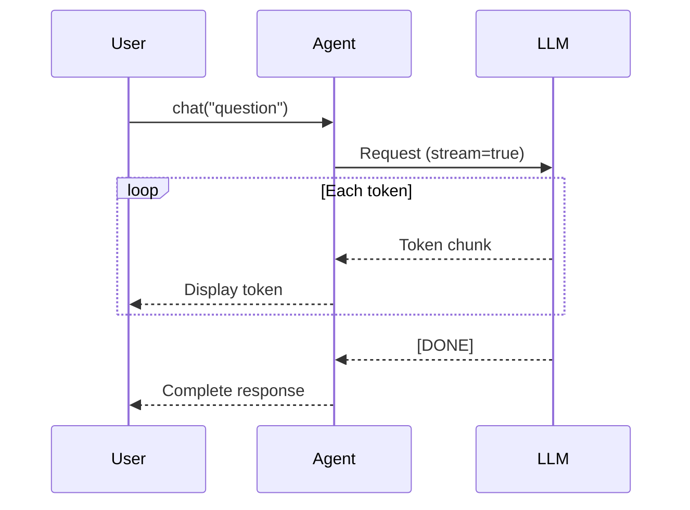

Stream agent responses word-by-word for instant feedback — no waiting for the full response.



## Quick Start

<Steps>
<Step title="Simple Usage">
Streaming is on by default — just create an agent and chat.

```typescript
import { Agent } from 'praisonai';

const agent = new Agent({
  instructions: 'You are a helpful assistant'
});

await agent.chat('Tell me a story about a robot');
// Response streams to the console word by word
```
</Step>

<Step title="With Configuration">
Turn off streaming when you need the complete response at once.

```typescript
import { Agent } from 'praisonai';

const agent = new Agent({
  instructions: 'Summarize text',
  stream: false
});

const response = await agent.chat('Summarize this article...');
console.log(response);  // Complete response returned all at once
```
</Step>

<Step title="Streaming with Tools">
Tool calls are handled automatically — the stream continues after tool execution.

```typescript
import { Agent } from 'praisonai';

function getWeather(city: string): string {
  return `Weather in ${city}: 22°C, sunny`;
}

const agent = new Agent({
  instructions: 'You are a weather assistant',
  stream: true,
  tools: [getWeather]
});

await agent.chat('What is the weather in Paris?');
// Tool executes, then response streams
```
</Step>
</Steps>

---

## How It Works



---

## Configuration Options

| Option | Type | Default | Description |
|--------|------|---------|-------------|
| `stream` | `boolean` | `true` | Enable streaming responses |
| `verbose` | `boolean` | `false` | Show formatted output while streaming |

---

## Common Patterns

### Interactive Chat Application

```typescript
import { Agent } from 'praisonai';
import * as readline from 'readline';

const agent = new Agent({
  instructions: 'You are a helpful assistant',
  stream: true,
  verbose: true
});

const rl = readline.createInterface({ input: process.stdin, output: process.stdout });

async function chat() {
  rl.question('You: ', async (input) => {
    if (input === 'exit') { rl.close(); return; }
    await agent.chat(input);
    chat();
  });
}

chat();
```

### Long-Form Content Generation

```typescript
import { Agent } from 'praisonai';

const writer = new Agent({
  instructions: 'You are a creative writer',
  stream: true
});

// See the story unfold as it is written
await writer.chat('Write a 500-word story about a time-traveling chef');
```

### Batch Processing (Disable Streaming)

```typescript
import { Agent } from 'praisonai';

const agent = new Agent({
  instructions: 'Classify the sentiment of the text as positive, neutral, or negative',
  stream: false  // Faster for batch jobs
});

const texts = ['Great product!', 'It is okay', 'Very disappointed'];
const results = await Promise.all(texts.map(t => agent.chat(t)));
console.log(results);
```

---

## Best Practices

<AccordionGroup>
  <Accordion title="Keep stream: true for user-facing interfaces">
    Streaming dramatically improves perceived performance. Users see responses immediately rather than waiting. Keep it enabled for any chat or interactive application.
  </Accordion>

  <Accordion title="Disable streaming for batch processing">
    When processing many documents or requests without a live user, `stream: false` is faster and simpler — you get back the complete string directly from `chat()`.
  </Accordion>

  <Accordion title="Use verbose for development">
    Set `verbose: true` during development to see formatted streaming output in the console. Disable it in production API endpoints where you only need the return value.
  </Accordion>

  <Accordion title="Streaming works with all providers">
    Every supported LLM provider (OpenAI, Anthropic, Google, Groq, etc.) supports streaming. You do not need to change the provider to enable it.
  </Accordion>
</AccordionGroup>

---

## Related

<CardGroup cols={2}>
  <Card title="Agent" icon="robot" href="/docs/js/agent">
    Full agent configuration
  </Card>
  <Card title="Providers" icon="plug" href="/docs/js/providers">
    LLM provider setup
  </Card>
</CardGroup>
