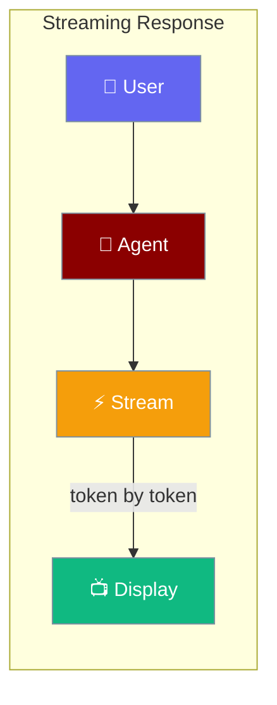
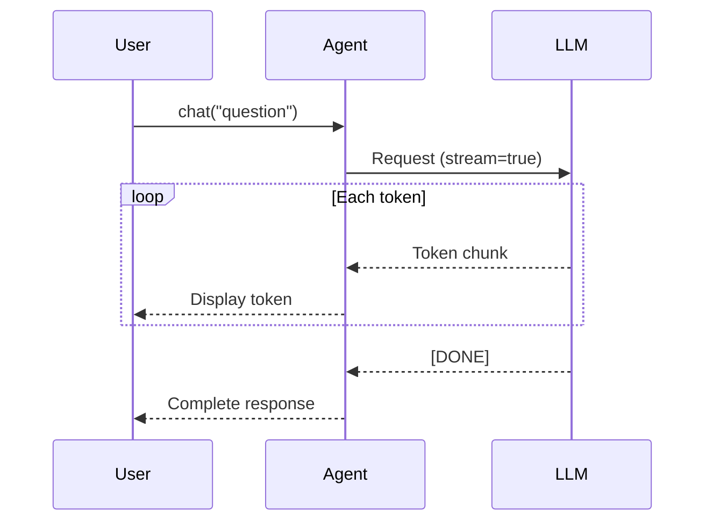
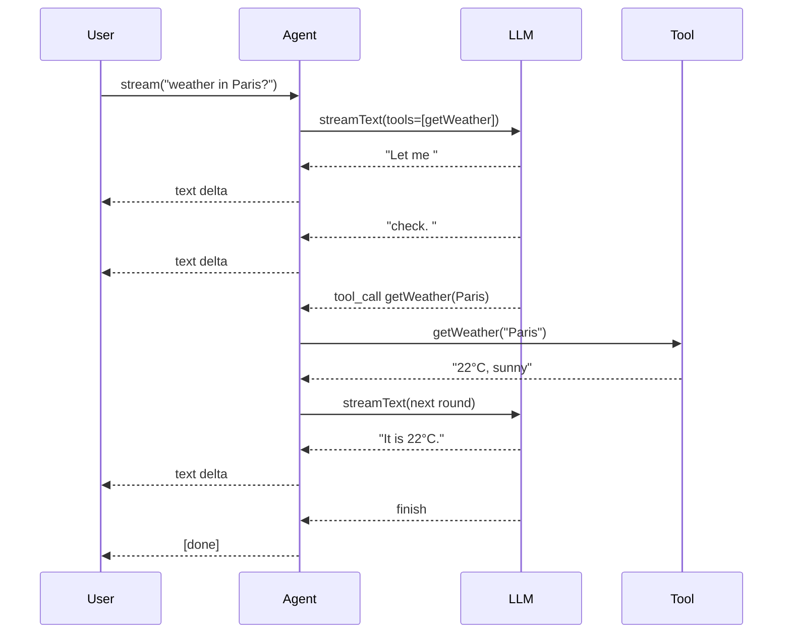
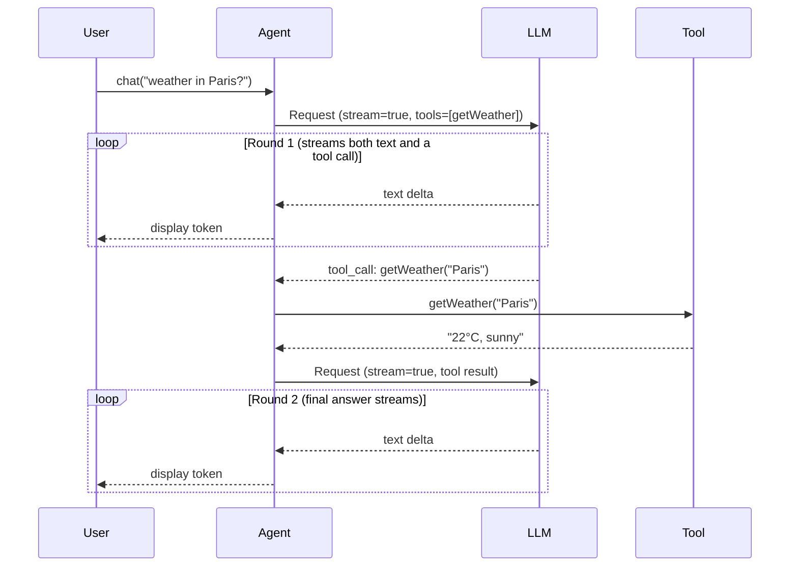

Stream agent responses word-by-word for instant feedback — no waiting for the full response.


```mermaid
graph LR
    subgraph "Streaming Response"
        U[💬 User] --> A[🤖 Agent]
        A --> S[⚡ Stream]
        S -->|token by token| D[📺 Display]
    end

    classDef user fill:#6366F1,stroke:#7C90A0,color:#fff
    classDef agent fill:#8B0000,stroke:#7C90A0,color:#fff
    classDef stream fill:#F59E0B,stroke:#7C90A0,color:#fff
    classDef output fill:#10B981,stroke:#7C90A0,color:#fff

    class U user
    class A agent
    class S stream
    class D output
    classDef agent fill:#8B0000,color:#fff
    classDef tool fill:#189AB4,color:#fff
```

## Quick Start

<Steps>
<Step title="Simple Usage">
Streaming is on by default — just create an agent and chat.

```typescript
import { Agent } from 'praisonai';

const agent = new Agent({
  instructions: 'You are a helpful assistant'
});

await agent.chat('Tell me a story about a robot');
// Response streams to the console word by word
```
</Step>

<Step title="With Configuration">
Turn off streaming when you need the complete response at once.

```typescript
import { Agent } from 'praisonai';

const agent = new Agent({
  instructions: 'Summarize text',
  stream: false
});

const response = await agent.chat('Summarize this article...');
console.log(response);  // Complete response returned all at once
```
</Step>

<Step title="Streaming with Tools">
Tool calls are woven into the same stream — text the model speaks **before** the tool (`"Let me check."`), the tool call itself, and the answer after it all arrive as they happen. This holds on every provider: OpenAI, Anthropic, Google, xAI, Groq, and any AI-SDK backend. Pre-tool commentary is delivered as tokens, not held back until the tool finishes.

```typescript
import { Agent } from 'praisonai';

function getWeather(city: string): string {
  return `Weather in ${city}: 22°C, sunny`;
}

const agent = new Agent({
  instructions: 'You are a weather assistant',
  llm: 'anthropic/claude-3-5-sonnet-latest',  // non-OpenAI provider
  stream: true,
  tools: [getWeather]
});

await agent.chat('What is the weather in Paris?');
// Console:
//   Let me check the weather.     <-- streamed reasoning
//   [getWeather("Paris") runs]     <-- tool executes
//   It is 22°C in Paris.           <-- streamed final answer
```

Iterate `agent.stream()` to observe the pre-tool text in a non-console caller — each `chunk` is a token string.

```typescript
for await (const chunk of agent.stream('What is the weather in Paris?')) {
  process.stdout.write(chunk);
}
```
</Step>
</Steps>

---

## How It Works


```mermaid
sequenceDiagram
    participant User
    participant Agent
    participant LLM

    User->>Agent: chat("question")
    Agent->>LLM: Request (stream=true)
    loop Each token
        LLM-->>Agent: Token chunk
        Agent-->>User: Display token
    end
    LLM-->>Agent: [DONE]
    Agent-->>User: Complete response
```

When tools are configured, the round routes through `streamText` on every provider — text spoken before the tool call streams as tokens, then the tool runs, then the answer after it streams too.


```mermaid
sequenceDiagram
    participant User
    participant Agent
    participant LLM
    participant Tool

    User->>Agent: stream("weather in Paris?")
    Agent->>LLM: streamText(tools=[getWeather])
    LLM-->>Agent: "Let me "
    Agent-->>User: text delta
    LLM-->>Agent: "check. "
    Agent-->>User: text delta
    LLM-->>Agent: tool_call getWeather(Paris)
    Agent->>Tool: getWeather("Paris")
    Tool-->>Agent: "22°C, sunny"
    Agent->>LLM: streamText(next round)
    LLM-->>Agent: "It is 22°C."
    Agent-->>User: text delta
    LLM-->>Agent: finish
    Agent-->>User: [done]
```

---

## Streaming with Tools

Text deltas, tool calls, and tool results interleave on a single loop — the stream never stops just because the agent needs a tool.


```mermaid
sequenceDiagram
    participant User
    participant Agent
    participant LLM
    participant Tool

    User->>Agent: chat("weather in Paris?")
    Agent->>LLM: Request (stream=true, tools=[getWeather])
    loop Round 1 (streams both text and a tool call)
        LLM-->>Agent: text delta
        Agent-->>User: display token
    end
    LLM-->>Agent: tool_call: getWeather("Paris")
    Agent->>Tool: getWeather("Paris")
    Tool-->>Agent: "22°C, sunny"
    Agent->>LLM: Request (stream=true, tool result)
    loop Round 2 (final answer streams)
        LLM-->>Agent: text delta
        Agent-->>User: display token
    end
```

### Bounding the loop

Two knobs bound the run when the model chains many tools.

| Option | Type | Default | Description |
|--------|------|---------|-------------|
| `maxIterations` | `number` | `20` | Maximum tool-call round-trips before the run aborts. |
| `maxToolCallsPerTurn` | `number` | `10` | Maximum tool calls executed in a single round; extras in one round are dropped with a warning. |

```typescript
const agent = new Agent({
  instructions: 'Research assistant',
  stream: true,
  tools: [search, fetchUrl, summarise],
  maxIterations: 30,          // more room for long research chains
  maxToolCallsPerTurn: 5,     // but at most 5 parallel tools per turn
});
```

<Warning>
If the loop still needs another tool round-trip after `maxIterations`, `chat()` throws and `agent.lastStopReason === 'max_steps'`. Wrap in `try/catch` and either raise `maxIterations` or narrow the task.
</Warning>

---

## Configuration Options

| Option | Type | Default | Description |
|--------|------|---------|-------------|
| `stream` | `boolean` | `true` | Enable streaming responses |
| `verbose` | `boolean` | `false` | Show formatted output while streaming |
| `tools` | `Function[]` | `undefined` | Tools available during streaming; text and tool calls interleave |
| `maxIterations` | `number` | `20` | Cap tool-call round-trips in a streaming+tools run |
| `maxToolCallsPerTurn` | `number` | `10` | Cap tool calls executed in a single round |

---

## Common Patterns

### Interactive Chat Application

```typescript
import { Agent } from 'praisonai';
import * as readline from 'readline';

const agent = new Agent({
  instructions: 'You are a helpful assistant',
  stream: true,
  verbose: true
});

const rl = readline.createInterface({ input: process.stdin, output: process.stdout });

async function chat() {
  rl.question('You: ', async (input) => {
    if (input === 'exit') { rl.close(); return; }
    await agent.chat(input);
    chat();
  });
}

chat();
```

### Long-Form Content Generation

```typescript
import { Agent } from 'praisonai';

const writer = new Agent({
  instructions: 'You are a creative writer',
  stream: true
});

// See the story unfold as it is written
await writer.chat('Write a 500-word story about a time-traveling chef');
```

### Batch Processing (Disable Streaming)

```typescript
import { Agent } from 'praisonai';

const agent = new Agent({
  instructions: 'Classify the sentiment of the text as positive, neutral, or negative',
  stream: false  // Faster for batch jobs
});

const texts = ['Great product!', 'It is okay', 'Very disappointed'];
const results = await Promise.all(texts.map(t => agent.chat(t)));
console.log(results);
```

---

## Best Practices

<AccordionGroup>
  <Accordion title="Keep stream: true for user-facing interfaces">
    Streaming dramatically improves perceived performance. Users see responses immediately rather than waiting. Keep it enabled for any chat or interactive application.
  </Accordion>

  <Accordion title="Disable streaming for batch processing">
    When processing many documents or requests without a live user, `stream: false` is faster and simpler — you get back the complete string directly from `chat()`.
  </Accordion>

  <Accordion title="Use verbose for development">
    Set `verbose: true` during development to see formatted streaming output in the console. Disable it in production API endpoints where you only need the return value.
  </Accordion>

  <Accordion title="Streaming works with all providers — including with tools">
    Every supported provider streams — OpenAI, Anthropic, Google, xAI, Groq, and any AI-SDK backend. That includes streaming **while tools are running**: text the model speaks before a `tool_call` is delivered as tokens, not held back until the tool finishes. Setting `stream: false` still works and collapses the round into a single non-streaming call.
  </Accordion>

  <Accordion title="Keep stream: true when you use tools on non-OpenAI providers">
    On Anthropic, Google, xAI, Groq, and any AI-SDK backend, `stream: true` gives you pre-tool commentary as tokens. Setting `stream: false` collapses the round into one non-streaming call and delivers the same text at the end in one lump.
  </Accordion>
</AccordionGroup>

---

## Beyond Text: Structured Events

For UIs that need to show tool activity live, use `streamEvents()` — it yields typed `AgentEvent`s instead of just tokens.

```typescript
import { Agent } from 'praisonai';

const agent = new Agent({ instructions: 'You are a helpful assistant' });

for await (const event of agent.streamEvents('What is the weather in Paris?')) {
  switch (event.type) {
    case 'text':        process.stdout.write(event.delta); break;
    case 'tool_call':   console.log(`\n[tool] ${event.name}`); break;
    case 'tool_result': console.log(`[tool] ${event.ok ? 'ok' : 'fail'}`); break;
    case 'finish':      console.log(`\n[done]`); break;
  }
}
```

<Card title="Streaming Events" icon="wave-square" href="/js/streaming-events">
  Stream tool calls, tool results, and text as structured events
</Card>

---

## Related

<CardGroup cols={2}>
  <Card title="Agent" icon="robot" href="/js/agent">
    Full agent configuration
  </Card>
  <Card title="Providers" icon="plug" href="/js/providers">
    LLM provider setup
  </Card>
</CardGroup>
