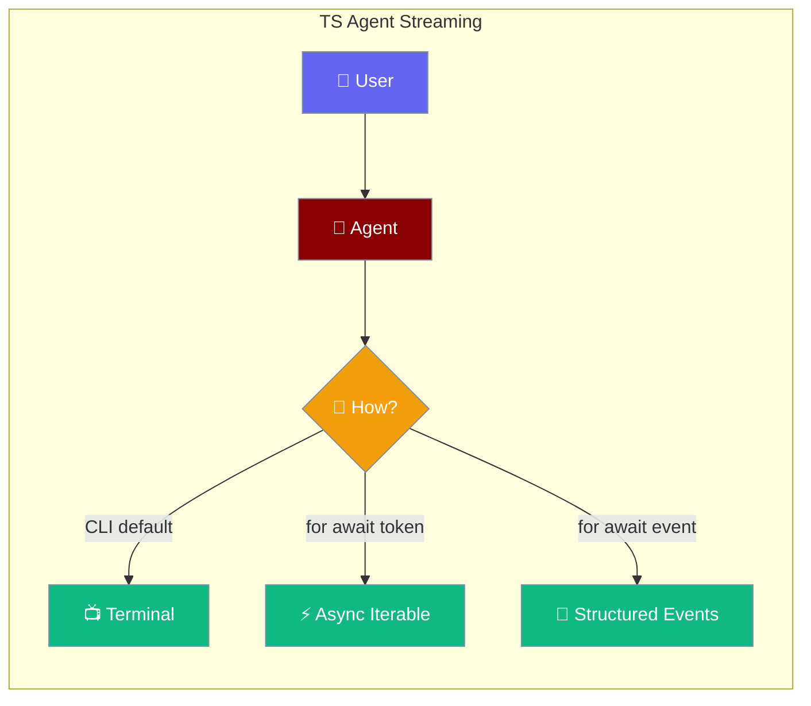
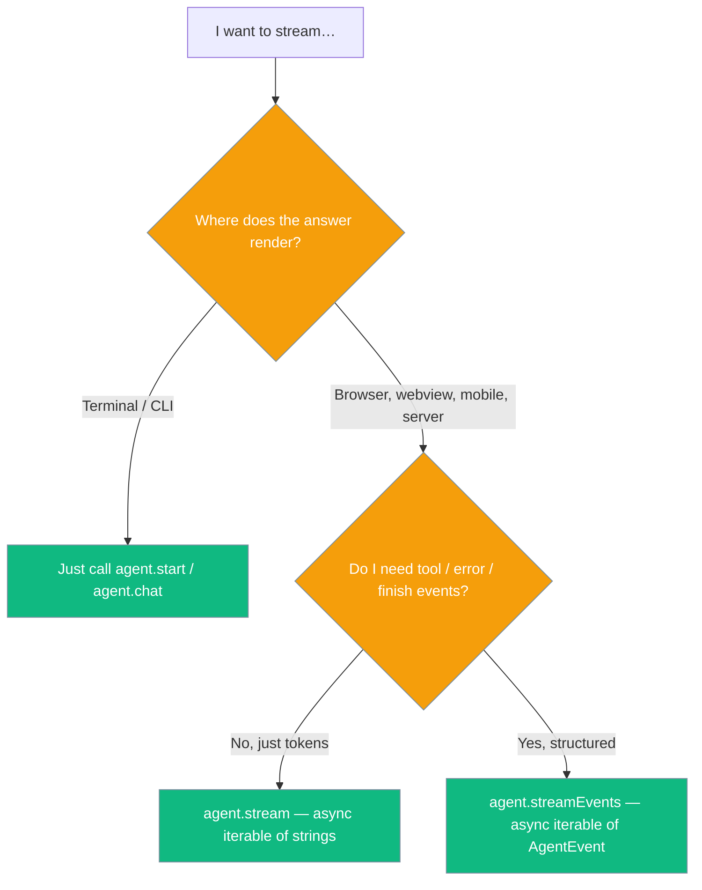
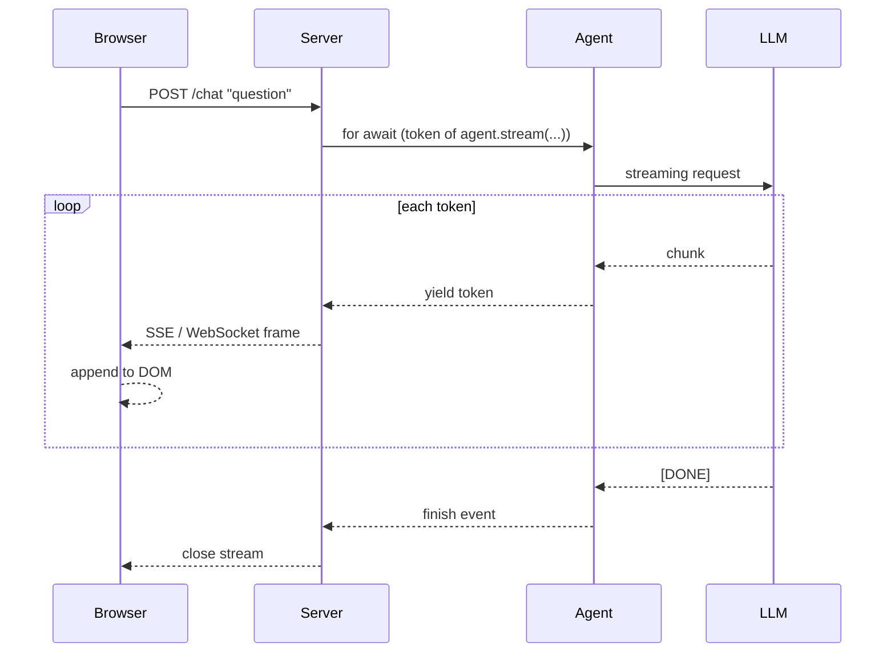
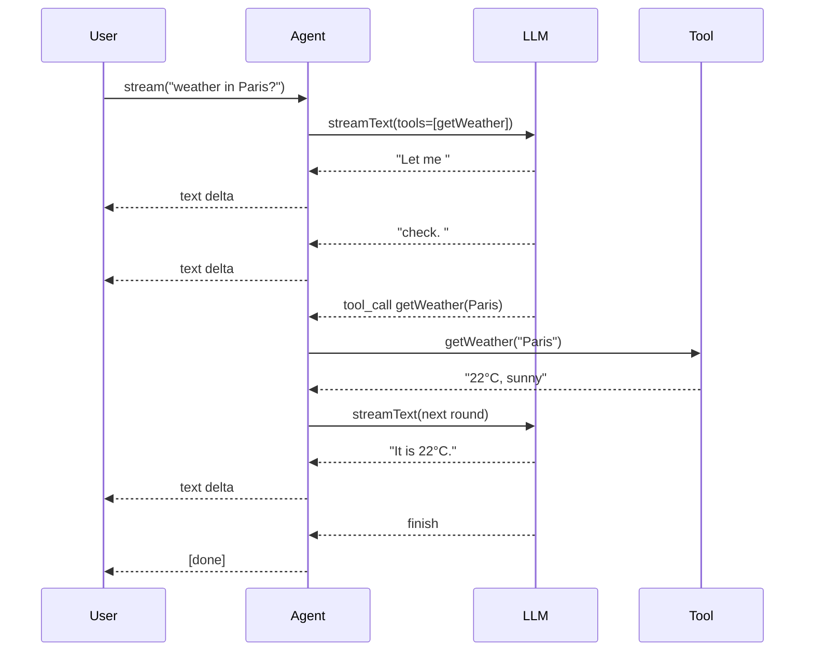
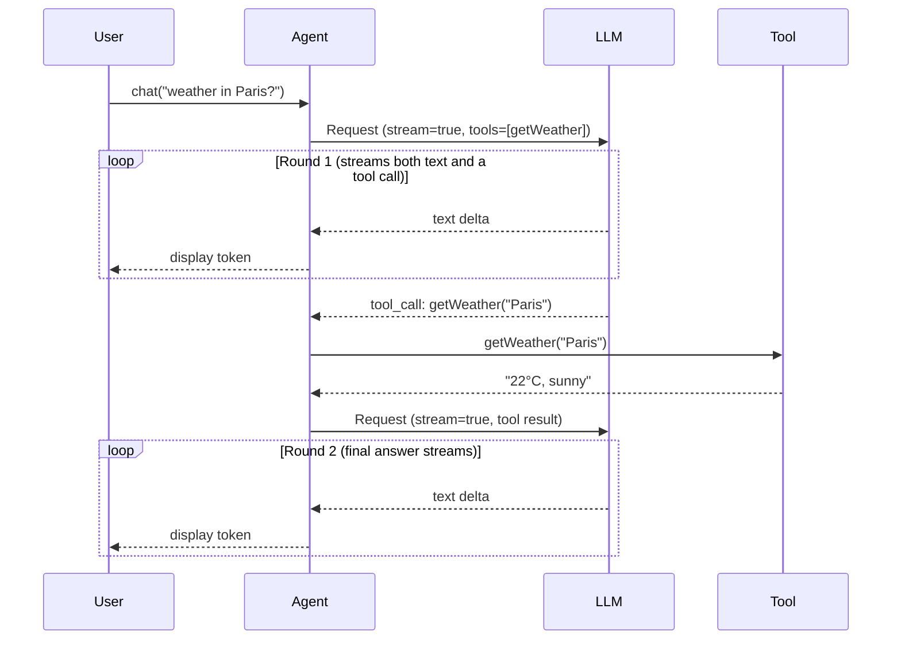
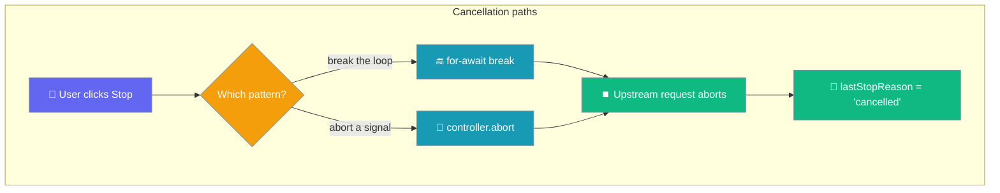

Stream agent responses token-by-token — print to the terminal, or iterate tokens yourself to render them in a browser, webview, mobile app, or server.


```mermaid
graph LR
    subgraph "TS Agent Streaming"
        U[💬 User] --> A[🤖 Agent]
        A --> C{🔀 How?}
        C -->|CLI default| Term[📺 Terminal]
        C -->|for await token| Iter[⚡ Async Iterable]
        C -->|for await event| Evt[📨 Structured Events]
    end

    classDef user fill:#6366F1,stroke:#7C90A0,color:#fff
    classDef agent fill:#8B0000,stroke:#7C90A0,color:#fff
    classDef choice fill:#F59E0B,stroke:#7C90A0,color:#fff
    classDef output fill:#10B981,stroke:#7C90A0,color:#fff

    class U user
    class A agent
    class C choice
    class Term,Iter,Evt output
```

## Which Mode Do I Want?

Pick the surface that matches where the answer renders.


```mermaid
graph TB
    Start[I want to stream…] --> Q1{Where does the answer render?}
    Q1 -->|Terminal / CLI| Default[Just call agent.start / agent.chat]
    Q1 -->|Browser, webview, mobile, server| Q2{Do I need tool / error / finish events?}
    Q2 -->|No, just tokens| StreamM[agent.stream — async iterable of strings]
    Q2 -->|Yes, structured| StreamE[agent.streamEvents — async iterable of AgentEvent]

    classDef q fill:#F59E0B,stroke:#7C90A0,color:#fff
    classDef ans fill:#10B981,stroke:#7C90A0,color:#fff
    class Q1,Q2 q
    class Default,StreamM,StreamE ans
```

## Quick Start

<Steps>
<Step title="Iterate tokens with stream()">
Render tokens live anywhere — the `for await` loop pulls them at its own pace.

```typescript
import { Agent } from 'praisonai';

const agent = new Agent({
  instructions: 'You are a storyteller'
});

for await (const token of agent.stream('Tell me a short story about a robot')) {
  process.stdout.write(token);  // or send to a WebSocket, React state, etc.
}
```
</Step>

<Step title="Terminal default (start / chat)">
On the CLI, streaming is already on — tokens print to the terminal.

```typescript
import { Agent } from 'praisonai';

const agent = new Agent({
  instructions: 'You are a helpful assistant'
});

await agent.chat('Tell me a story about a robot');
// Response streams to the console word by word
```
</Step>

<Step title="Structured events with streamEvents()">
Same agent, structured events — handle text, finish, and error.

```typescript
import { Agent } from 'praisonai';

const agent = new Agent({ instructions: 'You are helpful' });

for await (const event of agent.streamEvents('Hi')) {
  if (event.type === 'text') {
    process.stdout.write(event.delta);
  } else if (event.type === 'finish') {
    console.log('\n\nDone. Full text:', event.text);
  } else if (event.type === 'error') {
    console.error('Stream failed:', event.error);
  }
}
```
</Step>

<Step title="Streaming with Tools">
Tool calls are woven into the same stream — text the model speaks **before** the tool (`"Let me check."`), the tool call itself, and the answer after it all arrive as they happen. This holds on every provider: OpenAI, Anthropic, Google, xAI, Groq, and any AI-SDK backend. Pre-tool commentary is delivered as tokens, not held back until the tool finishes.

```typescript
import { Agent } from 'praisonai';

function getWeather(city: string): string {
  return `Weather in ${city}: 22°C, sunny`;
}

const agent = new Agent({
  instructions: 'You are a weather assistant',
  llm: 'anthropic/claude-3-5-sonnet-latest',  // non-OpenAI provider
  stream: true,
  tools: [getWeather]
});

await agent.chat('What is the weather in Paris?');
// Console:
//   Let me check the weather.     <-- streamed reasoning
//   [getWeather("Paris") runs]     <-- tool executes
//   It is 22°C in Paris.           <-- streamed final answer
```

Iterate `agent.stream()` to observe the pre-tool text in a non-console caller — each `chunk` is a token string.

```typescript
for await (const chunk of agent.stream('What is the weather in Paris?')) {
  process.stdout.write(chunk);
}
```
</Step>

<Step title="Consume Tokens Yourself">
Consume tokens yourself with `agent.stream()` — an async iterator over chunks.

```typescript
import { Agent } from 'praisonai';

const agent = new Agent({ instructions: 'You are a helpful assistant' });

for await (const chunk of agent.stream('Tell me a story about a robot')) {
  process.stdout.write(chunk);
}
```
</Step>

<Step title="Stop a Stream">
Break the loop to stop the request — the provider stops generating and billing immediately.

```typescript
import { Agent } from 'praisonai';

const agent = new Agent({ instructions: 'You are a helpful assistant' });

let tokens = 0;
for await (const chunk of agent.stream('Write a very long essay')) {
  process.stdout.write(chunk);
  if (++tokens === 50) break;  // Auto-aborts the underlying request
}

console.log(agent.lastStopReason);  // 'cancelled'
```

For a UI Stop button, pass an `AbortSignal`:

```typescript
const controller = new AbortController();
document.getElementById('stop')!.onclick = () => controller.abort();

try {
  for await (const chunk of agent.stream('Write a long essay', { signal: controller.signal })) {
    process.stdout.write(chunk);
  }
} catch (err) {
  if (agent.lastStopReason === 'cancelled') {
    console.log('User stopped the stream');
  } else {
    throw err;  // Real error
  }
}
```
</Step>
</Steps>

---

## Cancellation

Break out of the loop to stop the stream cleanly — no more tokens are queued and the in-flight provider request is aborted.

```typescript
let received = '';
for await (const token of agent.stream('Write a very long essay')) {
  received += token;
  if (received.length > 500) break;  // stops the stream cleanly
}
```

You can also pass an `AbortSignal` to cancel a turn from outside the loop.

```typescript
const controller = new AbortController();
setTimeout(() => controller.abort(), 2000);  // stop after 2s

for await (const token of agent.stream('Long essay', { signal: controller.signal })) {
  process.stdout.write(token);
}
```

---

## How It Works


```mermaid
sequenceDiagram
    participant Browser
    participant Server
    participant Agent
    participant LLM

    Browser->>Server: POST /chat "question"
    Server->>Agent: for await (token of agent.stream(...))
    Agent->>LLM: streaming request
    loop each token
        LLM-->>Agent: chunk
        Agent-->>Server: yield token
        Server-->>Browser: SSE / WebSocket frame
        Browser-->>Browser: append to DOM
    end
    LLM-->>Agent: [DONE]
    Agent-->>Server: finish event
    Server-->>Browser: close stream
```

When tools are configured, the round routes through `streamText` on every provider — text spoken before the tool call streams as tokens, then the tool runs, then the answer after it streams too.


```mermaid
sequenceDiagram
    participant User
    participant Agent
    participant LLM
    participant Tool

    User->>Agent: stream("weather in Paris?")
    Agent->>LLM: streamText(tools=[getWeather])
    LLM-->>Agent: "Let me "
    Agent-->>User: text delta
    LLM-->>Agent: "check. "
    Agent-->>User: text delta
    LLM-->>Agent: tool_call getWeather(Paris)
    Agent->>Tool: getWeather("Paris")
    Tool-->>Agent: "22°C, sunny"
    Agent->>LLM: streamText(next round)
    LLM-->>Agent: "It is 22°C."
    Agent-->>User: text delta
    LLM-->>Agent: finish
    Agent-->>User: [done]
```

---

## Streaming with Tools

Text deltas, tool calls, and tool results interleave on a single loop — the stream never stops just because the agent needs a tool.


```mermaid
sequenceDiagram
    participant User
    participant Agent
    participant LLM
    participant Tool

    User->>Agent: chat("weather in Paris?")
    Agent->>LLM: Request (stream=true, tools=[getWeather])
    loop Round 1 (streams both text and a tool call)
        LLM-->>Agent: text delta
        Agent-->>User: display token
    end
    LLM-->>Agent: tool_call: getWeather("Paris")
    Agent->>Tool: getWeather("Paris")
    Tool-->>Agent: "22°C, sunny"
    Agent->>LLM: Request (stream=true, tool result)
    loop Round 2 (final answer streams)
        LLM-->>Agent: text delta
        Agent-->>User: display token
    end
```

### Bounding the loop

Two knobs bound the run when the model chains many tools.

| Option | Type | Default | Description |
|--------|------|---------|-------------|
| `maxIterations` | `number` | `20` | Maximum tool-call round-trips before the run aborts. |
| `maxToolCallsPerTurn` | `number` | `10` | Maximum tool calls executed in a single round; extras in one round are dropped with a warning. |

```typescript
const agent = new Agent({
  instructions: 'Research assistant',
  stream: true,
  tools: [search, fetchUrl, summarise],
  maxIterations: 30,          // more room for long research chains
  maxToolCallsPerTurn: 5,     // but at most 5 parallel tools per turn
});
```

<Warning>
If the loop still needs another tool round-trip after `maxIterations`, `chat()` throws and `agent.lastStopReason === 'max_steps'`. Wrap in `try/catch` and either raise `maxIterations` or narrow the task.
</Warning>

---

## Stop a stream

Two ways to cancel a streaming turn — both stop the upstream provider request so no further tokens are generated or billed.


```mermaid
graph TB
    subgraph "Cancellation paths"
        A[👤 User clicks Stop] --> B{Which pattern?}
        B -->|break the loop| C[🔚 for-await break]
        B -->|abort a signal| D[🛑 controller.abort]
        C --> E[⏹️ Upstream request aborts]
        D --> E
        E --> F[📌 lastStopReason = 'cancelled']
    end

    classDef user fill:#6366F1,stroke:#7C90A0,color:#fff
    classDef choice fill:#F59E0B,stroke:#7C90A0,color:#fff
    classDef action fill:#189AB4,stroke:#7C90A0,color:#fff
    classDef state fill:#10B981,stroke:#7C90A0,color:#fff

    class A user
    class B choice
    class C,D action
    class E,F state
```

### Which one should I use?

| You want to… | Use | Why |
|--------------|-----|-----|
| Stop reading (loop-driven) | `break` in the `for await` | Natural JS pattern — no plumbing needed |
| Wire a UI Stop button | `{ signal: controller.signal }` | External event fires `abort()`, cancels the turn |
| Cancel the whole agent (not just this turn) | `SimpleAgentConfig.signal` | Agent-lifetime — outlives one call |

<Note>
`opts.signal` is **turn-scoped** and independent of the agent-level `SimpleAgentConfig.signal`. Aborting one turn does not disable the agent; the next `stream()` call runs normally.
</Note>

### Tell a Stop from a real error

`agent.lastStopReason` reports why the last run ended:

| Value | Meaning |
|-------|---------|
| `'completed'` | Ran to the end |
| `'cancelled'` | User-initiated abort (Stop button, `break`, or `opts.signal`) |
| `'error'` | Genuine failure (network, provider error, thrown tool) |
| `'max_steps'` | Hit the tool-loop step cap |
| `null` | Hasn't run yet |

```typescript
try {
  for await (const chunk of agent.stream('...', { signal })) { /* ... */ }
} catch (err) {
  if (agent.lastStopReason === 'cancelled') {
    // Silent — user asked for it
  } else {
    reportError(err);  // Real failure
  }
}
```

---

## AgentEvent Reference

`streamEvents()` yields a discriminated union. Switch on `event.type`.

| Event | Fields | When |
|-------|--------|------|
| `text` | `{ type: 'text'; delta: string }` | Each incremental token |
| `tool_call` | `{ type: 'tool_call'; callId: string; name: string; args: Record<string, unknown> }` | A tool is about to run |
| `tool_result` | `{ type: 'tool_result'; callId: string; name: string; ok: boolean; output: string }` | A tool finished (`ok` signals success) |
| `finish` | `{ type: 'finish'; text: string }` | Once, at the end of a successful run — carries the full response |
| `error` | `{ type: 'error'; error: Error }` | Once, if the run threw |

<Note>
Match a `tool_result` to its `tool_call` by `callId` — it is the only reliable pairing key. `plain stream()` skips tool events and yields text only.
</Note>

## AgentStreamOptions Reference

Both `stream()` and `streamEvents()` accept an optional second argument.

| Option | Type | Default | Description |
|--------|------|---------|-------------|
| `previousResult` | `string` | `undefined` | Substituted for the `{{previous}}` placeholder in `instructions` (same semantics as the second arg to `start()`) |
| `signal` | `AbortSignal` | `undefined` | Turn-scoped cancellation. Aborting it stops the provider request so no further tokens are generated or billed |

---

## Configuration Options

The `stream` config option controls the terminal default and whether token deltas are produced.

| Option | Type | Default | Description |
|--------|------|---------|-------------|
| `stream` | `boolean` | `true` | Enable streaming responses |
| `verbose` | `boolean` | `false` | Show formatted output while streaming |
| `tools` | `Function[]` | `undefined` | Tools available during streaming; text and tool calls interleave |
| `maxIterations` | `number` | `20` | Cap tool-call round-trips in a streaming+tools run |
| `maxToolCallsPerTurn` | `number` | `10` | Cap tool calls executed in a single round |
| `agent.stream(prompt, { signal })` | `AbortSignal` | `undefined` | Turn-scoped abort signal for the streaming call; aborting it stops the underlying provider request |

<Note>
When the run does not stream tokens (`stream: false`, tools in use, or a structured `outputSchema`), `stream()` still yields the full response as a single token — callers never silently receive nothing.
</Note>

---

## Common Patterns

### Stream to a Server-Sent Events endpoint

```typescript
import { Agent } from 'praisonai';
import express from 'express';

const agent = new Agent({ instructions: 'You are helpful' });
const app = express();

app.get('/chat', async (req, res) => {
  res.setHeader('Content-Type', 'text/event-stream');
  for await (const token of agent.stream(String(req.query.q))) {
    res.write(`data: ${token}\n\n`);
  }
  res.end();
});

app.listen(3000);
```

### Log the full text once with streamEvents()

```typescript
import { Agent } from 'praisonai';

const agent = new Agent({ instructions: 'You are helpful' });

for await (const event of agent.streamEvents('Explain streaming in one line')) {
  if (event.type === 'text') process.stdout.write(event.delta);
  if (event.type === 'finish') console.log('\n[full]', event.text);
}
```

### Terminal default (unchanged)

```typescript
import { Agent } from 'praisonai';

const writer = new Agent({
  instructions: 'You are a creative writer',
  stream: true
});

// See the story unfold in the terminal as it is written
await writer.chat('Write a 500-word story about a time-traveling chef');
```

---

## Best Practices

<AccordionGroup>
  <Accordion title="Use stream() for UI hosts">
    Anywhere tokens must land in a DOM, SSE, WebSocket, or React Native view, `for await (const token of agent.stream(...))` gives you each token to route yourself.
  </Accordion>

  <Accordion title="Use streamEvents() when you need finish/error semantics">
    Switch to `streamEvents()` to close a socket, log the full text once, react to tool activity, or fall back on error — the `finish`, `error`, `tool_call`, and `tool_result` events carry that context.
  </Accordion>

  <Accordion title="Break the loop to cancel">
    No separate `AbortController` is needed for the streaming surface itself — breaking out of the `for await` loop detaches the token sink and aborts the in-flight request. Pass `opts.signal` only when you need to cancel from outside the loop.
  </Accordion>

  <Accordion title="Streaming works with all providers — including with tools">
    Every supported provider streams — OpenAI, Anthropic, Google, xAI, Groq, and any AI-SDK backend. That includes streaming **while tools are running**: text the model speaks before a `tool_call` is delivered as tokens, not held back until the tool finishes. Setting `stream: false` still works and collapses the round into a single non-streaming call.
  </Accordion>

  <Accordion title="Keep stream: true when you use tools on non-OpenAI providers">
    On Anthropic, Google, xAI, Groq, and any AI-SDK backend, `stream: true` gives you pre-tool commentary as tokens. Setting `stream: false` collapses the round into one non-streaming call and delivers the same text at the end in one lump.
  </Accordion>

  <Accordion title="Break or abort — both stop billing">
    `Agent.stream()` owns the upstream request and cancels it in the iterator's `finally`. Breaking a `for await` loop, or aborting a `signal` you passed via `agent.stream(prompt, { signal })`, both stop provider tokens from being generated. Use `agent.lastStopReason === 'cancelled'` to distinguish a user Stop from a real failure in your error handler.
  </Accordion>

  <Accordion title="Non-streaming paths still work with stream()">
    Even when tools or `outputSchema` disable token deltas, `stream()` yields the full response as a single item, so callers always receive an answer.
  </Accordion>

  <Accordion title="Keep the CLI default alone">
    Omitting the token sink (i.e. calling `start()` or `chat()`) still writes to `process.stdout`, so existing CLI scripts don't change.
  </Accordion>
</AccordionGroup>

---

## Beyond Text: Structured Events

For UIs that need to show tool activity live, use `streamEvents()` — it yields typed `AgentEvent`s instead of just tokens.

```typescript
import { Agent } from 'praisonai';

const agent = new Agent({ instructions: 'You are a helpful assistant' });

for await (const event of agent.streamEvents('What is the weather in Paris?')) {
  switch (event.type) {
    case 'text':        process.stdout.write(event.delta); break;
    case 'tool_call':   console.log(`\n[tool] ${event.name}`); break;
    case 'tool_result': console.log(`[tool] ${event.ok ? 'ok' : 'fail'}`); break;
    case 'finish':      console.log(`\n[done]`); break;
  }
}
```

<Card title="Streaming Events" icon="wave-square" href="/js/streaming-events">
  Stream tool calls, tool results, and text as structured events
</Card>

---

## Related

<CardGroup cols={2}>
  <Card title="Agent" icon="robot" href="/js/agent">
    Full agent configuration
  </Card>
  <Card title="Providers" icon="plug" href="/js/providers">
    LLM provider setup
  </Card>
</CardGroup>
