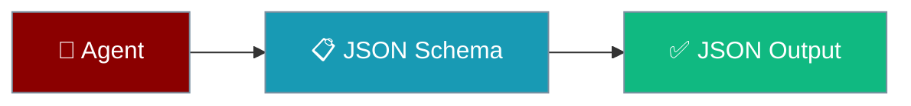
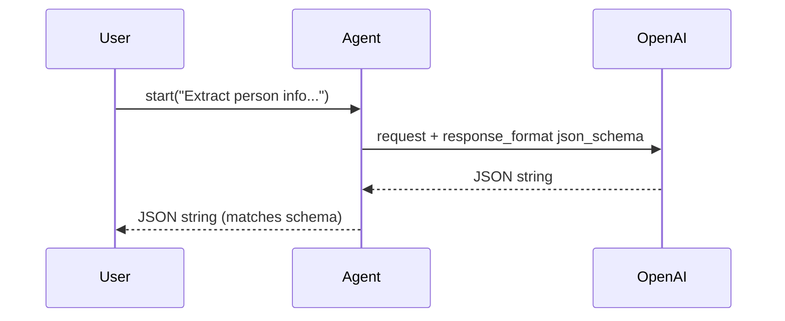

Set `outputSchema` on an `Agent` to make it return JSON that matches your schema.



<Info>
Structured output is **OpenAI-only** in v1.7.4. Non-OpenAI providers log a warning and continue without structured output (see [Provider support](#provider-support)).
</Info>

## Quick Start

<Steps>

<Step title="Simplest — one outputSchema">

```typescript
import { Agent } from 'praisonai';

const agent = new Agent({
  instructions: 'Extract person info as JSON.',
  llm: 'gpt-4o-mini',
  outputSchema: {
    type: 'object',
    properties: {
      name: { type: 'string' },
      age: { type: 'number' },
      email: { type: 'string' }
    },
    required: ['name', 'age']
  }
  // outputSchemaName defaults to 'response'
});

const result = await agent.start(
  'John Doe is 30 years old, email john@example.com'
);
console.log(result);
// result is a JSON string matching the schema:
// {"name":"John Doe","age":30,"email":"john@example.com"}
```

</Step>

<Step title="With outputSchemaName and a nested schema">

```typescript
import { Agent } from 'praisonai';

const agent = new Agent({
  instructions: 'Extract an order as JSON.',
  llm: 'gpt-4o-mini',
  outputSchemaName: 'order',
  outputSchema: {
    type: 'object',
    properties: {
      id: { type: 'string' },
      customer: {
        type: 'object',
        properties: {
          name: { type: 'string' },
          email: { type: 'string' }
        },
        required: ['name']
      },
      items: {
        type: 'array',
        items: {
          type: 'object',
          properties: {
            sku: { type: 'string' },
            qty: { type: 'number' }
          },
          required: ['sku', 'qty']
        }
      }
    },
    required: ['id', 'customer', 'items']
  }
});

const json = await agent.start('Order 42 for Ada (ada@example.com): 2x SKU-1, 1x SKU-9');
console.log(JSON.parse(json));
```

</Step>

</Steps>

---

## How It Works

The agent forwards `outputSchema` to OpenAI as `response_format: { type: 'json_schema', json_schema: { name, schema } }` and returns the raw JSON string.



| Field | Type | Default | Description |
|-------|------|---------|-------------|
| `outputSchema` | `Record<string, any>` | `undefined` | JSON Schema for the response. |
| `outputSchemaName` | `string` | `'response'` | Name used in `response_format.json_schema.name`. |

<Note>
`outputSchema` is a **JSON Schema object** (`Record<string, any>`), not a Zod schema. If you keep schemas in Zod, convert first with `zodToJsonSchema(MySchema)`.
</Note>

---

## Provider support

Structured output works with OpenAI models today. On a non-OpenAI provider the agent skips structured output and logs this warning verbatim:

```
Agent <name>: outputSchema is not yet supported with non-OpenAI providers (<llm>) — proceeding without structured output.
```

Grep your logs for `outputSchema is not yet supported` to confirm whether a provider dropped it.

---

## Multi-turn behaviour

Structured output goes through the agent's full message history, so follow-up prompts see prior turns and stay consistent.

```typescript
const agent = new Agent({
  instructions: 'Return the running total as JSON.',
  llm: 'gpt-4o-mini',
  outputSchema: {
    type: 'object',
    properties: { total: { type: 'number' } },
    required: ['total']
  }
});

await agent.chat('Add 5');   // {"total":5}
await agent.chat('Add 3');   // {"total":8} — remembers the previous turn
```

---

## How this differs from `generateObject`

<Note>
The low-level `provider.generateObject({ schema })` from `resolveBackend` is still available for direct AI SDK use. The recommended, agent-centric path is `outputSchema` on the `Agent`.
</Note>

```typescript
import { resolveBackend } from 'praisonai';
import { z } from 'zod';

const { provider } = await resolveBackend('openai/gpt-4o-mini');

const result = await provider.generateObject({
  messages: [{ role: 'user', content: 'What is the weather in Paris?' }],
  schema: z.object({ location: z.string(), temperature: z.number() })
});

console.log(result.object); // { location: "Paris", temperature: 18 }
```

See the [Zod docs](https://zod.dev) for schema construction.

---

## Common Patterns

### Extraction

```typescript
const agent = new Agent({
  instructions: 'Extract the invoice fields as JSON.',
  llm: 'gpt-4o-mini',
  outputSchema: {
    type: 'object',
    properties: {
      invoiceNumber: { type: 'string' },
      total: { type: 'number' },
      dueDate: { type: 'string' }
    },
    required: ['invoiceNumber', 'total']
  }
});

const json = await agent.start('Invoice INV-7 for $240, due 2026-01-15');
```

### Classification

```typescript
const agent = new Agent({
  instructions: 'Classify the email as JSON.',
  llm: 'gpt-4o-mini',
  outputSchema: {
    type: 'object',
    properties: {
      category: { type: 'string', enum: ['spam', 'ham'] },
      confidence: { type: 'number' }
    },
    required: ['category', 'confidence']
  }
});

const json = await agent.start('You won $1,000,000! Click here!');
// {"category":"spam","confidence":0.96}
```

### Sentiment

```typescript
const agent = new Agent({
  instructions: 'Return sentiment as JSON.',
  llm: 'gpt-4o-mini',
  outputSchema: {
    type: 'object',
    properties: {
      sentiment: { type: 'string', enum: ['positive', 'negative', 'neutral'] },
      score: { type: 'number' }
    },
    required: ['sentiment']
  }
});

const json = await agent.start('The service was fast and friendly.');
```

---

## Best Practices

<AccordionGroup>
  <Accordion title="Mark required fields">
    List every field you always expect in `required`. It nudges the model to include them and keeps the JSON predictable.
  </Accordion>
  <Accordion title="Use enums for fixed choices">
    Add `enum` on classification fields so the model can only pick valid values.
  </Accordion>
  <Accordion title="Parse the result">
    The agent returns a JSON string. Call `JSON.parse(result)` to get an object.
  </Accordion>
  <Accordion title="Keep to OpenAI for now">
    Structured output is OpenAI-only in v1.7.4. On other providers the agent logs a warning and returns unstructured text.
  </Accordion>
</AccordionGroup>

---

## Related

<CardGroup cols={2}>
  <Card title="Agent" icon="robot" href="/js/agent">Agent configuration</Card>
  <Card title="Multi-Provider (AI SDK)" icon="sparkles" href="/js/ai-sdk">Switch LLM providers</Card>
</CardGroup>
