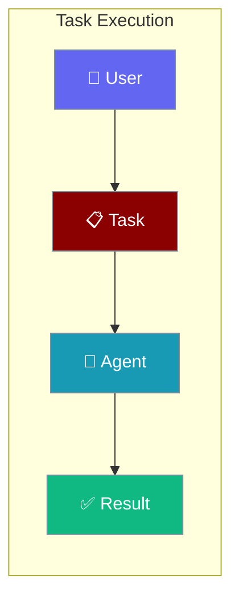
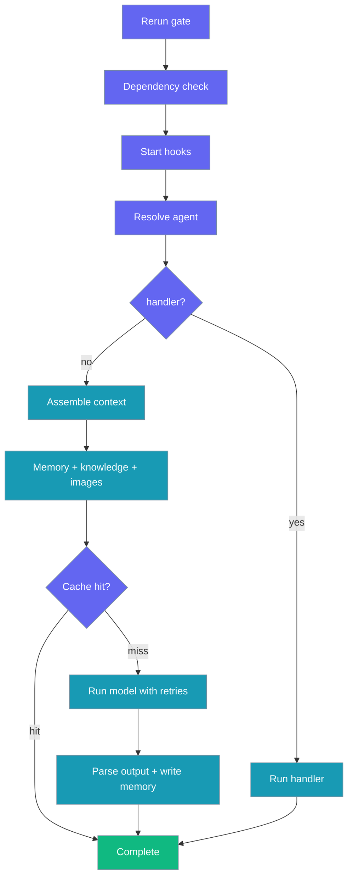
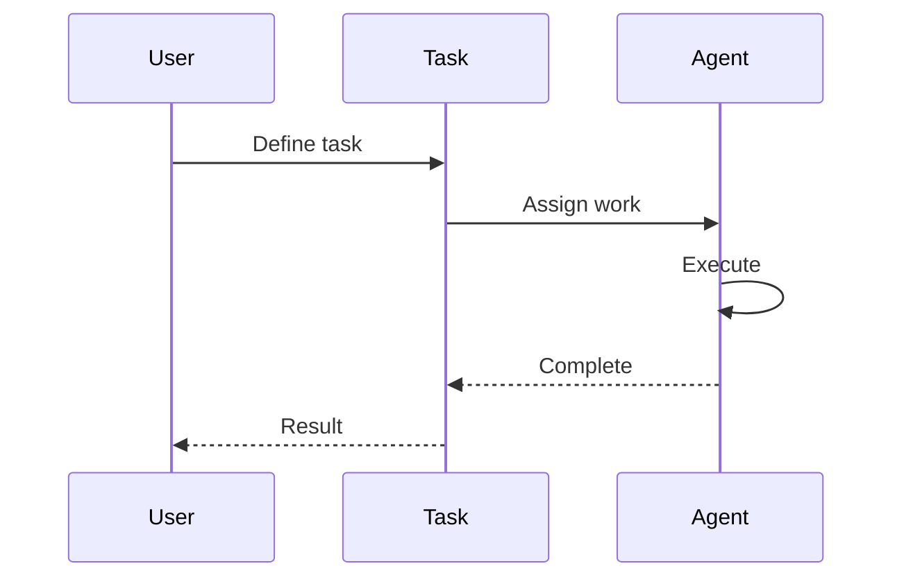

Tasks define specific work for agents to complete with clear objectives.


```mermaid
graph LR
    subgraph "Task Execution"
        A[👤 User] --> B[📋 Task]
        B --> C[🤖 Agent]
        C --> D[✅ Result]
    end

    classDef user fill:#6366F1,stroke:#7C90A0,color:#fff
    classDef task fill:#8B0000,stroke:#7C90A0,color:#fff
    classDef agent fill:#189AB4,stroke:#7C90A0,color:#fff
    classDef output fill:#10B981,stroke:#7C90A0,color:#fff

    class A user
    class B task
    class C agent
    class D output
```

## Quick Start

<Steps>

<Step title="Run a task through a team">
```typescript
import { Agent, Team } from 'praisonai';

const team = new Team({
  agents: [new Agent({ instructions: 'You research and summarize topics' })],
  tasks: ['Research AI trends in 2024']
});

const results = await team.start();
console.log(results[0]);
```
</Step>

<Step title="With a Task object">
```typescript
import { Agent, Team } from 'praisonai';

const analyst = new Agent({ instructions: 'You analyse data' });

const team = new Team({
  agents: [analyst],
  tasks: [{
    name: 'analyse',
    description: 'Analyze sales data',
    expectedOutput: 'A summary with top 3 insights',
    agent: analyst
  }]
});

await team.start();
```
</Step>

</Steps>

<Warning>
`import { Task } from 'praisonai'` resolves to the **workflow-step** class — its shape is `{ name, execute }`, not `{ description, expectedOutput }`. To give a `Team` a rich task with `description`, `expectedOutput`, `agent`, and the routing fields below, pass a **plain object** (or a task string), as shown above. `Team` reads those fields directly; you do not need to call `new Task(...)`.
</Warning>

<Note>
Only `autonomy`, `web`, `reflection`, and `planning` are still accepted for Python-SDK parity but **not yet implemented** in the TypeScript SDK. Passing one emits a `[praisonai] … not yet honoured` notice — see [Parity Notices](/docs/js/typescript). Every other Task option below is fully live through `team.start()`.
</Note>

---

## How a Task Runs

`team.start()` runs every task through the same pipeline, in this exact order.


```mermaid
graph TB
    A[Rerun gate] --> B[Dependency check]
    B --> C[Start hooks]
    C --> D[Resolve agent]
    D --> E{handler?}
    E -->|yes| F[Run handler]
    E -->|no| G[Assemble context]
    G --> H[Memory + knowledge + images]
    H --> I{Cache hit?}
    I -->|hit| L[Complete]
    I -->|miss| J[Run model with retries]
    J --> K[Parse output + write memory]
    K --> L
    F --> L

    classDef gate fill:#6366F1,stroke:#7C90A0,color:#fff
    classDef run fill:#189AB4,stroke:#7C90A0,color:#fff
    classDef done fill:#10B981,stroke:#7C90A0,color:#fff

    class A,B,C,D,E,I gate
    class F,G,H,J,K run
    class L done
```

| Step | What happens |
|------|--------------|
| Rerun gate | A re-queued completed task is skipped unless `rerun` (or `execution.rerun`) is set. |
| Dependency check | If a `dependsOn` task failed, `skipOnFailure` marks this one degraded; otherwise it fails. |
| Start hooks | Team `onTaskStart`, then the task's own `hooks.onTaskStart`. |
| Resolve agent | With no agent but an `agentConfig`, one is built at run time named `<taskName>Agent`. |
| `handler` | Runs **instead of the model** when provided. |
| Context | `retainFullContext` carries every earlier result; the default carries only the latest. |
| Memory + knowledge | Recalled and folded into the prompt. |
| Images | Per-task `images` attach as multimodal `image_url` parts. |
| Cache | A `caching` hit returns the stored answer and skips the retries. |
| Retries | `retryDelay` backs off `min(delay * 2^attempt, 300)` seconds. |
| Output | `outputPydantic` / `outputConfig.pydanticModel` parse the answer and strip ` ```json ` fences. |
| Complete | Result stored to memory, then team and task `onTaskComplete` hooks. |

---

## Task Options

Every option below changes what `team.start()` does.

### Core

| Option | Type | Default | Description |
|--------|------|---------|-------------|
| `description` | `string` | — | What the task should accomplish. |
| `expectedOutput` | `string` | `"Complete the task successfully"` | Desired format of the result. |
| `agent` | `Agent` | `null` | Agent assigned to the task. |
| `agentConfig` | `object` | `null` | Build an agent at run time when none is set. |
| `dependsOn` / `context` | `Task[]` | `[]` | Tasks whose results feed this one. |
| `handler` | `function` | `null` | Run a function instead of the model. |
| `hooks` | `{ onTaskStart, onTaskComplete }` | `null` | Per-task lifecycle callbacks. |

```typescript
// task objects inside team.tasks
// handler runs instead of the model
{
  name: 'compute',
  description: 'add the numbers',
  handler: () => 'computed without an LLM'
}

// agentConfig builds `researchAgent` at run time
{
  name: 'research',
  description: 'research whales',
  agentConfig: { llm: 'gpt-4o-mini', instructions: 'be brief' }
}
```

### Context, memory & knowledge

| Option | Type | Default | Description |
|--------|------|---------|-------------|
| `retainFullContext` | `boolean` | `false` | Carry every earlier result, not just the latest. |
| `memory` | store | `null` | Recall into the prompt and write the answer back. |
| `failOnMemoryError` | `boolean` | `false` | Re-throw memory failures instead of swallowing them. |
| `config.memory_config` | `object` | `null` | Auto-create a per-task memory store. |
| `knowledge` | `string \| string[] \| base` | `null` | Fold matching knowledge into the prompt. |
| `images` | `string[]` | `[]` | Attach pictures as multimodal parts. |

```typescript
// a task object inside team.tasks
{
  name: 'summarise',
  description: 'summarise whales',
  memory,                 // recalled into the prompt, answer written back
  retainFullContext: true,
  knowledge: 'penguins cannot fly'
}
```

### Output

| Option | Type | Default | Description |
|--------|------|---------|-------------|
| `outputPydantic` | schema | `null` | Parse the answer into a typed object. |
| `outputConfig` | `{ pydanticModel }` | `null` | Same parsing through its own field. |

```typescript
// a task object inside team.tasks
{
  name: 'shape',
  description: 'shape it',
  outputPydantic: { type: 'object', properties: { title: { type: 'string' } } }
}
```

### Execution & retries

| Option | Type | Default | Description |
|--------|------|---------|-------------|
| `asyncExecution` | `boolean` | `false` | Batch consecutive async tasks together. |
| `caching` | `boolean` | `false` | Serve a repeated prompt from cache. |
| `rerun` | `boolean` | `false` | Run again when the team reaches it a second time. |
| `execution` | `{ rerun }` | `null` | Alternate switch for `rerun`. |
| `retryDelay` | `number` | `0` | Seconds to back off between attempts (doubles each retry). |
| `skipOnFailure` | `boolean` | `false` | Run even if a dependency failed. |

```typescript
// task objects inside team.tasks
{ name: 'alpha', description: 'alpha', asyncExecution: true }
{ name: 'quote', description: 'quote the price', caching: true, rerun: true }
```

### Routing & loops

| Option | Type | Default | Description |
|--------|------|---------|-------------|
| `isStart` | `boolean` | `false` | Entry point of a workflow graph. |
| `nextTasks` | `string[]` | `[]` | Tasks to run after this one. |
| `taskType` | `string` | `"task"` | `'decision'` drives the routing table. |
| `routing` / `condition` | `{ [decision]: string[] }` | `null` | Route by the decision the model returned. |
| `when` | `string` | `null` | Condition gating `thenTask` / `elseTask`. |
| `thenTask` / `elseTask` | `string` | `null` | Branch targets. |
| `loopOver` | `string` | `null` | Variable name of an array to fan out over. |
| `loopVar` | `string` | `"item"` | Placeholder each loop item binds to. |
| `inputFile` | `string` | `null` | CSV file — one subtask per row. |

Routing lives on [Routing](/docs/js/routing); loops live on [Loops](/docs/js/loops).

### Human review

| Option | Type | Default | Description |
|--------|------|---------|-------------|
| `humanInput` | `boolean` | `false` | Require a person to approve the task's output before the next task consumes it. See [Human Review](/js/human-in-the-loop-review). |
| `humanReviewPrompt` | `string` | — | Custom question the reviewer is asked. |

```typescript
// a task object inside team.tasks
{
  name: 'refund',
  description: 'draft a refund reply',
  humanInput: true,
  humanReviewPrompt: 'Is this legally safe to send?'
}
```

---

## User Interaction Flow


```mermaid
sequenceDiagram
    participant User
    participant Task
    participant Agent

    User->>Task: Define task
    Task->>Agent: Assign work
    Agent->>Agent: Execute
    Agent-->>Task: Complete
    Task-->>User: Result
```

---

## API Reference

<Card title="TaskConfig" icon="code" href="/sdk/reference/typescript/classes/TaskConfig">
  Task configuration options
</Card>
<Card title="Task" icon="robot" href="/sdk/reference/typescript/classes/Task">
  Task class documentation
</Card>

<Note>
A few Python `Task` helper methods have no TypeScript counterpart yet. Configure tasks with the plain-object fields above and let `team.start()` drive them — see the [parity baseline](https://github.com/MervinPraison/PraisonAI/blob/main/src/praisonai/praisonai/_dev/parity/signatures/inventory-baseline.json) for the current method list.
</Note>

---

## Best Practices

<AccordionGroup>
  <Accordion title="Be specific in descriptions">
    "Write 500-word blog post about AI benefits" beats "Write about AI".
  </Accordion>

  <Accordion title="Use handler for deterministic steps">
    A `handler` runs instead of the model — perfect for math, lookups, or calling your own code.
  </Accordion>

  <Accordion title="Chain tasks with dependsOn">
    Pass earlier tasks so their output feeds the next one.
  </Accordion>

  <Accordion title="Reach for caching on repeated prompts">
    `caching: true` skips the model entirely on a repeat.
  </Accordion>
</AccordionGroup>

---

## Related

<CardGroup cols={2}>
  <Card title="Handlers" icon="bolt" href="/docs/features/task-handlers">
    Run a function instead of the model
  </Card>
  <Card title="Routing" icon="route" href="/js/routing">
    Branch between tasks
  </Card>
  <Card title="Loops" icon="repeat" href="/js/loops">
    Fan out over lists and CSVs
  </Card>
  <Card title="Teams" icon="users" href="/js/teams">
    Multi-agent teams
  </Card>
  <Card title="Human Review" icon="user-check" href="/js/human-in-the-loop-review">
    Approve a task's output before the next task
  </Card>
</CardGroup>
