Tasks define specific work for agents to complete with clear objectives.

```mermaid
graph LR
    subgraph "Task Execution"
        A[👤 User] --> B[📋 Task]
        B --> C[🤖 Agent]
        C --> D[✅ Result]
    end
    
    classDef user fill:#6366F1,stroke:#7C90A0,color:#fff
    classDef task fill:#F59E0B,stroke:#7C90A0,color:#fff
    classDef output fill:#10B981,stroke:#7C90A0,color:#fff
    
    class A user
    class B task
    class C,D output
```



## Quick Start

<Steps>

<Step title="Simple Task">
```typescript
import { Agent, Task } from 'praisonai';

const agent = new Agent({
  instructions: 'You research and summarize topics'
});

const task = new Task({
  description: 'Research AI trends in 2024',
  agent: agent
});

const result = await task.execute();
console.log(result.output);
```
</Step>

<Step title="With Expected Output">
```typescript
const task = new Task({
  description: 'Analyze sales data',
  expectedOutput: 'A summary with top 3 insights',
  agent: analyst
});
```
</Step>

</Steps>

---

## User Interaction Flow


---

## Configuration Levels

```typescript
// Level 1: String - Simple description
const task = new Task({
  description: 'Write a blog post about AI',
  agent: writer
});

// Level 2: Dict - With options
const task = new Task({
  description: 'Write a blog post',
  expectedOutput: '500 words, engaging tone',
  agent: writer
});

// Level 3: Instance - Full control
const task = new Task({
  description: 'Write a blog post',
  expectedOutput: '500 words',
  agent: writer,
  context: [researchTask],  // Use output from other tasks
  callback: (result) => console.log('Done!')
});
```

---

## Task Options

| Option | Description |
|--------|-------------|
| `description` | What the task should accomplish |
| `expectedOutput` | Format/structure of result |
| `agent` | Agent assigned to the task |
| `context` | Other tasks to use as input |
| `async` | Run without blocking |

---

## Best Practices

<AccordionGroup>
  <Accordion title="Be specific in descriptions">
    "Write 500-word blog post about AI benefits" beats "Write about AI".
  </Accordion>
  
  <Accordion title="Define expected output">
    Telling the agent what format you want improves results.
  </Accordion>
  
  <Accordion title="Use context for dependencies">
    Chain tasks by passing earlier outputs as context.
  </Accordion>
</AccordionGroup>

---

## Related

<CardGroup cols={2}>
  <Card title="Workflows" icon="diagram-project" href="/docs/js/workflows">
    Multi-step workflows
  </Card>
  <Card title="Teams" icon="users" href="/docs/js/teams">
    Multi-agent teams
  </Card>
</CardGroup>
