Tasks break down complex work into clear, manageable pieces for agents to execute.

```mermaid
graph LR
    subgraph "Task Execution"
        A[📋 Task] --> B[🤖 Agent]
        B --> C[✅ Result]
    end
    
    classDef task fill:#6366F1,stroke:#7C90A0,color:#fff
    classDef agent fill:#F59E0B,stroke:#7C90A0,color:#fff
    classDef result fill:#10B981,stroke:#7C90A0,color:#fff
    
    class A task
    class B agent
    class C result
```



## Quick Start

<Steps>

<Step title="Define a Task">
```typescript
import { Task, Agent } from 'praisonai';

const task = new Task({
  description: 'Write a summary of the given article',
  expectedOutput: 'A 2-3 sentence summary'
});
```
</Step>

<Step title="Assign to Agent">
```typescript
const agent = new Agent({
  instructions: 'You are a skilled summarizer'
});

const result = await task.execute(agent, 'Article text here...');
console.log(result);
```
</Step>

<Step title="Chain Tasks">
```typescript
// First task: research
const researchTask = new Task({
  description: 'Research the topic',
  expectedOutput: 'Key facts and figures'
});

// Second task: write
const writeTask = new Task({
  description: 'Write an article using the research',
  expectedOutput: 'A complete article'
});

const research = await researchTask.execute(researcher, 'AI trends');
const article = await writeTask.execute(writer, research);
```
</Step>

</Steps>

---

## Task Structure

| Field | Purpose |
|-------|---------|
| `description` | What the agent should do |
| `expectedOutput` | What format/type of result you want |
| `context` | Additional information to help the agent |

---

## Common Examples

### Analysis Task

```typescript
const analyzeTask = new Task({
  description: 'Analyze the sentiment of these customer reviews',
  expectedOutput: 'A list of positive, negative, and neutral reviews with counts'
});
```

### Creative Task

```typescript
const createTask = new Task({
  description: 'Write a product description for this item',
  expectedOutput: 'An engaging 100-word product description',
  context: { tone: 'professional', target: 'business users' }
});
```

### Multi-Step Workflow

```typescript
// Define tasks
const tasks = [
  new Task({ description: 'Gather requirements', expectedOutput: 'Requirements list' }),
  new Task({ description: 'Create design', expectedOutput: 'Design document' }),
  new Task({ description: 'Write code', expectedOutput: 'Working code' }),
  new Task({ description: 'Test solution', expectedOutput: 'Test results' })
];

// Execute sequentially
let result = input;
for (const task of tasks) {
  result = await task.execute(agent, result);
}
```

---

## Best Practices

<AccordionGroup>
  <Accordion title="Be specific in descriptions">
    Clear, specific task descriptions lead to better results. Include any constraints or requirements.
  </Accordion>
  
  <Accordion title="Define expected output">
    Tell the agent exactly what format you want - "a bulleted list", "JSON", "a paragraph", etc.
  </Accordion>
  
  <Accordion title="Break complex work into tasks">
    Instead of one big task, create multiple smaller tasks that build on each other.
  </Accordion>
</AccordionGroup>

---

## Related

<CardGroup cols={2}>
  <Card title="Agent" icon="user" href="/docs/js/agent">
    Create AI agents
  </Card>
  <Card title="Workflows" icon="diagram-project" href="/docs/js/workflows">
    Multi-step workflows
  </Card>
</CardGroup>
