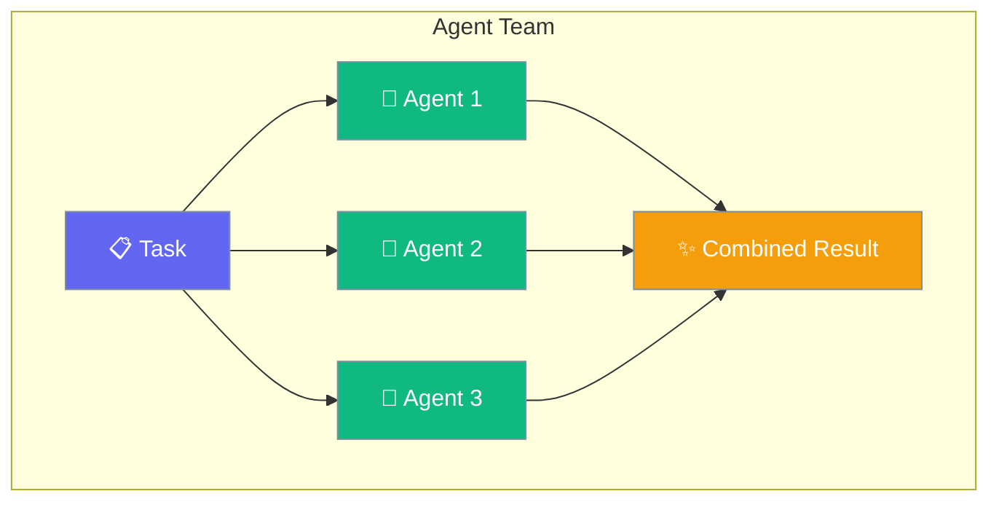
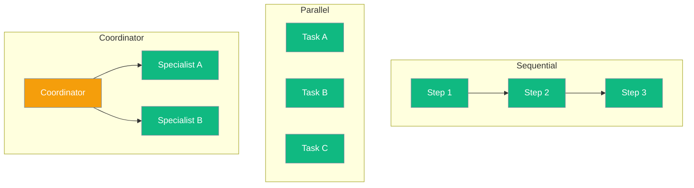

Teams let multiple agents collaborate on complex tasks - like a group of specialists working together.



## Quick Start

<Steps>

<Step title="Create Team Members">
```typescript
import { Agent } from 'praisonai';

const researcher = new Agent({
  name: 'Researcher',
  instructions: 'You find and analyze information'
});

const writer = new Agent({
  name: 'Writer',
  instructions: 'You write clear, engaging content'
});

const editor = new Agent({
  name: 'Editor',
  instructions: 'You polish and improve text'
});
```
</Step>

<Step title="Create Team Workflow">
```typescript
// Sequential workflow: research → write → edit
const research = await researcher.chat("Find facts about AI trends");
const draft = await writer.chat(`Write an article using: ${research}`);  
const final = await editor.chat(`Improve this article: ${draft}`);
```
</Step>

<Step title="Use with Handoffs">
```typescript
import { handoff } from 'praisonai';

const coordinator = new Agent({
  name: 'Coordinator',
  instructions: 'Direct tasks to the right specialist',
  handoffs: [
    handoff({ agent: researcher, description: 'For research tasks' }),
    handoff({ agent: writer, description: 'For writing tasks' }),
    handoff({ agent: editor, description: 'For editing tasks' })
  ]
});

await coordinator.chat("Write an article about AI trends");
```
</Step>

</Steps>

---

## Team Patterns



| Pattern | Best For |
|---------|----------|
| Sequential | Tasks that build on each other |
| Parallel | Independent subtasks |
| Coordinator | Dynamic task routing |

---

## Common Examples

### Content Creation Team

```typescript
const researcher = new Agent({ 
  instructions: 'Research the topic thoroughly' 
});
const writer = new Agent({ 
  instructions: 'Write engaging content' 
});
const seoExpert = new Agent({ 
  instructions: 'Optimize for search engines' 
});

// Sequential processing
const research = await researcher.chat("AI in healthcare 2024");
const article = await writer.chat(`Write article: ${research}`);
const optimized = await seoExpert.chat(`Add SEO: ${article}`);
```

### Support Team

```typescript
const triage = new Agent({
  name: 'Triage',
  instructions: 'Classify and route support requests',
  handoffs: [
    handoff({ agent: technicalAgent, description: 'Technical issues' }),
    handoff({ agent: billingAgent, description: 'Billing questions' }),
    handoff({ agent: salesAgent, description: 'Sales inquiries' })
  ]
});

await triage.chat("My payment failed");
// → Routes to billing agent
```

### Analysis Team

```typescript
// Parallel analysis
const [financial, technical, market] = await Promise.all([
  financialAnalyst.chat("Analyze company finances"),
  technicalAnalyst.chat("Analyze technology stack"),
  marketAnalyst.chat("Analyze market position")
]);

// Synthesize results
const summary = await synthesizer.chat(`
  Combine these analyses:
  Financial: ${financial}
  Technical: ${technical}
  Market: ${market}
`);
```

---

## Best Practices

<AccordionGroup>
  <Accordion title="Give clear roles">
    Each agent should have a specific expertise. Clear roles lead to better collaboration.
  </Accordion>
  
  <Accordion title="Use parallel when possible">
    Run independent tasks in parallel with Promise.all() to save time.
  </Accordion>
  
  <Accordion title="Add a coordinator for complex flows">
    For dynamic routing, use a coordinator agent with handoffs rather than hardcoding logic.
  </Accordion>
</AccordionGroup>

---

## Related

<CardGroup cols={2}>
  <Card title="Handoffs" icon="hand" href="/docs/js/handoffs">
    Transfer between agents
  </Card>
  <Card title="Workflows" icon="diagram-project" href="/docs/js/workflows">
    Multi-step workflows
  </Card>
</CardGroup>
