Agents can work together as a team to solve complex problems.

```mermaid
graph LR
    subgraph "Agent Team"
        A[👤 User] --> B[🤖 Manager]
        B --> C[📝 Researcher]
        B --> D[✍️ Writer]
        B --> E[✅ Reviewer]
    end
    
    classDef user fill:#6366F1,stroke:#7C90A0,color:#fff
    classDef manager fill:#F59E0B,stroke:#7C90A0,color:#fff
    classDef worker fill:#10B981,stroke:#7C90A0,color:#fff
    
    class A user
    class B manager
    class C,D,E worker
```



## Quick Start

<Steps>

<Step title="Create a Team">
```typescript
import { Agent, Team } from 'praisonai';

const researcher = new Agent({
  name: 'Researcher',
  instructions: 'You research topics thoroughly'
});

const writer = new Agent({
  name: 'Writer',
  instructions: 'You write clear, engaging content'
});

const team = new Team({
  agents: [researcher, writer],
  process: 'sequential'
});

await team.start('Write an article about AI');
// Researcher gathers info → Writer creates article
```
</Step>

<Step title="With Manager">
```typescript
const team = new Team({
  agents: [researcher, writer],
  process: 'hierarchical',
  manager: new Agent({ instructions: 'You coordinate the team' })
});
```
</Step>

</Steps>

---

## User Interaction Flow


---

## Configuration Levels

```typescript
// Level 1: Array - Simple team
const team = new Team({
  agents: [researcher, writer]
});

// Level 2: String - Named process
const team = new Team({
  agents: [researcher, writer],
  process: 'sequential'  // or 'parallel', 'hierarchical'
});

// Level 3: Dict - Full configuration
const team = new Team({
  agents: [researcher, writer],
  process: 'hierarchical',
  manager: managerAgent,
  maxRounds: 5,
  verbose: true
});
```

---

## Team Processes

| Process | How It Works |
|---------|--------------|
| `sequential` | Agents work one after another |
| `parallel` | Agents work at the same time |
| `hierarchical` | Manager coordinates agents |

---

## API Reference

<Card title="TeamStructure" icon="code" href="/docs/sdk/reference/typescript/classes/TeamStructure">
  Team configuration
</Card>
<Card title="MultiAgentExecutionConfig" icon="robot" href="/docs/sdk/reference/typescript/classes/MultiAgentExecutionConfig">
  Multi-agent execution options
</Card>

---

## Best Practices

<AccordionGroup>
  <Accordion title="Give each agent one role">
    Specialized agents produce better results than generalists.
  </Accordion>
  
  <Accordion title="Use sequential for dependencies">
    When one agent needs another's output, use sequential process.
  </Accordion>
  
  <Accordion title="Use hierarchical for complex tasks">
    A manager helps coordinate when tasks require judgment calls.
  </Accordion>
</AccordionGroup>

---

## Related

<CardGroup cols={2}>
  <Card title="Handoffs" icon="hand" href="/docs/js/handoffs">
    Transfer between agents
  </Card>
  <Card title="Workflows" icon="diagram-project" href="/docs/js/workflows">
    Multi-step workflows
  </Card>
</CardGroup>
