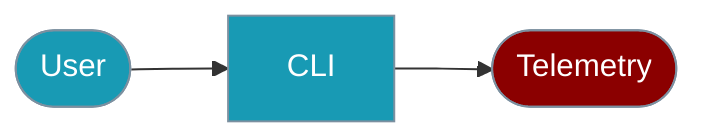

The `praisonai-ts` CLI provides commands for managing telemetry and usage tracking.



## Quick Start

<Steps>

<Step title="Simple Usage">

```bash
praisonai-ts telemetry status
```

</Step>

<Step title="With Configuration">

```bash
export PRAISONAI_TELEMETRY_DISABLED=true
```

</Step>

</Steps>

---

## Check Telemetry Status

```bash
# Check current telemetry status
praisonai-ts telemetry status

# Get JSON output
praisonai-ts telemetry status --json
```

**Example Output:**
```json
{
  "success": true,
  "data": {
    "enabled": true,
    "pendingEvents": 0
  }
}
```

## Enable/Disable Telemetry

```bash
# Enable telemetry
praisonai-ts telemetry enable

# Disable telemetry
praisonai-ts telemetry disable
```

## Clear Telemetry Data

```bash
# Clear all telemetry data
praisonai-ts telemetry clear
```

## Export Telemetry

```bash
# Export telemetry data
praisonai-ts telemetry export --json
```

## Environment Variables

You can also control telemetry via environment variables:

```bash
# Disable telemetry via environment
export PRAISONAI_TELEMETRY_DISABLED=true
# or
export DO_NOT_TRACK=true
```

## SDK Usage

For programmatic telemetry control, see the [Telemetry SDK documentation](/docs/js/telemetry).

## Related

<CardGroup cols={2}>
  <Card title="Telemetry" icon="chart-line" href="/docs/js/telemetry">Telemetry SDK</Card>
  <Card title="Agent CLI" icon="terminal" href="/docs/js/agent-cli">Agent commands</Card>
</CardGroup>
