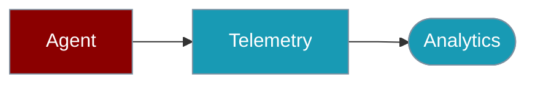

Telemetry tracks agent, tool, and LLM usage for analytics and debugging.



## Quick Start

<Steps>

<Step title="Simple Usage">

```typescript
import { TelemetryCollector } from 'praisonai';

const telemetry = new TelemetryCollector({ enabled: true });
telemetry.track('user_action', { action: 'click' });
```

</Step>

<Step title="With Configuration">

Configure batching, endpoints, and opt-out — see sections below.

</Step>

</Steps>

---

## Basic Usage

```typescript
import { TelemetryCollector } from 'praisonai';

const telemetry = new TelemetryCollector({ enabled: true });

telemetry.track('user_action', { action: 'click', target: 'button' });
```

## Track Feature Usage

```typescript
import { getTelemetry } from 'praisonai';

const telemetry = getTelemetry();

telemetry.trackFeatureUsage('chat', { model: 'gpt-4o' });
telemetry.trackFeatureUsage('tool_call', { tool: 'calculator' });
```

## Track Agent Execution

```typescript
import { getTelemetry } from 'praisonai';

const telemetry = getTelemetry();

const startTime = Date.now();
// ... agent execution ...
const duration = Date.now() - startTime;

telemetry.trackAgentExecution('MyAgent', duration, true);
```

## Track Tool Calls

```typescript
import { getTelemetry } from 'praisonai';

const telemetry = getTelemetry();

telemetry.trackToolCall('calculator', 150, true);
telemetry.trackToolCall('web_search', 2000, false);
```

## Track LLM Calls

```typescript
import { getTelemetry } from 'praisonai';

const telemetry = getTelemetry();

telemetry.trackLLMCall('openai', 'gpt-4o', 1500, 2500);
```

## Enable/Disable

```typescript
import { enableTelemetry, disableTelemetry, getTelemetry } from 'praisonai';

// Enable telemetry
enableTelemetry();

// Disable telemetry
disableTelemetry();

// Check status
const telemetry = getTelemetry();
console.log('Enabled:', telemetry.isEnabled());
```

## Environment Variables

```bash
# Disable telemetry
export PRAISONAI_TELEMETRY_DISABLED=true

# Or use DO_NOT_TRACK
export DO_NOT_TRACK=true
```

## Cleanup

```typescript
import { cleanupTelemetry } from 'praisonai';

// Flush pending events and cleanup
cleanupTelemetry();
```

## Custom Configuration

```typescript
import { TelemetryCollector } from 'praisonai';

const telemetry = new TelemetryCollector({
  enabled: true,
  endpoint: 'https://your-analytics.com/events',
  batchSize: 50,
  flushInterval: 30000
});
```

## Related

<CardGroup cols={2}>
  <Card title="Observability" icon="chart-line" href="/docs/js/observability">Observability tools</Card>
  <Card title="Agent" icon="robot" href="/docs/js/agent">Agent configuration</Card>
</CardGroup>
