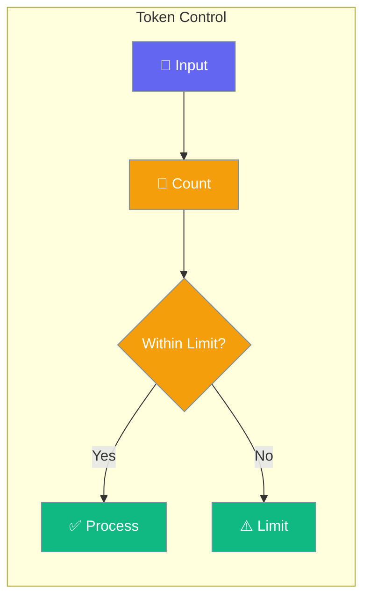
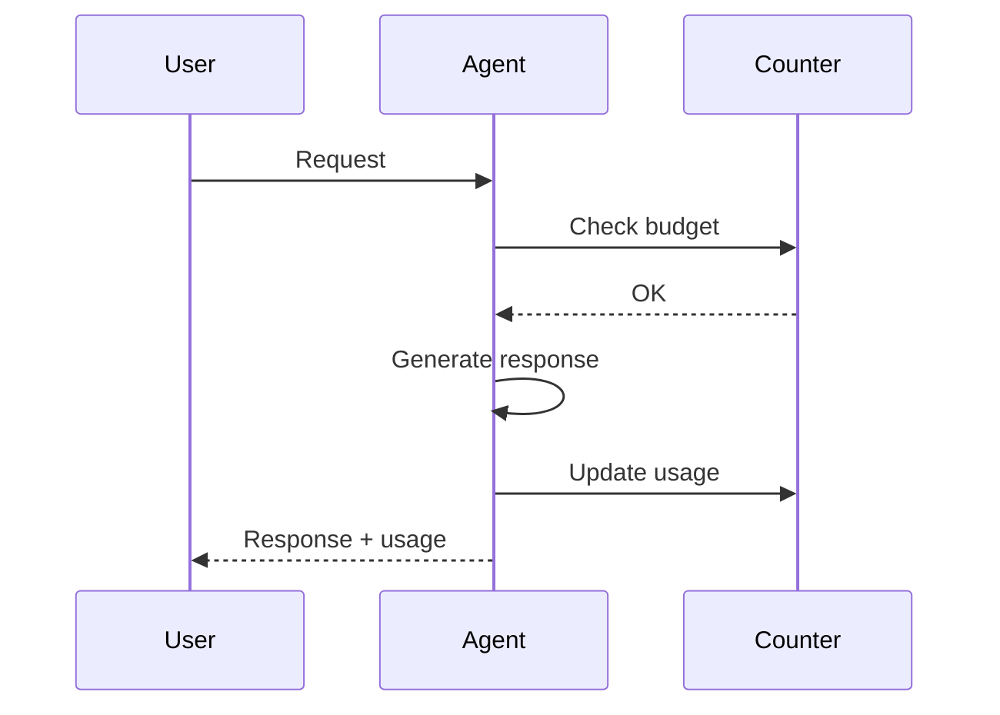

Agents can track and limit token usage for cost control.



## Quick Start

<Steps>

<Step title="Set Token Limits">
```typescript
import { Agent } from 'praisonai';

const agent = new Agent({
  instructions: 'You are concise',
  maxTokens: 1000  // Limit output tokens
});

await agent.chat('Write a summary');
```
</Step>

<Step title="Track Usage">
```typescript
const result = await agent.chat('Hello');
console.log('Tokens used:', result.usage);
// { input: 5, output: 20, total: 25 }
```
</Step>

</Steps>

---

## User Interaction Flow



---

## Configuration Levels

```typescript
// Level 1: Number - Simple limit
const agent = new Agent({
  maxTokens: 1000
});

// Level 2: Dict - Multiple limits
const agent = new Agent({
  tokens: {
    maxInput: 4000,
    maxOutput: 1000
  }
});

// Level 3: Instance - Full control
const agent = new Agent({
  tokens: {
    maxInput: 4000,
    maxOutput: 2000,
    maxTotal: 8000,
    trackUsage: true,
    onLimit: (usage) => console.warn('Limit reached')
  }
});
```

---

## Token Options

| Option | Description |
|--------|-------------|
| `maxTokens` | Limit output tokens |
| `maxInput` | Limit input tokens |
| `maxTotal` | Total token budget |
| `trackUsage` | Enable usage tracking |

---

## Best Practices

<AccordionGroup>
  <Accordion title="Set output limits">
    Prevent unexpectedly long responses.
  </Accordion>
  
  <Accordion title="Track usage">
    Monitor costs with trackUsage.
  </Accordion>
  
  <Accordion title="Estimate costs">
    Use token counts to estimate API costs.
  </Accordion>
</AccordionGroup>

---

## Related

<CardGroup cols={2}>
  <Card title="Providers" icon="plug" href="/docs/js/providers">
    LLM providers
  </Card>
  <Card title="Execution" icon="play" href="/docs/js/execution">
    Execution settings
  </Card>
</CardGroup>
