Token management helps you track, limit, and optimize token usage for cost control.

```mermaid
graph LR
    subgraph "Token Control"
        A[📝 Input] --> B[🔢 Count]
        B --> C{Within Limit?}
        C -->|Yes| D[✅ Process]
        C -->|No| E[⚠️ Truncate]
    end
    
    classDef input fill:#6366F1,stroke:#7C90A0,color:#fff
    classDef check fill:#F59E0B,stroke:#7C90A0,color:#fff
    classDef result fill:#10B981,stroke:#7C90A0,color:#fff
    
    class A input
    class B,C check
    class D,E result
```



## Quick Start

```typescript
import { Agent } from 'praisonai';

const agent = new Agent({
  instructions: 'Be concise',
  tokenLimits: {
    maxInput: 4000,
    maxOutput: 1000,
    maxTotal: 8000
  }
});
```

## Token Settings

| Option | Description |
|--------|-------------|
| `maxInput` | Limit input tokens |
| `maxOutput` | Limit output tokens |
| `maxTotal` | Limit total per request |
| `trackUsage` | Enable usage tracking |

---

## Common Patterns

### Track Usage

```typescript
const agent = new Agent({
  trackUsage: true
});

const result = await agent.chat('Hello');
console.log('Tokens used:', result.usage);
// { input: 5, output: 20, total: 25 }
```

### Cost Estimation

```typescript
const usage = await agent.getUsage();
const cost = usage.totalTokens * 0.00001;  // Example rate
console.log(`Estimated cost: $${cost.toFixed(4)}`);
```

---

## Related

<CardGroup cols={2}>
  <Card title="Providers" icon="plug" href="/docs/js/providers">
    LLM providers
  </Card>
  <Card title="Execution" icon="play" href="/docs/js/execution">
    Execution settings
  </Card>
</CardGroup>
