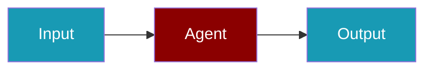

# Airweave CLI

Search across connected data sources from the command line.

## Prerequisites

```bash
npm install @airweave/ai-sdk
export AIRWEAVE_API_KEY=your-airweave-api-key
```

## Basic Search

```bash
praisonai-ts agent run \
  --tools airweave \
  --prompt "Find documents about Q4 planning"
```

## Filter by Source

```bash
praisonai-ts agent run \
  --tools "airweave:sources=notion|slack" \
  --prompt "Find discussions about the new feature"
```

## Environment Variables

| Variable | Required | Description |
|----------|----------|-------------|
| `AIRWEAVE_API_KEY` | Yes | Airweave API key |
| `OPENAI_API_KEY` | Yes | OpenAI API key |
