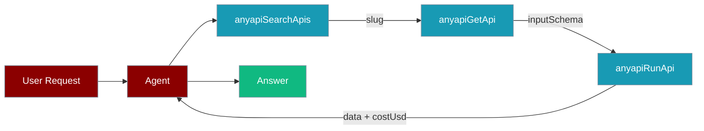
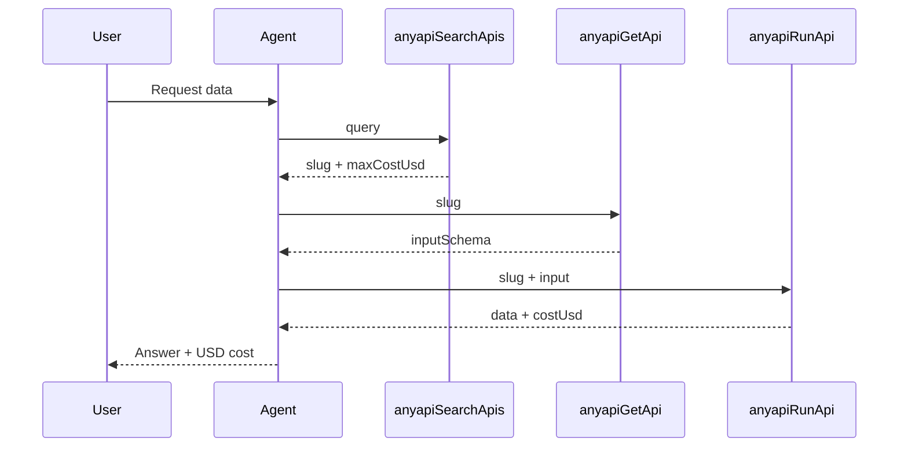

AnyAPI gives an agent hundreds of scraping and data APIs behind one key, each priced per request in USD.

The catalog is large and keeps growing, so instead of one tool per platform the agent follows a discover-then-run loop: search the catalog, read one API's input schema, then run it.



## Installation

```bash
npm install @getanyapi/sdk
```

## Environment Variables

```bash
ANYAPI_API_KEY=your-anyapi-api-key
```

<Warning>
`anyapiRunApi` charges real USD per call. The `maxItems` and `fields` options shrink the response returned to the LLM — they do **not** reduce the price. Read `costUsd` on every result and check `maxCostUsd` before running.
</Warning>

## Quick Start

<Steps>
<Step title="Search the catalog">
```typescript
import { Agent } from 'praisonai';
import { anyapiSearchApis } from 'praisonai/tools';

const agent = new Agent({
  name: 'ApiFinder',
  instructions: 'Find a data API for the user request and report its USD cost.',
  tools: [anyapiSearchApis()],
});

const result = await agent.run('Find an API for Instagram profiles');
console.log(result.text);
```
</Step>
<Step title="Discover then run">
```typescript
import { Agent } from 'praisonai';
import { anyapiSearchApis, anyapiGetApi, anyapiRunApi } from 'praisonai/tools';

const agent = new Agent({
  name: 'DataFinder',
  instructions: `You have access to hundreds of data APIs through AnyAPI.
    1. Use anyapiSearchApis to find a matching API for the user's request.
    2. Use anyapiGetApi to inspect its input schema.
    3. Use anyapiRunApi to run it with the right input.
    Always tell the user the USD cost of the call.`,
  tools: [
    anyapiSearchApis(),
    anyapiGetApi(),
    anyapiRunApi({ maxItems: 20 }),
  ],
});

const result = await agent.run('Get the follower count for the instagram profile @nike');
console.log(result.text);
```
</Step>
</Steps>

## How It Works

The agent discovers an API, reads its schema, then runs it — three tools chained in one loop.



## The Three Tools

### anyapiSearchApis

Search the catalog for an API by natural-language query, ranked by relevance.

```typescript
import { anyapiSearchApis } from 'praisonai/tools';

const searchTool = anyapiSearchApis({ category: 'social', limit: 5 });
```

### anyapiGetApi

Fetch one API's normalized input and output JSON Schema by slug. Call it before running so the agent knows what input to send.

```typescript
import { anyapiGetApi } from 'praisonai/tools';

const schemaTool = anyapiGetApi();
```

### anyapiRunApi

Run an API by slug with normalized input; returns the data plus the exact USD charged.

```typescript
import { anyapiRunApi } from 'praisonai/tools';

const runTool = anyapiRunApi({ maxItems: 20, fields: ['username', 'followers'] });
```

## Configuration Options

`anyapiSearchApis(config?)`

| Option | Type | Default | Description |
|--------|------|---------|-------------|
| `limit` | `number` | `undefined` | Maximum number of APIs to return. |
| `category` | `string` | `undefined` | Restrict results to one catalog category. |

`anyapiRunApi(config?)`

| Option | Type | Default | Description |
|--------|------|---------|-------------|
| `maxItems` | `number` | `undefined` | Cap the result rows returned. Shrinks the response, not the USD price. |
| `fields` | `string[]` | `undefined` | Keep only these keys on each result item. Shrinks the response, not the USD price. |

`anyapiGetApi()` takes no configuration.

## Response Shapes

```typescript
interface AnyapiApiSummary {
  slug: string;
  name: string;
  category: string;
  description: string;
  maxCostUsd: number;      // Ceiling USD per request on the cheapest route
  failoverMaxUsd: number;  // Ceiling USD if AnyAPI has to fail over
  relevance: number;       // Search score, higher = closer match
}

interface AnyapiSearchApisResult {
  apis: AnyapiApiSummary[];
  total: number;
}

interface AnyapiGetApiResult {
  slug: string;
  name: string;
  category: string;
  description: string;
  maxCostUsd: number;
  failoverMaxUsd: number;
  inputSchema?: Record<string, unknown>;   // JSON Schema
  outputSchema?: Record<string, unknown>;  // JSON Schema
}

interface AnyapiRunApiResult {
  data: unknown;      // Normalized output, or null when no match
  found: boolean;     // false when the API ran ok but had nothing to return
  costUsd: number;    // Actual USD charged for this call
  items: number;      // Number of result rows returned
}
```

## Error Handling

<Warning>
`anyapiRunApi` never fakes a zero-cost result. Missing setup throws instead of returning empty data, so money is never misreported.
</Warning>

| Condition | Behavior |
|-----------|----------|
| `ANYAPI_API_KEY` not set | Throws `MissingEnvVarError` on any tool call. |
| `@getanyapi/sdk` not installed | Throws `MissingDependencyError` with install hints for npm / pnpm / yarn / bun. |

## Common Patterns

**Instagram profile lookup**

```typescript
import { Agent } from 'praisonai';
import { anyapiSearchApis, anyapiGetApi, anyapiRunApi } from 'praisonai/tools';

const agent = new Agent({
  name: 'ProfileLookup',
  instructions: 'Find and run the Instagram profile API. Report the USD cost.',
  tools: [anyapiSearchApis(), anyapiGetApi(), anyapiRunApi()],
});

await agent.run('Look up the instagram profile @nike');
```

**Google Maps reviews**

```typescript
import { Agent } from 'praisonai';
import { anyapiSearchApis, anyapiGetApi, anyapiRunApi } from 'praisonai/tools';

const agent = new Agent({
  name: 'ReviewFinder',
  instructions: 'Find the Google Maps reviews API and return the latest reviews.',
  tools: [
    anyapiSearchApis({ category: 'maps' }),
    anyapiGetApi(),
    anyapiRunApi({ maxItems: 10, fields: ['author', 'rating', 'text'] }),
  ],
});

await agent.run('Get recent reviews for the Eiffel Tower');
```

**Let the agent pick the API**

```typescript
import { Agent } from 'praisonai';
import { anyapiSearchApis, anyapiGetApi, anyapiRunApi } from 'praisonai/tools';

const agent = new Agent({
  name: 'DataAgent',
  instructions: `Pick the best API for any data request on your own.
    Search first, read the schema, then run. Always report the USD cost.`,
  tools: [anyapiSearchApis(), anyapiGetApi(), anyapiRunApi()],
});

await agent.run('How many stars does the tensorflow GitHub repo have?');
```

## Best Practices

<AccordionGroup>
  <Accordion title="Always call anyapiGetApi before anyapiRunApi">
    Read the input schema first so the agent sends the exact fields the API expects, avoiding wasted paid calls.
  </Accordion>
  <Accordion title="Scope with category when you know the domain">
    Pass `category` to `anyapiSearchApis` to narrow results and rank the right API higher.
  </Accordion>
  <Accordion title="Check maxCostUsd before running">
    Every summary reports `maxCostUsd`. Have the agent confirm the ceiling before it runs a paid call.
  </Accordion>
  <Accordion title="Handle the found: false case">
    A call can succeed with nothing to return. Check `found` before assuming `data` holds a result.
  </Accordion>
  <Accordion title="Use fields to trim the payload">
    Pass `fields` to keep only the keys you need. This shrinks what the LLM reads — not the price.
  </Accordion>
</AccordionGroup>

## Related

<CardGroup cols={2}>
  <Card title="Airweave" icon="database" href="/js/tools/airweave">
    Unified search across 35+ data sources.
  </Card>
  <Card title="Exa" icon="magnifying-glass" href="/js/tools/exa">
    Neural web search for agents.
  </Card>
</CardGroup>
