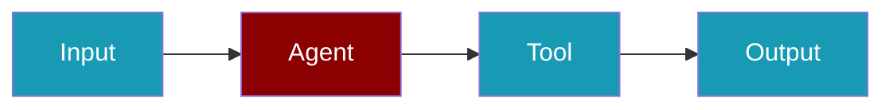

# Bedrock AgentCore

AWS Bedrock AgentCore provides code interpretation and browser automation capabilities.

## Installation

```bash
npm install praisonai-ts
```

## Code Interpreter

Execute Python code in a sandboxed environment:

```typescript
import { Agent, bedrockCodeInterpreter } from 'praisonai-ts';

const codeInterpreter = bedrockCodeInterpreter({
  // Optional configuration
});

const agent = new Agent({
  name: 'CodeAgent',
  instructions: 'You help with data analysis using Python code.',
  tools: [codeInterpreter],
});

const response = await agent.chat('Calculate the factorial of 10');
```

## Browser Tools

### Navigate

```typescript
import { bedrockBrowserNavigate } from 'praisonai-ts';

const navigate = bedrockBrowserNavigate();

const agent = new Agent({
  name: 'BrowserAgent',
  instructions: 'You help navigate websites.',
  tools: [navigate],
});
```

### Click

```typescript
import { bedrockBrowserClick } from 'praisonai-ts';

const click = bedrockBrowserClick();
```

### Fill Form

```typescript
import { bedrockBrowserFill } from 'praisonai-ts';

const fill = bedrockBrowserFill();
```

## Configuration

```typescript
interface CodeInterpreterConfig {
  timeout?: number;      // Execution timeout in ms
  maxMemory?: number;    // Max memory in MB
}

interface BrowserConfig {
  headless?: boolean;    // Run in headless mode
  timeout?: number;      // Navigation timeout
}
```

## Environment Variables

| Variable | Required | Description |
|----------|----------|-------------|
| `AWS_ACCESS_KEY_ID` | Yes | AWS access key |
| `AWS_SECRET_ACCESS_KEY` | Yes | AWS secret key |
| `AWS_REGION` | Yes | AWS region |

## Related


<CardGroup cols={2}>
  <Card title="Code Execution" icon="book" href="/docs/js/tools/code-execution">
    General code execution
  </Card>
  <Card title="Computer Use" icon="book" href="/docs/js/computer-use">
    Desktop automation
  </Card>
</CardGroup>
