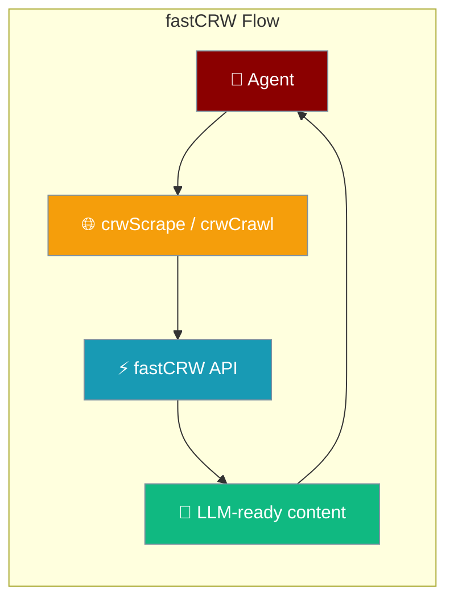
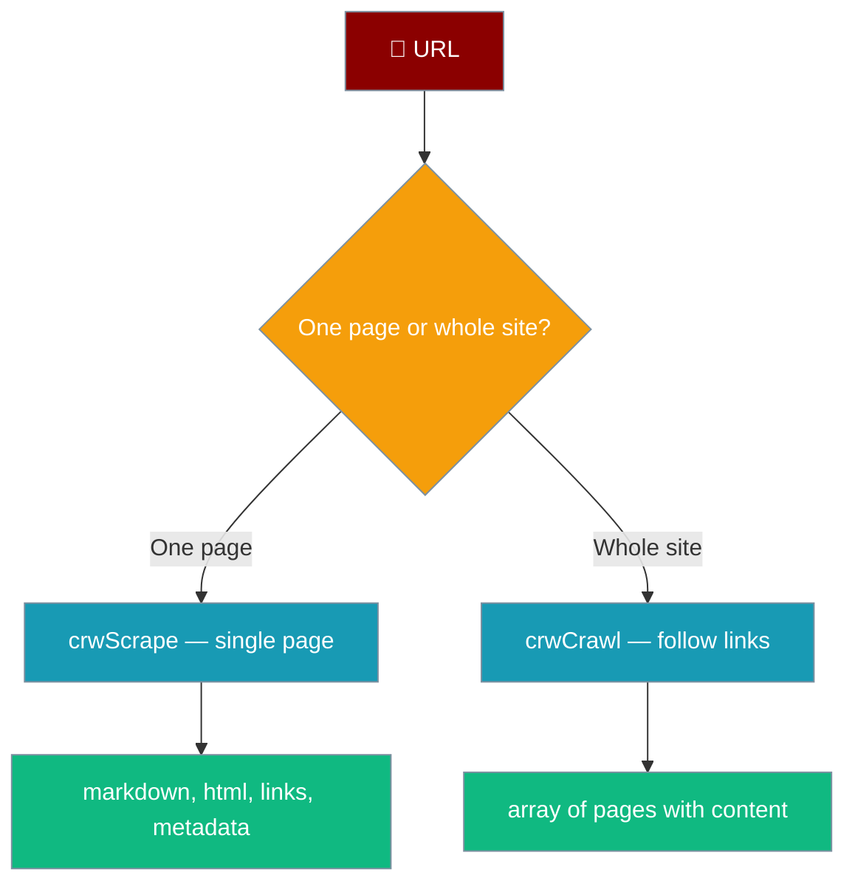

Scrape single pages or crawl entire websites and get clean, LLM-ready markdown — no parsing needed.



## Quick Start

<Steps>
<Step title="Install dependency">
```bash
npm install @mendable/firecrawl-js
```
</Step>

<Step title="Set API key">
```bash
export CRW_API_KEY=your_key_here
```
</Step>

<Step title="Scrape a page with an agent">
```typescript
import { Agent } from 'praisonai-ts';
import { crwScrape } from 'praisonai-ts';

const scraper = crwScrape({ formats: ['markdown'], onlyMainContent: true });

const agent = new Agent({
  name: 'WebAgent',
  instructions: 'Extract and summarize web content.',
  tools: [scraper],
});

const result = await agent.runSync('Summarize https://example.com');
console.log(result);
```
</Step>
</Steps>

## Scrape vs Crawl



## Scrape Tool — `crwScrape`

Extracts content from a single web page.

```typescript
import { crwScrape } from 'praisonai-ts';

const scraper = crwScrape({
  formats: ['markdown', 'links'],
  onlyMainContent: true,
});

const result = await scraper.execute({ url: 'https://example.com' });
console.log(result.markdown);
```

### `crwScrape` Configuration

| Option | Type | Default | Description |
|--------|------|---------|-------------|
| `formats` | `('markdown' \| 'html' \| 'rawHtml' \| 'links' \| 'screenshot')[]` | `undefined` | Output formats to return |
| `onlyMainContent` | `boolean` | `undefined` | Strip nav/footer/sidebar |
| `includeTags` | `string[]` | `undefined` | Whitelist of HTML tags |
| `excludeTags` | `string[]` | `undefined` | Blacklist of HTML tags |
| `waitFor` | `number` | `undefined` | Milliseconds to wait before scraping |

### Scrape Result

| Field | Type | Description |
|-------|------|-------------|
| `content` | `string` | Main content (always present) |
| `markdown` | `string?` | Markdown version |
| `html` | `string?` | Cleaned HTML |
| `links` | `string[]?` | Extracted links |
| `metadata` | `Record<string, unknown>?` | Page metadata |

## Crawl Tool — `crwCrawl`

Follows links and collects content from multiple pages.

```typescript
import { crwCrawl } from 'praisonai-ts';

const crawler = crwCrawl({
  limit: 10,
  maxDepth: 2,
  includePaths: ['/docs'],
});

const result = await crawler.execute({ url: 'https://example.com' });
console.log(`Crawled ${result.pages.length} pages`);
```

### `crwCrawl` Configuration

| Option | Type | Default | Description |
|--------|------|---------|-------------|
| `limit` | `number` | `undefined` | Maximum pages to crawl |
| `maxDepth` | `number` | `undefined` | Maximum link depth |
| `includePaths` | `string[]` | `undefined` | URL path patterns to include |
| `excludePaths` | `string[]` | `undefined` | URL path patterns to exclude |
| `allowBackwardLinks` | `boolean` | `undefined` | Follow links going "up" in the URL tree |
| `allowExternalLinks` | `boolean` | `undefined` | Follow links to other domains |

### Crawl Result

| Field | Type | Description |
|-------|------|-------------|
| `pages` | `Array<{url, content, markdown?}>` | All crawled pages |

## Import Options

```typescript
// Named import
import { crwScrape, crwCrawl } from 'praisonai-ts';

// Via tools registry
import { tools } from 'praisonai-ts';
const scraper = tools.crwScrape({ onlyMainContent: true });
const crawler = tools.crwCrawl({ limit: 5 });
```

## Self-hosting

Point the client at your own fastCRW instance:

```bash
export CRW_API_URL=https://your-fastcrw-instance.com/api
```

When `CRW_API_URL` is not set, the tool defaults to `https://fastcrw.com/api`.

## Environment Variables

| Variable | Required | Description |
|----------|----------|-------------|
| `CRW_API_KEY` | Yes | fastCRW API key |
| `CRW_API_URL` | No | Custom API endpoint (default: `https://fastcrw.com/api`) |

## Best Practices

<AccordionGroup>
<Accordion title="Use onlyMainContent for cleaner output">
Set `onlyMainContent: true` to strip navigation, footers, and sidebars. This reduces token usage and improves LLM comprehension.
</Accordion>
<Accordion title="Limit crawl depth for large sites">
Use `limit` and `maxDepth` to avoid crawling thousands of pages. Start with `limit: 10, maxDepth: 2` and adjust.
</Accordion>
<Accordion title="Use includePaths to focus crawls">
Set `includePaths: ['/docs', '/blog']` to crawl only relevant sections of a site.
</Accordion>
<Accordion title="Choose the right format">
Request only the formats you need. `markdown` is best for LLMs; `links` is useful for discovering more pages; `screenshot` is for visual inspection.
</Accordion>
</AccordionGroup>

## Related

<CardGroup cols={2}>
<Card title="Firecrawl Tool" icon="fire" href="/docs/js/tools/firecrawl">
  Official Firecrawl integration
</Card>
<Card title="Tools Overview" icon="wrench" href="/docs/js/tools">
  All available TypeScript tools
</Card>
</CardGroup>
