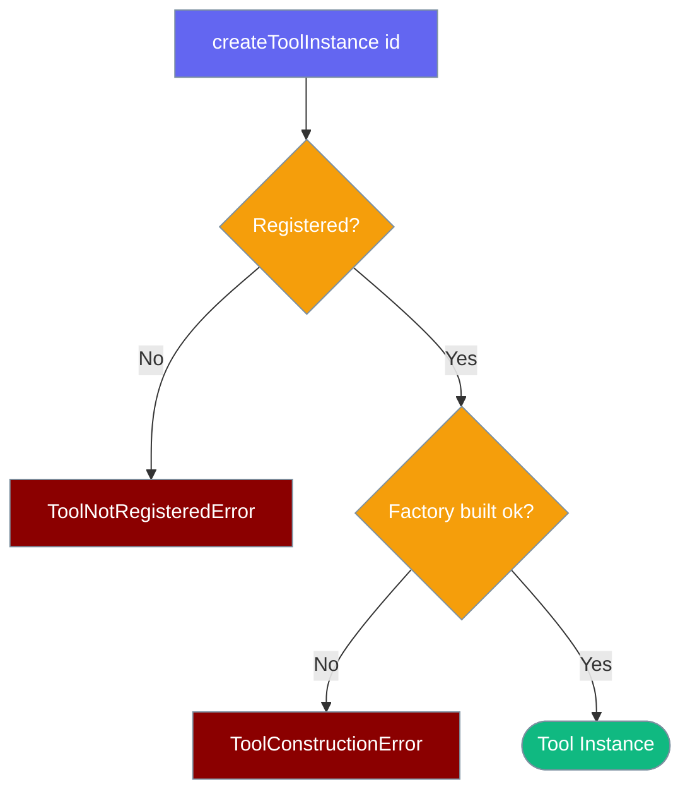

Building a tool instance can fail two ways — the tool isn't registered, or it is but its factory threw. Two error classes keep them apart.



## Quick Start

<Steps>

<Step title="Catch and Discriminate">
```typescript
import {
  createToolInstance,
  ToolNotRegisteredError,
  ToolConstructionError,
} from 'praisonai';

try {
  const tool = createToolInstance('web-search', { apiKey });
} catch (err) {
  if (err instanceof ToolNotRegisteredError) {
    // Missing id — register the factory or fix the name.
  }
  if (err instanceof ToolConstructionError) {
    // Factory threw — err.cause has the underlying error.
  }
}
```
</Step>

</Steps>

---

## Why Two Classes

Before PR #4902, building a missing tool and building a broken tool both returned `null` — hiding real bugs. Now the two failures are distinct.

| Situation | Before | After |
|-----------|--------|-------|
| Unknown id | `null` | `ToolNotRegisteredError` |
| Factory throws while building | `null` | `ToolConstructionError` (with `cause`) |

`ToolsRegistry.create` throws these instead of a generic `Error`, so callers can react to each.

---

## Error Fields

| Class | Field | Type | Description |
|-------|-------|------|-------------|
| `ToolNotRegisteredError` | `toolId` | `string` | The id that was not found |
| `ToolConstructionError` | `toolId` | `string` | The id whose factory failed |
| `ToolConstructionError` | `cause` | `unknown` | The error the factory threw |

```typescript
import { createToolInstance, ToolConstructionError } from 'praisonai';

try {
  createToolInstance('web-search', { apiKey });
} catch (err) {
  if (err instanceof ToolConstructionError) {
    console.error(`Tool ${err.toolId} failed to build:`, err.cause);
  }
}
```

---

## Return null Instead of Throwing

When a tool is optional, `tryCreateToolInstance` returns `null` for a missing id — but still throws `ToolConstructionError` if the registered factory fails, so a broken tool never looks like a missing one.

```typescript
import { tryCreateToolInstance } from 'praisonai';

const tool = tryCreateToolInstance('web-search', { apiKey });
if (!tool) {
  // Not registered — skip it.
} else {
  await tool.execute({ query: 'praisonai' });
}
```

---

## Validation Errors

`ToolValidationError` is separate — it comes from validating a tool **object**, not building a factory instance.

```typescript
import { validate_tool, ToolValidationError } from 'praisonai';

try {
  validate_tool(myTool);
} catch (err) {
  if (err instanceof ToolValidationError) {
    console.error('Malformed tool:', err.message);
  }
}
```

`validate_tool` delegates to the tool's own `validate()` when present, listing every problem it finds.

---

## Best Practices

<AccordionGroup>
  <Accordion title="Handle both classes at build sites">
    Catch `ToolNotRegisteredError` and `ToolConstructionError` separately — one is a config/name fix, the other a bug in the factory.
  </Accordion>
  <Accordion title="Log err.cause on construction failure">
    `ToolConstructionError.cause` carries the underlying error the factory threw — log it, don't swallow it.
  </Accordion>
  <Accordion title="Use tryCreateToolInstance for optional tools">
    Prefer returning `null` over catching for tools that may legitimately be absent, while still letting build failures surface.
  </Accordion>
</AccordionGroup>

---

## Related

<CardGroup cols={2}>
  <Card title="Factory Registry" icon="industry" href="/js/tools/factory-registry">
    Register builders, construct instances
  </Card>
  <Card title="Custom Tools" icon="toolbox" href="/js/customtools">
    Name-keyed registry & validation
  </Card>
</CardGroup>
