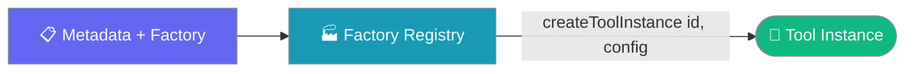

The factory registry stores **builders** that construct tool instances from config — use it when you have "here's how to build this tool from user config", not "I already have my tool".



<Note>
**Two registries, two jobs.** The **factory registry** (this page) builds *instances* from config. The **name-keyed registry** stores tools by name — use `register_tool` for "I already have my tool" (see [Custom Tools](/js/customtools)). Reach for `registerToolFactory` for "here's how to build this tool from user config".
</Note>

## Quick Start

<Steps>

<Step title="Register a Factory">
```typescript
import { registerToolFactory } from 'praisonai';

registerToolFactory(
  {
    id: 'web-search',
    name: 'web_search',
    packageName: '@my-org/web-search',
    tags: ['search'],
    requiredEnv: ['SEARCH_API_KEY'],
    capabilities: {},
    install: { npm: 'npm install @my-org/web-search' },
  },
  (config) => createWebSearchTool(config),
);
```
</Step>

<Step title="Build an Instance">
```typescript
import { createToolInstance } from 'praisonai';

const tool = createToolInstance('web-search', { maxResults: 5 });
```
</Step>

</Steps>

---

## Migration from the Old Root Exports

Before PR #4902, `register_tool` / `get_tool` / `validate_tool` at the package root pointed at the factory registry by accident. They now point at the **name-keyed** registry. If you actually wanted the factory registry, switch names:

```typescript
// Before — these root names were the factory registry by accident:
import { register_tool, get_tool } from 'praisonai';

// Now those names are the name-keyed registry. For the factory registry, use:
import {
  registerToolFactory,
  createToolInstance,
  tryCreateToolInstance,
} from 'praisonai';
```

<Warning>
The old snake_case aliases (`register_tool`, `get_tool`, `validate_tool`) still exist on the deprecated subpath `praisonai/tools/registry`, bound to the factory registry. They are `@deprecated` — prefer the new names.
</Warning>

---

## Building Instances

Two builders, differing only in how they report a missing id.

```typescript
import { createToolInstance, tryCreateToolInstance } from 'praisonai';

// Throws ToolNotRegisteredError for an unknown id.
const tool = createToolInstance('web-search', { apiKey });

// Returns null for a missing id (still throws ToolConstructionError if the
// factory itself fails).
const maybe = tryCreateToolInstance('web-search', { apiKey });
if (maybe) {
  await maybe.execute({ query: 'praisonai' });
}
```

| Function | Missing id | Factory throws |
|----------|-----------|----------------|
| `createToolInstance(id, config?)` | throws `ToolNotRegisteredError` | throws `ToolConstructionError` |
| `tryCreateToolInstance(id, config?)` | returns `null` | throws `ToolConstructionError` |

See [Tool Errors](/js/tools/errors) for the try/catch pattern that tells "missing" apart from "broken".

---

## Pre-flight Checks

`validateToolInstall(id)` reports whether a registered tool's npm dependency and required environment variables are in place — ideal for CLIs and setup scripts.

```typescript
import { validateToolInstall } from 'praisonai';

const status = await validateToolInstall('web-search');
// { valid, installed, missingEnvVars, errors }

if (!status.valid) {
  console.error(status.errors.join('\n'));
}
```

| Field | Type | Description |
|-------|------|-------------|
| `valid` | `boolean` | `true` when installed and no env vars missing |
| `installed` | `boolean` | Whether the npm package resolves |
| `missingEnvVars` | `string[]` | Required env vars not set |
| `errors` | `string[]` | Human-readable problems, with install commands |

<Warning>
`validateToolInstall(id)` (factory registry) is **not** `validate_tool(tool)`. The name-keyed `validate_tool` takes a tool **object** and throws `ToolValidationError` on a malformed tool — see [Custom Tools](/js/customtools).
</Warning>

---

## Registry API

Access the singleton for advanced use cases.

```typescript
import { getToolsRegistry, createToolsRegistry } from 'praisonai';

const registry = getToolsRegistry();
registry.list();               // all metadata
registry.has('web-search');    // presence check
registry.getMetadata('web-search');

// An isolated registry for tests or multi-agent scenarios
const scoped = createToolsRegistry();
```

---

## Best Practices

<AccordionGroup>
  <Accordion title="Use the factory registry only for config-built tools">
    If you already hold a tool instance or function, `register_tool` on the name-keyed registry is simpler. The factory registry earns its keep when a tool is built from user config or a lazy-loaded dependency.
  </Accordion>
  <Accordion title="Prefer tryCreateToolInstance when a tool is optional">
    Return `null` for a missing id instead of catching an exception — but still let `ToolConstructionError` surface, so a broken tool never looks identical to a missing one.
  </Accordion>
  <Accordion title="Run validateToolInstall in setup scripts">
    Call it before first use in a CLI or bootstrap step so users get a clear "run npm install …" or "set SEARCH_API_KEY" message instead of a runtime failure.
  </Accordion>
  <Accordion title="Migrate off the deprecated subpath aliases">
    Replace `praisonai/tools/registry` snake_case imports with `registerToolFactory` / `createToolInstance` / `tryCreateToolInstance` / `validateToolInstall`.
  </Accordion>
</AccordionGroup>

---

## Related

<CardGroup cols={2}>
  <Card title="Custom Tools" icon="toolbox" href="/js/customtools">
    Name-keyed registry & FunctionTool
  </Card>
  <Card title="Tool Errors" icon="triangle-exclamation" href="/js/tools/errors">
    Missing vs broken tools
  </Card>
  <Card title="Tools Registry" icon="wrench" href="/js/tools/registry">
    Built-in AI SDK tools
  </Card>
  <Card title="Tool System" icon="wrench" href="/js/tools">
    Tools overview
  </Card>
</CardGroup>
