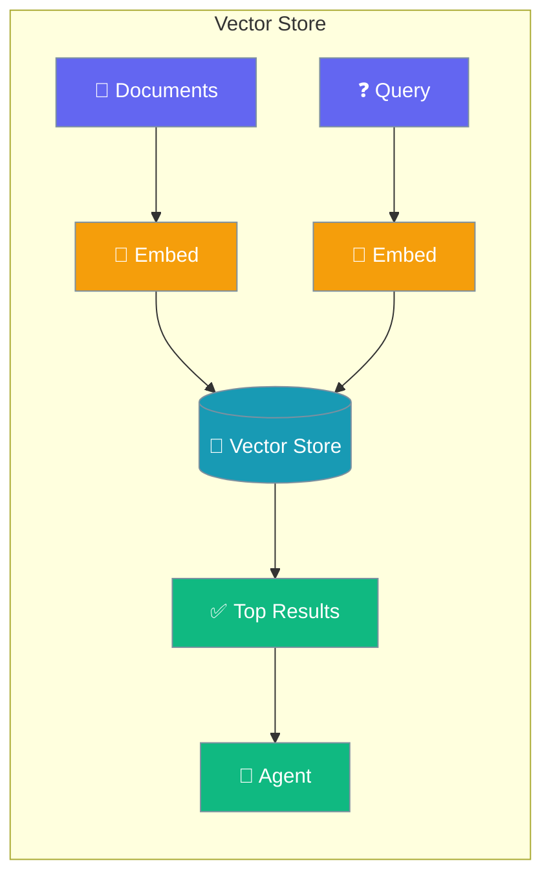
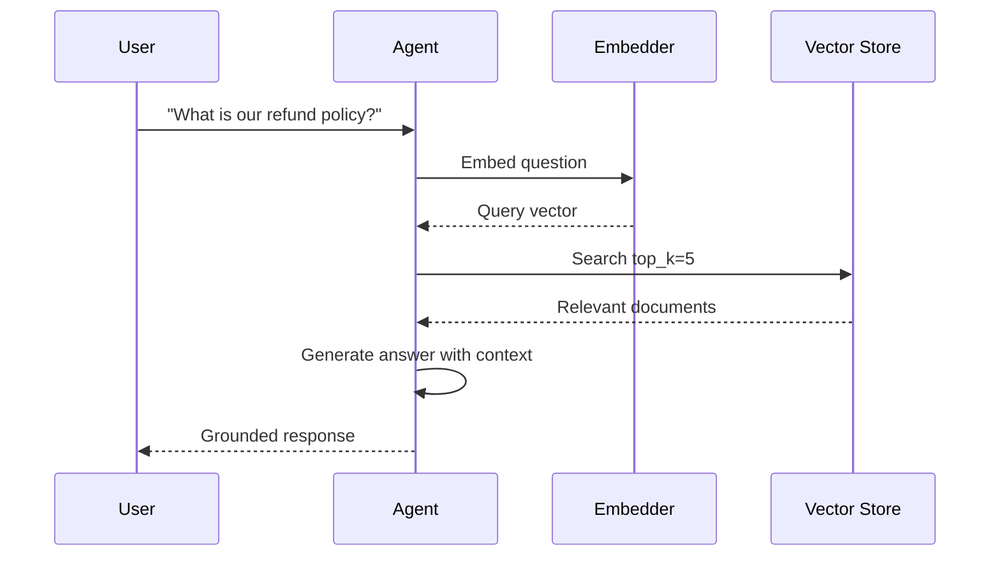

Vector stores give agents the ability to store and retrieve knowledge from large document collections — enabling RAG (Retrieval Augmented Generation) where agents answer questions grounded in your data.



## Quick Start

<Steps>

<Step title="Simple Usage">
```typescript
import { Agent } from 'praisonai';

const agent = new Agent({
  name: 'Knowledge Assistant',
  instructions: 'Answer questions using the provided knowledge base.',
  knowledge: ['./docs/', './manuals/product.pdf']
});

const response = await agent.chat('What is our refund policy?');
console.log(response);
```
</Step>

<Step title="With Configuration">
```typescript
import { Agent, createPineconeStore } from 'praisonai';

const vectorStore = createPineconeStore({
  apiKey: process.env.PINECONE_API_KEY
});

const agent = new Agent({
  name: 'Research Assistant',
  instructions: 'Search the knowledge base and answer accurately.',
  knowledge: {
    vectorStore,
    indexName: 'company-docs'
  }
});

await agent.chat('Find information about our pricing plans');
```
</Step>

<Step title="In-Memory Store (Testing)">
```typescript
import { Agent, createMemoryVectorStore } from 'praisonai';

const vectorStore = createMemoryVectorStore();

const agent = new Agent({
  instructions: 'Answer questions from the knowledge base.',
  knowledge: { vectorStore, indexName: 'test-docs' }
});
```
</Step>

</Steps>

---

## How It Works



---

## Supported Vector Stores

| Store | Use Case |
|-------|----------|
| **Pinecone** | Production, large-scale |
| **Weaviate** | Hybrid search, self-hosted |
| **Qdrant** | High performance, self-hosted |
| **Chroma** | Development, local |
| **Memory** | Testing, ephemeral |

---

## Configuration Options

<Card title="Vector Store API Reference" icon="code" href="/docs/sdk/reference/typescript/modules/vector-stores">
  TypeScript vector store configuration options
</Card>

---

## Common Patterns

### Agent with Search Tool

```typescript
import { Agent, createTool, createPineconeStore } from 'praisonai';

const vectorStore = createPineconeStore({
  apiKey: process.env.PINECONE_API_KEY
});

const searchDocs = createTool({
  name: 'search_docs',
  description: 'Search the knowledge base for relevant information',
  parameters: {
    type: 'object',
    properties: {
      query: { type: 'string', description: 'Search query' }
    },
    required: ['query']
  },
  execute: async ({ query }) => {
    const results = await vectorStore.query({
      indexName: 'documents',
      queryText: query,
      topK: 5
    });
    return results.map(r => r.content).join('\n\n');
  }
});

const agent = new Agent({
  name: 'Research Assistant',
  instructions: 'Use the search tool to find accurate information.',
  tools: [searchDocs]
});
```

### Multi-Agent with Shared Knowledge

```typescript
import { Agent, createPineconeStore } from 'praisonai';

const sharedStore = createPineconeStore({
  apiKey: process.env.PINECONE_API_KEY
});

const researcher = new Agent({
  name: 'Researcher',
  instructions: 'Find relevant information from the knowledge base.',
  knowledge: { vectorStore: sharedStore, indexName: 'docs' }
});

const writer = new Agent({
  name: 'Writer',
  instructions: 'Write clear responses based on the research.',
  knowledge: { vectorStore: sharedStore, indexName: 'docs' }
});
```

### Setup Pinecone Index

```typescript
import { createPineconeStore } from 'praisonai';

const pinecone = createPineconeStore({
  apiKey: process.env.PINECONE_API_KEY
});

await pinecone.createIndex({
  indexName: 'agent-knowledge',
  dimension: 1536,
  metric: 'cosine'
});
```

---

## Best Practices

<AccordionGroup>
  <Accordion title="Use memory store for development">
    `createMemoryVectorStore()` requires no external dependencies. Switch to Pinecone or Qdrant before going to production.
  </Accordion>

  <Accordion title="Chunk large documents">
    Split large documents into 500–1000 token chunks before indexing. Smaller chunks retrieve more precisely.
  </Accordion>

  <Accordion title="Set top_k carefully">
    A `top_k` of 3–5 gives the agent focused context. Higher values can dilute relevance.
  </Accordion>

  <Accordion title="Keep embeddings consistent">
    Use the same embedding model for indexing and querying. Mixing models produces incorrect similarity scores.
  </Accordion>
</AccordionGroup>

---

## Related

<CardGroup cols={2}>
  <Card title="Knowledge Base" icon="book" href="/docs/js/knowledge-base">
    Higher-level RAG for agents
  </Card>
  <Card title="Embeddings" icon="vector-square" href="/docs/js/embeddings">
    Create and manage embeddings
  </Card>
</CardGroup>
