Agents can analyze videos - describe content, answer questions, and extract key moments.

```mermaid
graph LR
    subgraph "Video Analysis"
        A[👤 User] --> B[🤖 Agent]
        B --> C[🎬 Video]
        C --> D[📝 Analysis]
    end
    
    classDef user fill:#6366F1,stroke:#7C90A0,color:#fff
    classDef agent fill:#F59E0B,stroke:#7C90A0,color:#fff
    classDef output fill:#10B981,stroke:#7C90A0,color:#fff
    
    class A user
    class B agent
    class C,D output
```



## Quick Start

<Steps>

<Step title="Enable Video Analysis">
```typescript
import { Agent } from 'praisonai';

const agent = new Agent({
  instructions: 'You analyze videos and describe what you see',
  video: true
});

await agent.chat('Analyze https://example.com/video.mp4');
```
</Step>

<Step title="Ask Questions About Videos">
```typescript
await agent.chat([
  { role: 'user', content: [
    { type: 'text', text: 'What is happening in this video?' },
    { type: 'video', url: 'https://example.com/video.mp4' }
  ]}
]);
```
</Step>

</Steps>

---

## User Interaction Flow


---

## Configuration Levels

Based on your needs, configure video analysis at different levels:

```typescript
// Level 1: Bool - Enable with defaults
const agent = new Agent({ video: true });

// Level 2: Dict - Custom options
const agent = new Agent({
  video: {
    maxDuration: 300,
    frameRate: 1
  }
});

// Level 3: Instance - Full control
import { VideoAgent } from 'praisonai';

const videoAgent = new VideoAgent({
  llm: 'gpt-4o',
  maxDuration: 600,
  transcribeAudio: true
});
```

---

## What You Can Do

| Action | Example |
|--------|---------|
| Describe video | `agent.chat('What happens in this video?')` |
| Ask questions | `agent.chat('How many people appear?')` |
| Get summary | `agent.chat('Summarize this in 2 sentences')` |
| Find moments | `agent.chat('List the key events')` |

---

## Best Practices

<AccordionGroup>
  <Accordion title="Use GPT-4o for video">
    GPT-4o has the best video understanding. Other models may have limited support.
  </Accordion>
  
  <Accordion title="Keep videos short">
    Videos under 5 minutes work best. Split longer videos for better analysis.
  </Accordion>
  
  <Accordion title="Be specific in questions">
    Ask about specific moments or details rather than general questions.
  </Accordion>
</AccordionGroup>

---

## Related

<CardGroup cols={2}>
  <Card title="Vision" icon="eye" href="/docs/js/vision">
    Analyze images
  </Card>
  <Card title="Audio" icon="headphones" href="/docs/js/audio">
    Process audio content
  </Card>
</CardGroup>
