VideoAgent analyzes videos using AI - describe content, answer questions, and extract key moments.

```mermaid
graph LR
    subgraph "Video Analysis"
        A[🎬 Video] --> B[🤖 VideoAgent]
        B --> C[📝 Description]
        B --> D[❓ Q&A]
        B --> E[📋 Summary]
    end
    
    classDef video fill:#6366F1,stroke:#7C90A0,color:#fff
    classDef agent fill:#F59E0B,stroke:#7C90A0,color:#fff
    classDef output fill:#10B981,stroke:#7C90A0,color:#fff
    
    class A video
    class B agent
    class C,D,E output
```



## Quick Start

<Steps>

<Step title="Create VideoAgent">
```typescript
import { VideoAgent } from 'praisonai';

const agent = new VideoAgent({
  llm: 'gpt-4o'
});
```
</Step>

<Step title="Analyze a Video">
```typescript
const result = await agent.analyze('https://example.com/video.mp4');
console.log(result.description);
```
</Step>

<Step title="Ask Questions">
```typescript
const answer = await agent.ask(
  "What is happening in the first 10 seconds?",
  "https://example.com/video.mp4"
);
```
</Step>

</Steps>

---

## What You Can Do

| Method | Purpose |
|--------|---------|
| `analyze()` | Get detailed description of the video |
| `ask()` | Ask specific questions about the video |
| `describe()` | Get a basic description |
| `summarize()` | Get a concise summary |
| `extractKeyMoments()` | List important events |

---

## Common Examples

### Summarize a Video

```typescript
const summary = await agent.summarize('https://example.com/video.mp4');
console.log(summary);
// "This video shows a cooking tutorial for making pasta..."
```

### Get Key Moments

```typescript
const moments = await agent.extractKeyMoments('https://example.com/video.mp4');
console.log(moments);
// ["1. Introduction at 0:00", "2. Ingredients at 0:30", ...]
```

### Custom Instructions

```typescript
const agent = new VideoAgent({
  llm: 'gpt-4o',
  instructions: 'Focus on identifying products and brands'
});

const result = await agent.analyze('https://example.com/ad.mp4');
```

---

## Best Practices

<AccordionGroup>
  <Accordion title="Use GPT-4o for best results">
    GPT-4o has strong video understanding capabilities. Other models may have limited video support.
  </Accordion>
  
  <Accordion title="Keep videos short">
    Shorter videos (under 5 minutes) work best. For longer videos, consider splitting them.
  </Accordion>
  
  <Accordion title="Ask specific questions">
    Instead of general questions, ask about specific moments or details for better answers.
  </Accordion>
</AccordionGroup>

---

## Related

<CardGroup cols={2}>
  <Card title="Vision" icon="eye" href="/docs/js/vision">
    Analyze images
  </Card>
  <Card title="Audio" icon="headphones" href="/docs/js/audio">
    Process audio content
  </Card>
</CardGroup>
