Vision lets agents see and understand images - describe photos, read text, answer questions about pictures.

```mermaid
graph LR
    subgraph "Image Analysis"
        A[🖼️ Image] --> B[🤖 Agent]
        B --> C[📝 Description]
        B --> D[❓ Q&A]
        B --> E[🔍 Details]
    end
    
    classDef image fill:#6366F1,stroke:#7C90A0,color:#fff
    classDef agent fill:#F59E0B,stroke:#7C90A0,color:#fff
    classDef output fill:#10B981,stroke:#7C90A0,color:#fff
    
    class A image
    class B agent
    class C,D,E output
```



## Quick Start

<Steps>

<Step title="Create Agent with Vision">
```typescript
import { Agent } from 'praisonai';

const agent = new Agent({
  llm: 'gpt-4o',  // Use vision-capable model
  instructions: 'You can see and analyze images'
});
```
</Step>

<Step title="Analyze an Image">
```typescript
const response = await agent.chat([
  { role: 'user', content: [
    { type: 'text', text: 'What do you see in this image?' },
    { type: 'image', image: 'https://example.com/photo.jpg' }
  ]}
]);
```
</Step>

<Step title="Ask Questions">
```typescript
const response = await agent.chat([
  { role: 'user', content: [
    { type: 'text', text: 'How many people are in this photo?' },
    { type: 'image', image: 'https://example.com/group.jpg' }
  ]}
]);
```
</Step>

</Steps>

---

## What You Can Do

| Capability | Example |
|-----------|---------|
| Describe images | "What's in this photo?" |
| Count objects | "How many cars are there?" |
| Read text | "What does the sign say?" |
| Identify brands | "What brand is this product?" |
| Analyze charts | "What trends does this graph show?" |

---

## Common Examples

### Describe a Photo

```typescript
const response = await agent.chat([
  { role: 'user', content: [
    { type: 'text', text: 'Describe this image in detail' },
    { type: 'image', image: 'https://example.com/landscape.jpg' }
  ]}
]);
// "A beautiful mountain landscape with a lake..."
```

### Compare Images

```typescript
const response = await agent.chat([
  { role: 'user', content: [
    { type: 'text', text: 'What differences do you notice?' },
    { type: 'image', image: 'https://example.com/before.jpg' },
    { type: 'image', image: 'https://example.com/after.jpg' }
  ]}
]);
```

### Read Text from Image (OCR)

```typescript
const response = await agent.chat([
  { role: 'user', content: [
    { type: 'text', text: 'Extract all text from this receipt' },
    { type: 'image', image: 'https://example.com/receipt.jpg' }
  ]}
]);
```

---

## Best Practices

<AccordionGroup>
  <Accordion title="Use vision-capable models">
    Not all models support images. Use GPT-4o, Claude 3, or other vision models.
  </Accordion>
  
  <Accordion title="Use clear images">
    Higher quality images produce better results. Avoid blurry or very small images.
  </Accordion>
  
  <Accordion title="Be specific in questions">
    Instead of "What's this?", ask "What brand of shoe is this?" for better answers.
  </Accordion>
</AccordionGroup>

---

## Related

<CardGroup cols={2}>
  <Card title="Video" icon="video" href="/docs/js/video">
    Analyze videos
  </Card>
  <Card title="OCR" icon="font" href="/docs/js/ocr">
    Extract text from images
  </Card>
</CardGroup>
