Agents can see and understand images - describe content, read text, and answer questions.

```mermaid
graph LR
    subgraph "Image Analysis"
        A[👤 User] --> B[🤖 Agent]
        B --> C[🖼️ Image]
        C --> D[📝 Analysis]
    end
    
    classDef user fill:#6366F1,stroke:#7C90A0,color:#fff
    classDef agent fill:#F59E0B,stroke:#7C90A0,color:#fff
    classDef output fill:#10B981,stroke:#7C90A0,color:#fff
    
    class A user
    class B agent
    class C,D output
```



## Quick Start

<Steps>

<Step title="Analyze an Image">
```typescript
import { Agent } from 'praisonai';

const agent = new Agent({
  instructions: 'You describe images in detail',
  llm: 'gpt-4o'  // Vision-capable model
});

await agent.chat([
  { role: 'user', content: [
    { type: 'text', text: 'What is in this image?' },
    { type: 'image', url: 'https://example.com/photo.jpg' }
  ]}
]);
```
</Step>

<Step title="From Local File">
```typescript
await agent.chat([
  { role: 'user', content: [
    { type: 'text', text: 'Describe this image' },
    { type: 'image', path: './my-photo.jpg' }
  ]}
]);
```
</Step>

</Steps>

---

## User Interaction Flow


---

## Configuration Levels

```typescript
// Level 1: Bool - Enable with vision model
const agent = new Agent({
  llm: 'gpt-4o',  // Vision-capable
  vision: true
});

// Level 2: String - Specify detail level
const agent = new Agent({
  llm: 'gpt-4o',
  vision: 'high'  // 'low', 'auto', 'high'
});

// Level 3: Dict - Full options
const agent = new Agent({
  llm: 'gpt-4o',
  vision: {
    detail: 'high',
    maxImages: 5
  }
});
```

---

## What You Can Do

| Task | Example |
|------|---------|
| Describe images | "What is in this photo?" |
| Read text (OCR) | "What does the sign say?" |
| Compare images | "What changed between these?" |
| Identify objects | "List everything you see" |

---

## Best Practices

<AccordionGroup>
  <Accordion title="Use vision-capable models">
    Use GPT-4o, Claude 3, or Gemini Pro Vision for image analysis.
  </Accordion>
  
  <Accordion title="Be specific in questions">
    "What text is on the document?" works better than "What is this?"
  </Accordion>
  
  <Accordion title="Use high detail for text">
    Set `detail: 'high'` when reading small text or documents.
  </Accordion>
</AccordionGroup>

---

## Related

<CardGroup cols={2}>
  <Card title="Video" icon="video" href="/docs/js/video">
    Analyze videos
  </Card>
  <Card title="OCR" icon="font" href="/docs/js/ocr">
    Extract text from images
  </Card>
</CardGroup>
